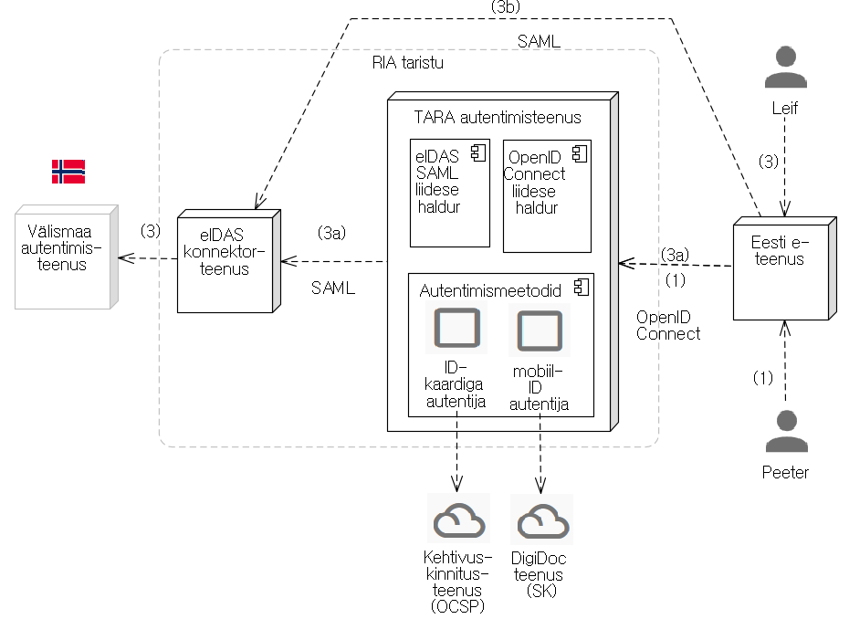

# 3. arendusjärk ("eIDAS"). Lähteülesanne
{: .no_toc}

- TOC
{:toc}

Märkus. Kasutame [sõnastiku](Sonastik) mõisteid.

## Eesmärk

3\. arendusjärgu eesmärk on lisada TARA-teenusele eIDAS piiriülese autentimise võimekus. Tööde tulemusena peab  Eesti e-teenusel olema võimalik:
a) saata välismaalane TARA ja eIDAS piiriülese autentimise taristu kaudu autentimiseks välisriigi autentimisteenusesse
b) autentimiselt tagasisuunatud välismaalane vastu võtta
c) ja saada kätte autentimist kinnitav eIDAS autentimistõend.

Arendusjärguga jätkame TARA-teenuse [1.](1JARK) ja [2.](2JARK) arendusjärguga tehtut.

## Arhitektuur

TARA-teenuse üldistatud komponentmudel (arendusjärgu lõpus) on esitatud joonisel 1.

Joonis 1. eIDAS-võimekusega TARA autentimisteenus

## TARA serverrakendus

1\. ja 2. arendusjärguga on loodud TARA serverrakendus, mis teostab Eesti e-teenust kasutava eestlase autentimist (joonisel 1 kasutusvoog 1). Suhtlus klientrakendusega toimub [OpenID Connect](Viited#1-1) protokolli kohaselt. TARA serverrakendus on ehitatud [CAS platvormile](Viited#3-1).

## Teostatav kasutusvoog

3\. arendusjärgus tuleb teostada kasutusvoog `3a` ("Eesti e-teenust kasutava välismaalase autentimine TARA kaudu") (vt joonis 1). Kasutusvoog koosneb järgmistest sammudest:

1\. Välismaalane avaldab soovi TARA-ga liidestatud Eesti-e teenuses sisse logida.

2\. e-teenus (TARA suhtes klientrakendus) suunab välismaalase TARA teenusesse. 
\- suunamine tehakse veebisirvija ümbersuunamiskorralduse abil, vastavalt OpenID Connect protokollile. Vt [Tehniline kirjeldus](TehnilineKirjeldus).

3\. Välismaalane saabub TARA-teenusesse, autentimismeetodi valiku lehele.

4\. Välismaalane valib välisriigi. 
\- kui välisriigist osaleb eIDAS-skeemis mitu identiteedisüsteemi, siis valib ka identiteedisüsteemi.

5\. TARA-teenus koostab SAML autentimispäringu. 
\- TARA teenus allkirjastab ja sõltuvalt seadistusest ka krüpteerib autentimispäringu.

6\. TARA-teenus suunab välismaalase RIA eIDAS konnektorteenusesse. 
\- ümbersuunamiskorralduses pannakse kaasa SAML autentimispäring.

7\. RIA eIDAS konnektorteenus korraldab välismaalase suunamise välisriiki, autentima.

8\. RIA eIDAS konnektorteenus suunab välisriigist tagasi saabunud välismaalase tagasi TARA-teenusesse. 
\- tagasisuunamisega koos edastab RIA eIDAS konnektorteenus allkirjastatud - ja vastavalt seadistusele - krüpteeritud eIDAS autentimisvastuse.

9\. TARA-teenus võtab vastu tagasisuunatud välismaalase, dekrüpteerib autentimisvastuse ja kontrollib allkirja.

10\. TARA-teenus, vastavalt OpenID Connect protokollile (volituskoodi voog) edastab tulemuse klientrakendusele.

11\. Klientrakendus, eduka autentimise korral pärib, vastavalt OpenID Connect protokollile TARA-teenuselt identsustõendi.

12\. TARA-teenus väljastab identsustõendi.

Kasutusvoogu on kujutatud ka [RIA SSO autentimisteenuses kavandis](Viited#4-3) oleval järgnevusdiagrammil.

## Tööde koosseis

Tuleb teostada:

| nr |       töö       |  tulemus    | töömahu orientiir |
|----|-----------------|-------------|-------------------|
| 1  | autentimismeetodi valiku kuva täiendamine piiriülese autentimismeetodi valimisega | konfigureeritud ja ülalolevad välisriikide autentimismeetodid on kasutajale valitavad |  |
| 2  | SAML autentimispäringu moodustamine | TARA serverrakendus suudab moodustada korrektse SAML autentimispäringu. NB! Autentimispäringu vorming on spetsifitseeritud |  |
| 3  | välismaalase suunamine RIA eIDAS konnektorteenusesse | TARA serverrakendus suudab teha _browser redirect_-i RIA eIDAS konnektorteenusesse (SAML autentimispäring pannakse kaasa) |  |
| 4  | välismaalase vastuvõtmine RIA eIDAS konnektorteenusest | TARA serverrakendus suudab välismaalase RIA eIDAS konnektorteenusest vastu võtta |  |
| 5  | SAML autentimisvastuse dekrüpteerimine ja valideerimine | TARA serverrakendus suudab SAML autentimisvastuse dekrüpteerida ja valideerida |
| 6  | välismaalase tagasisuunamine autentimisrakendusse | TARA serverrakendus suudab välismaalase OpenID Connect _redirect_-ga klientrakendusse tagasi saata | | 
| 7  | identsustõendi moodustamine | TARA serverrakendus suudab moodustada korrektse OpenID Connect identsustõendi. Tõend jääb klientrakenduse järeletulemist ootama |
| 8  | identsustõendi väljastamine klientrakendusele | TARA serverrakendus suudab identsustõendi klientrakendusele väljastada |
| 9  | eIDAS nõuete kohased logimised (vrdl [eIDAS-Node Error and Event Logging](Viited#2-4)) | TARA-teenuse logimised vastavad nõuetele | |
| 10 | SAML metaandmeotspunkti teostus | TARA-teenus on publitseerinud oma SAML metaandmed |  |

Arendustööd hõlmavad:
- kavandamist, sh
  - tehnilist kavandamist
  - projektijuhtimist
- programmeerimist, sh
  - koodi läbivaatust
- testimist
- dokumenteerimist.

Ettevalmistavate ja kaasnevate töödena:
- tutvumine olemasoleva TARA-teenuse
  - dokumentatsiooniga
  - koodiga
- tutvumine eIDAS Node tarkvara
  - dokumentatsiooniga
  - koodiga.

## Riskid

| nr   | risk | kirjeldus | ohuhinnang |
|------|------|-----------|-------------|
| 1    | eIDAS Node tarkvara ebastabiilsus | eIDAS konnektorteenuse tarkvara ei ole kahjuks veel stabiilne. Sept 2017 avaldati eIDAS Node v1.4. See versioon on RIAs paigaldatud. Euroopa Komisjonil on töös v2.0, milles suur muutus saab olema SAML 2-lt üleminek SAML 3.0-le (OpenSAML). Komisjoni sõnul v2.0 tuleb jaan-veebr 2018. | võib oluliselt ohustada töid (vajadus ümber teha) |
| 2    | eIDAS "protokolli" muutumine | Praegu kehtib eIDAS tehniline spetsifikatsioon v1.1. Kavas on seda uuendada, kuid tähtaegu teada ei ole. | Ohtu hindame väikeseks. |
| 3    | eIDAS Node tarkvara dokumentatsiooni puudulikkus | Komisjon on täiendanud eIDAS Node-i tehnilist dokumentatsiooni. Seda tehti meie soovi peale. Palgati professionaalne _technical writer_, kes on teinud head tööd. Siiski ei saa dokumentatsiooni lugeda perfektseks. | Ohtu meie töödele hindame keskmiseks. |
| 4    | raskused valitud platvormi tõttu | Vt [TARA tarkvara jätkusuutlikkus](Jatkusuutlikkus) | Hetke parima teadmise põhjal peame eIDAS-võimekust valitud platvormil teostatavaks. |

## Tööde planeerimine 

Arendusjärgu eesmärk on suhteliselt konkreetne ja selge. Siiski on arendusjärgus mitu tegurit, mis raskendavad töömahtude ja edenemistempo ennustamist. Seetõttu jagame arendusetapi küll konkreetsete tulemitega ja konkreetsete tähtaegadega töödeks (vt ülal), kuid tegeliku edenemistempo alusel vajadusel korrigeerime nii mahtusid kui ka tähtaegu.

