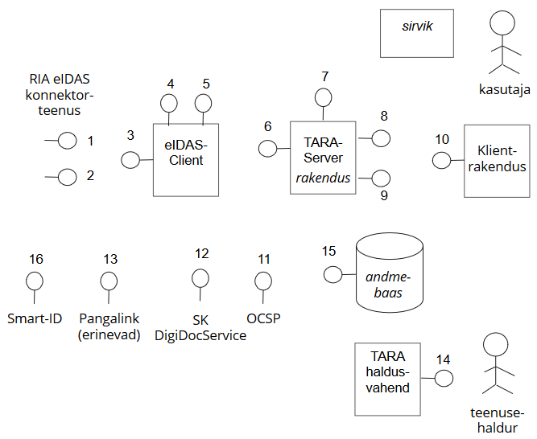

# TARA arhitektuurikirjeldus
{: .no_toc}

- TOC
{:toc}

## Ülevaade 

Käesolev dokument kirjeldab autentimisteenuse TARA ja selle vahetu ümbruse:
- osapooled ja komponendid
- teenused ja liidesed
- olulisemad sõltuvused.

Ülevaate osapooltest, komponentidest ja liidestest esitab järgnev joonis. (Teenused on esitatud numbritega.) Täpsemad kirjeldused vt allpool.

## Teenused

_Teenus on ühe komponendi v osapoole poolt teisele pakutav andmeteenus või kasutajaliides Esitame autentimisteenuse TARA ja selle vahetu ümbruse poolt osutatavad ja tarbitavad teenused osapoolte ja komponentide kaupa. Andmeteenused võimalusel otspunkti täpsusega._

RIA eIDAS konnektorteenus

nr | teenus    | kasutaja(d)
---|-----------|-----------------------
1  | autentimispäringu vastuvõtu otspunkt | TARA server
2  | metateabe otspunkt                   | eIDAS klient

eIDAS-Client

nr | teenus    | kasutaja(d)
---|-----------|-----------------------
3  | metateabe otspunkt | RIA eIDAS konnektorteenus
4  | autentimispäringu moodustamise otspunkt | TARA server
5  | autentimisvastuse töötlemise otspunkt | TARA server

TARA-Server

nr | teenus    | kasutaja(d)
---|-----------|-----------------------
6  | eIDAS autentimisvastuse vastuvõtu otspunkt | RIA eIDAS konnektorteenus
7  | autentimismeetodi valiku kasutajaliides ID-kaardiga autentimise kasutajaliidest mobiil-ID-ga autentimise kasutajaliides | kasutaja
8  | autentimispäringu vastuvõtu otspunkt (OpenID Connect) | klientrakendus
9  | identsustõendi väljastamise otspunkt (OpenID Connect) | klientrakendus

klientrakendus

nr | teenus    | kasutaja(d)
---|-----------|-----------------------
10 | OpenID Connect tagasisuunamisotspunkt | TARA server

SK ID Solutions

nr | teenus    | kasutaja(d)
---|-----------|-----------------------
11 | ID-kaardi kehtivuskinnitusteenus (OCSP) | TARA server
12 | mobiil-ID-ga autentimise teenus DigiDocService | TARA server
   | Pank (erinevad)
16 | Smart-ID (veel teostamata) | TARA server   

Panga infosüsteem

nr | teenus    | kasutaja(d)
---|-----------|-----------------------
13 | panga autentimisteenus ("pangalink") | TARA server

TARA haldusvahend

nr | teenus    | kasutaja(d)
---|-----------|-----------------------
14 | teenusehalduri kasutajaliides | teenusehaldur
   | andmebaas
15 | andmebaasiteenus (JDBC) | TARA server, TARA haldusvahend

## Komponendid ja osapooled

### Organisatsioonid

organisatsioon | roll
---------------|-------
Riigi Infosüsteemi Amet (RIA) | pakub TARA teenust
asutus (OpenID Connect mõistes - teenusepakkuja) | kasutab TARA 
autentimisteenuse pakkuja | ettevõte (pank, AS SK ID Solutions), kelle teenust RIA kasutab TARA pakkumisel

### Inimesed

inimene       | roll
--------------|----------
kasutaja      | füüsiline isik, kes TARA abil ära autenditakse; võib olla välismaalane  
kontaktisik   | asutuse töötaja, kellega RIA suhtleb klientrakenduse käitamisel ettetulevates küsimustes
teenusehaldur | RIA töötaja, kes suhtleb asutustega ja teeb teisi TARA osutamisega seotud toiminguid 

### TARA tuumkomponendid

komponent v osapool  | funktsioon | repo vm detailsem kirjeldus 
-----------|------------|----------------------------
TARA server | siseriikliku autentimisteenuse pakkumine;siseriiklike autentimismeetodite teostus; piiriülese autentimise vahendamine | [https://github.com/e-gov/TARA-Server](https://github.com/e-gov/TARA-Server)
TARA haldusvahend | TARA kasutavate asutuste ja klientrakenduste metateabe registreerimine ja säilitamine | [https://github.com/e-gov/TARA-Management](https://github.com/e-gov/TARA-Management) 
eIDAS-Client | SAML autentimispäringu koostamine; SAML autentimisvastuse töötlemine; SAML metateabe otspunkti pakkumine | [https://github.com/e-gov/eIDAS-Client](https://github.com/e-gov/eIDAS-Client)
teenusehaldur | RIA töötaja, kes registreerib klientrakendusi | -  

### Välised komponendid ja osapooled

komponent v osapool  | funktsioon | repo vm detailsem kirjeldus 
-----------|------------|----------------------------
RIA eIDAS konnektorteenus | piiriülese autentimise vahendamine | [https://github.com/e-gov/eIDAS-Connector](https://github.com/e-gov/eIDAS-Connector)
klientrakendus | TARA teenust kasutav, asutuse registreeritud infosüsteem | -
kasutaja | autenditav füüsiline isik | -
DigiDocService | SK ID Solutions AS mobiil-ID autentimisteenus | [Technical information](https://sk.ee/en/services/validity-confirmation-services/digidoc-service/)
OCSP | SK ID Solutions ID-kaardi kehtivuskinnitusteenus | 
Panga infosüsteem | panga autentimisteenuse osutamine | 
Äriregister (perspektiivne) |  esindusõigusteabe pakkumine | [kirjeldus RIHAs](https://www.riha.ee/Infos%C3%BCsteemid/Vaata/arireg)
Rahvastikuregister (perspektiivne) | füüsilise isiku aadressi pakkumine | [kirjeldus RIHAs](https://www.riha.ee/Infos%C3%BCsteemid/Vaata/rr)

### Testikomponendid

komponent  | funktsioon | repo vm detailsem kirjeldus 
-----------|------------|----------------------------
TARA-Server-Test | TARA serveri testid | [https://github.com/e-gov/TARA-Server-Test](https://github.com/e-gov/TARA-Server-Test)
eIDAS-Client-Test | eIDAS kliendi testid | [https://github.com/e-gov/eIDAS-Client-Test](https://github.com/e-gov/eIDAS-Client-Test)

### Toetavad komponendid

Näited

komponent  | funktsioon | repo vm detailsem kirjeldus 
-----------|------------|----------------------------
TARA-Client | TARA klientrakenduse näide (Java) | [https://github.com/e-gov/TARA-Client](https://github.com/e-gov/TARA-Client)
TARA-Demo | TARA klientrakenduse näide (Node.js) | [https://github.com/e-gov/TARA-Demo](https://github.com/e-gov/TARA-Demo)
TARA-Java | TARA klientrakenduse näide (Java) | [https://github.com/e-gov/TARA-Java](https://github.com/e-gov/TARA-Java)
eIDAS-Client-Demo | eIDAS kliendi kasutajaliidesega test- ja demorakendus | [https://github.com/e-gov/eIDAS-Client-Demo](https://github.com/e-gov/eIDAS-Client-Demo)

Muud

komponent  | funktsioon | repo vm detailsem kirjeldus 
-----------|------------|----------------------------
TARA-Stat  | kasutusstatistika tootmine | [https://github.com/e-gov/TARA-Stat](https://github.com/e-gov/TARA-Stat)

## Sõltuvused (olulisemad)

sõltuvus | märkused
---------|------------
CEF eIDAS Node 1.4 tarkvara (RIA eIDAS konnektorteenuses) | 2019. a kevadeks vaja üle minna Node 2.0 tarkvarale. See tähendab eIDAS konnektorteenuse liidese täielikku ümbertegemist
Apereo CAS | probleemne, sest _bloated_, sisaldab mittevajalikku, raskesti kohandatav ja täiendatav
OpenID Connect | kasutusel piiratud ja kohandatud ulatuses
OpenSAML 3.3.0 | Node 2.x üleminekul vajadus langeb ära
Java 1.8 | 
Spring Framework |
PostgreSQL 9.4 |
iPizza | pangalinkide protokoll
DigiDocService | mobiil-ID autentimisteenuse API
ID-kaardi serdimehhanism |
SmartID | (liides on veel teostamata)

