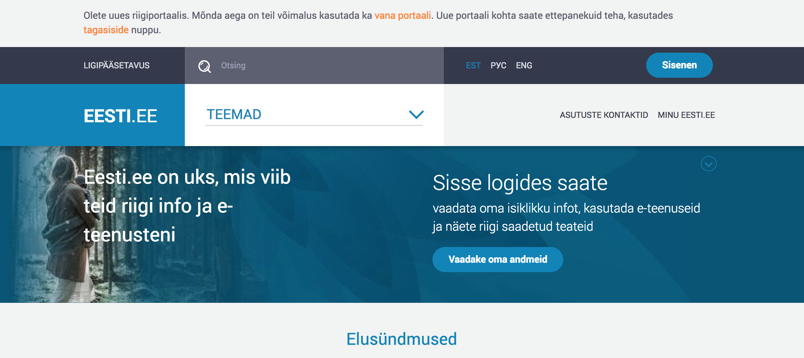

# Autentimisteenus TARA

Autentimisteenus TARA on Riigi Infosüsteemi Ameti poolt pakutav teenus, millega asutus saab oma e-teenusesse lisada nii siseriiklike kui ka Euroopa Liidu piiriüleste autentimismeetodite toe.

Siseriiklikest autentimismeetoditest pakume autentimist riikliku identiteedisüsteemiga:

- mobiil-ID (ainult Eesti isikukoodiga kasutajad)
- ID-kaart

Samuti pakume piiriülest autentimist Euroopa Liidu teavitatud eID vahenditega.

## Kellele?

Riigiasutusele ja avalik-juriidilistele isikutele või eraõiguslikele isikutele, kes täidavad avalikku ülesannet ja soovivad:
- oma e-teenustes pakkuda kasutajatele laia valikut autentimismeetodeid, ise neid meetodeid teostamata.
- lisada oma e-teenusele piiriülese autentimise toe.

## Kes TARA kasutavad?

Riigi autentimisteenusega on liitunud 8 riigiasutust 50
infosüsteemiga, sh (riigiportaal eesti.ee, e-maksuamet/e-toll (e-MTA), Haridusportaal, RIHA, ePRIA, Ehitisregister, Rahvastikuregister, eToetus, eSTAT, TAKIS, ) (aprill 2019 seisuga).

## Tehnilised tingimused?

E-teenus liidestatakse autentimisteenusega OpenID Connect protokolli kohaselt. Vt lähemalt: [Tehniline kirjeldus](TehnilineKirjeldus).

Soovi korral võib riigi autentimisteenusega liidesta asutuse oma autentimislahenduse, mis siis autentimist e seanssi asutuse e-teenustele edasi jagab. Selle kohta vt: [Autentimise e seansi edasiandmine](Feder).

## Kuidas liituda?

Asutusel tuleb:

1 välja selgitada, kas ja millistes e-teenustes RIA autentimisteenust tahab kasutada 

2 kavandada ja tellida liidestamistöö

- autentimiskomponendi täiendamine OpenID Connect-ga või väljavahetamine
- hinnanguline töömaht:
  - kogenud arendajal u 2 päeva
  - kui OpenID Connect-i pole varem teinud, siis 2 nädalat
  - kui on vaja välja vahetada olemasolev (mitte OpenID Connect põhine) autentimislahendus (mis tõenäoliselt on tihedalt seotud seansi- ja pääsuhaldusega), siis tasub arvestada vähemalt 1 inimkuuga.

3 teostada arendus 

4 esitada RIA-le taotlus teenusega liitumiseks 

- seejuures esitada kasutajate arvu prognoos
- RIA registreerib teie rakenduse teenuse kliendiks ja avab teile testteenuse.

5 testida liidest RIA testteenuse vastu

- RIA abistab võimalike probleemide lahendamisel

6 eduka testimise järel taodelda ühendamist toodanguteenusega

- RIA avab toodanguteenuse.

## Millal?

Testteenus on avatud 2017. a sügisest.

Teenus on toodangus avatud 2018. a märtsist.

## Kuidas teenus välja näeb?

## Soovitused Riigi autentimisteenuse integreerimiseks kliendi teenuses

- kui teenuses on kasutuses üksnes Riigi autentimisteenus (TARA), on soovituslik kasutada viidet “Sisene” koos paigutusega veebilehe paremal üleval servas

- ainult eIDAS-liidestuse korral on soovituslik Riigi autentimisteenusele (TARA) suunamiseks kasutada viidet “EL kodanik” / “EU citizen” või kasutada [logo](https://github.com/e-gov/TARA-Server/blob/master/disain/assets/eu_citizen_login_btn_190x50.svg)

   

- kui teenuses on kasutusel Riigi autentimisteenuse (TARA) kõrval ka teisi autentimisvahendeid, on soovituslik kasutada viitena RIA autentimisteenuse [logo](https://github.com/e-gov/TARA-Server/blob/master/disain/assets/tara_logo.svg) koos selgitusega “Sisene Riigi autentimisteenuse kaudu” või “Sisene läbi Riigi autentimisteenuse”.

  

## Rohkem teavet?

Kontakt: `help@ria.ee`.

Kui pöördute liidestamisel või liidestatud klientrakenduses TARA kasutamise tehnilise probleemiga, siis palume valmis panna väljavõte klientrakenduse logist. Tõrkepõhjuse väljaselgitamiseks vajame teavet, mis päring(ud) TARAsse saadeti ja mis vastuseks saadi.

Samuti tasub heita pilk [eneseabile](Eneseabi).

[Tehniline kirjeldus](TehnilineKirjeldus) (liidese arendajale).

