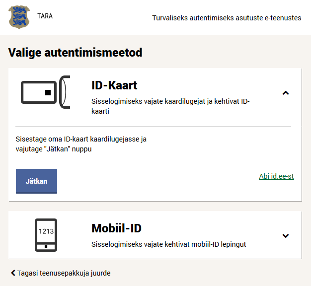
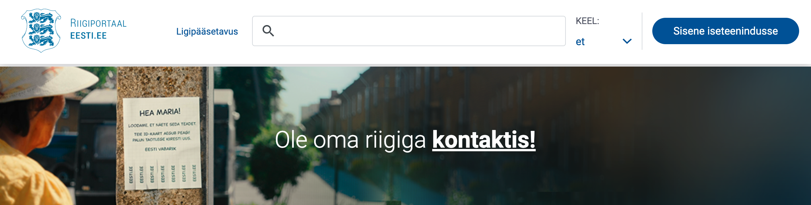

# Riigi autentimisteenus (TARA)

Riigi autentimisteenus (TARA) on Riigi Infosüsteemi Ameti poolt pakutav teenus, millega asutus saab oma e-teenusesse lisada nii siseriiklike kui ka Euroopa Liidu piiriüleste autentimismeetodite toe.

Teenust osutatakse kõigile valitsussektori asutustele vastavalt Rahandusministeeriumi [kodulehel»](https://www.fin.ee/riigihaldus-ja-avalik-teenistus-kinnisvara/riigihaldus/avaliku-sektori-statistika) toodud tabelile "Avaliku sektori asutused haldusalade kaupa" (v.a Muu avalik sektor).

Siseriiklikest autentimismeetoditest pakume autentimist järgmiste vahenditega:

- mobiil-ID (ainult Eesti isikukoodiga kasutajad)
- ID-kaart
- smart-ID (ainult Eesti isikukoodiga kasutajad) *Palume pöörata e-teenuste osutajatel tähelepanu asjaolule, et Smart-IDga isiku tuvastamisel ei ole võimalik eristada Eesti residente mitte residentidest (näiteks nagu seda võimaldab e-residentide sertifikaat).*

Samuti pakume piiriülest autentimist [Euroopa Liidu teavitatud eID vahenditega](https://ec.europa.eu/digital-building-blocks/sites/display/EIDCOMMUNITY/Overview+of+pre-notified+and+notified+eID+schemes+under+eIDAS) läbi eIDAS-Node taristu. Käesolevalt on TARAs toetatud järgmiste riikide teavitatud eID vahendid:

- Austria: ID Austria
- Belgia: Belgian Citizen eCard; Foreigner eCard; itsme® mobile App
- Bulgaaria: Evrotrust eID
- Hispaania: Documento Nacional de Identidad electrónico (DNIe)
- Holland: eHerkenning; DigiD Substantieel; DigiD Hoog
- Horvaatia: Personal Identity Card (eOI)
- Itaalia: Carta di Identità elettronica (CIE); Aruba PEC SpA; Namirial SpA; InfoCert SpA; In.Te.S.A. SpA; Poste Italiane SpA; Register.it SpA; Sielte SpA; Telecom Italia Trust Technologies S.r.l.; Lepida SpA
- Küpros: IDMe.cy
- Läti: eID karte; eParaksts karte; eParaksts karte+; eParaksts
- Leedu: Lithuanian National Identity card (eID / ATK)
- Liechtenstein: eID.li
- Luksemburg: Luxembourg eID card
- Malta: Maltese eID card and e-residence documents
- Poola: Trusted profile, personal profile
- Portugal: Portuguese national identity card (eID card); Digital Mobile Key
- Prantsusmaa: France Identité; FranceConnect+ / The Digital Identity La Poste 
- Rootsi: BankID; Freja eID; EFOS
- Saksamaa: National Identity Card; Electronic Residence Permit; eID Card for Union Citizens and EEA Nationals
- Slovakkia: Slovak Citizen eCard; Foreigner eCard
- Sloveenia: eID card
- Taani: MitID Mobile App; MitID App enhanced security; MitID chip; MitID code display; MitID Audio code reader; MitID Password
- Tšehhi: CZ eID card; Mobile eGovernment Key (MEG); mojeID.

Eesti riiklike ja piiriüleselt tunnustatud eID vahenditega (ID-kaart, mobiil-ID) on tagatud juurdepääs järgmiste Euroopa Liidu riikide e-teenustele: Austria, Belgia, Hispaania, Holland, Horvaatia, Itaalia, Kreeka, Leedu, Luksemburg, Läti, Malta, Norra, Poola, Portugal, Rootsi, Saksamaa, Slovakkia, Sloveenia, Soome, Taani, Tšehhi.

## Kellele?

Valitsussektori asutustele, kes soovivad:
- oma e-teenustes pakkuda kasutajatele laia valikut autentimismeetodeid, ise neid meetodeid teostamata.
- lisada oma e-teenusele piiriülese autentimise toe.

## Kes Riigi autentimisteenust kasutavad?

Riigi autentimisteenusega on liitunud 112 asutust 582 infosüsteemiga, sh e-Maksuamet/e-Toll, Transpordiameti e-teenindus, Eesti hariduse infosysteem (EHIS), Eksamite Infosüsteem (EIS), Tahvel, SAIS, Riigipilve iseteenindus, RIHA, Ehitisregister, Teeregister, e-Töötukassa, SKAIS, Statistikaameti iseteenindus, E-Notar, Pollumajandusvaldkonna kliendiportaal, Ravimiameti kliendiportaal, Majandustegevuse register (MTR), Riigi koosloome keskkond, Bürokratt, Riigitootaja iseteenindusportaal (RTIP), Tallinna e-teeninduskeskkond jt.

## Tehnilised tingimused?

E-teenus liidestatakse autentimisteenusega OpenID Connect protokolli kohaselt. Vt lähemalt: [Tehniline kirjeldus](TehnilineKirjeldus).

RIA pakub alates augustist 2022 Riigi SSO teenust (GovSSO), mille dokumentatsiooniga saab tutvuda [GovSSO GitHub](https://e-gov.github.io/GOVSSO) lehel.

## Kuidas liituda?

Asutusel tuleb:

1 välja selgitada, kas ja millistes e-teenustes RIA autentimisteenust tahab kasutada 

2 kavandada ja tellida liidestamistöö

- autentimiskomponendi täiendamine OpenID Connect-ga või väljavahetamine
- hinnanguline töömaht:
  - kogenud arendajal u 2 päeva
  - kui OpenID Connect-i pole varem teinud, siis 2 nädalat
  - kui on vaja välja vahetada olemasolev (mitte OpenID Connect põhine) autentimislahendus (mis tõenäoliselt on tihedalt seotud seansi- ja pääsuhaldusega), siis tasub arvestada vähemalt 1 inimkuuga.

3 teostada arendus 

4 esitada RIA-le taotlus teenusega liitumiseks 

- seejuures esitada kasutajate arvu prognoos
- RIA registreerib teie rakenduse teenuse kliendiks ja avab teile demoteenuse.

5 testida liidest RIA demoteenuse vastu

- RIA abistab võimalike probleemide lahendamisel

6 eduka testimise järel taodelda ühendamist toodanguteenusega

- RIA avab toodanguteenuse.

## Millal?

Demoteenus on avatud 2017. a sügisest.

Teenus on toodangukeskkonnas avatud 2018. a märtsist.

## Kuidas teenus välja näeb?

## Soovitused Riigi autentimisteenuse integreerimiseks kliendi teenuses

- kui teenuses on kasutuses üksnes Riigi autentimisteenus (TARA), kasutada viidet “Logi sisse” koos paigutusega veebilehe paremal üleval servas

- ainult eIDAS-liidestuse korral kasutada Riigi autentimisteenusele (TARA) suunamiseks viidet “EL riigi eID” / “Other EU country” või kasutada [logo](https://github.com/e-gov/TARA-Login/blob/master/disain/assets/eu_citizen_login_btn_190x50.svg)

 

- kui teenuses on kasutusel Riigi autentimisteenuse (TARA) kõrval ka teisi autentimisvahendeid, kasutada viitena Riigi autentimisteenuse [logo](https://github.com/e-gov/TARA-Login/blob/master/disain/assets/tara_logo.svg) koos selgitusega “Sisene Riigi autentimisteenuse kaudu” või “Sisene läbi Riigi autentimisteenuse”.

  

## Rohkem teavet?

Kontakt: [klient@ria.ee](mailto:klient@ria.ee).

Kui pöördute liidestamisel või liidestatud klientrakenduses TARA kasutamise tehnilise probleemiga, siis palume valmis panna väljavõte klientrakenduse logist. Tõrkepõhjuse väljaselgitamiseks vajame teavet, mis päring(ud) TARAsse saadeti ja mis vastuseks saadi.

Samuti tasub heita pilk [korduma kippuvate küsimuste rubriiki](Abi).

[Tehniline kirjeldus](TehnilineKirjeldus) (liidese arendajale).
