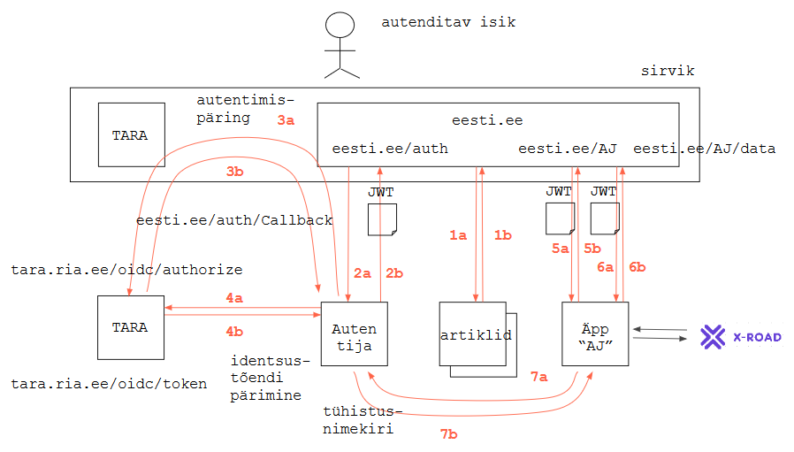

# eesti.ee autentimislahendus
{: .no_toc}

14.06.2018

- TOC
{:toc}

## Arhitektuurijoonis

## Mõisted

- _sirvik_ - kasutaja brauser.
- _serveripool_ - eesti.ee aga ka TARA _backend_.
- _lehelaadimispäring_ - HTTP GET päring sirvikust lehe laadimiseks.
- _AJAX-päring_ - XMLHttpRequest (uuem: Fetch API) sirvikusse laetud lehe Javascripti poolt serveripoolele saadetav päring, eesmärgiga andmeid serveripoolelt laadida või serveripoolele saata, ilma lehevahetuseta. Reeglina HTTP GET või POST päring.
- _veebitõend_ - JWT, JSON Web Token, standardne JSON-struktuur andmete vahetuseks sirviku ja serveripoole vahel.
- _tühistusnimekiri_ - _blacklist_, Autentija poolt peetav nimekiri tühistatud veebitõenditest. Veebitõend tühistatakse kasutaja väljalogimisega (joonisel mittenäidatud).
- _Autentija_ - eesti.ee komponent, mis ülesandeks on kasutaja suunamine TARA-sse, veebitõendi koostamine ja tühistusnimekirja pidamine.
- _äpp_ - eesti.ee koosseisus kasutajale pakutav e-teenus. Äppi eristab artiklist: 1) dünaamiline interaktsioon kasutajaga, sh andmete sisestamine kasutaja poolt; 2) andmete pärimine andmekogudest (üle X-tee); 3) andmete salvestamine andmekogusse. Äppi pakutakse `eesti.ee` domeeni alt, nn "kaika" abil, kujul `eesti.ee/<äpi nimi>`. Nt `eesti.ee/AJ` on andmejälgija esitusteenus. 

## Kasutusvoog

(ei ole näidatud väljalogimine)

 nr | toiming
----|---------
    | _Autentimata tegutsemine_
1a  | kasutaja saabub portaali (); kasutaja navigeerib artiklite vahel; kasutaja ei ole autenditud - tehniliselt: lehelaadimispäringud URL-dele `eesti.ee/` (pealeht) või `eesti.ee/artikkel`.
1b  | portaali serveripool saadab sirvikusse esilehe või artikli.
    | _Autentimine_
2a  | kasutaja vajutab "Logi sisse" vms; sirvikust saadetakse serveripoolele, URL-le `eesti.ee/auth` (Autentijasse) lehelaadimispäring.
3a  | Autentija suunab kasutaja TARA-sse autentima (URL-le `tara.ria.ee/oidc/authorize`).
... | kasutaja autenditakse (joonisel mittenäidatud)    
3b  | TARA suunab kasutaja eesti.ee-sse tagasi, URL-le `eesti.ee/auth/Callback`.
4a  | Autentija pärib TARA serveripoolelt identsustõendi.
4b  | TARA väljastab Autentijale identsustõendi.
2b  | Autentija koostab identsustõendi põhjal veebitõendi (JWT), saadab sirvikusse lehe "Sisse logitud", lisades lehele veebitõendi; sirvik salvestab veebitõendi küpsisesse. Küpsis on `HttpOnly` ja seotud domeeniga `eesti.ee`.
    | _Äpi kasutamine_
5a  | kasutaja on juba autenditud (sirviku küpsises on veebitõend). Kasutaja soovib kasutada eesti.ee koosseisus olevat äppi (teenust v rakendust). Kasutaja vajutab artiklis või menüüs äpi lingile; serveripoolele läheb lehelaadimispäring kujul `eesti.ee/<äpi nimi>`. Sirvik paneb päringuga kaasa küpsises oleva veebitõendi (JWT).
5b  | äpi sirvikupool laetakse sirvikusse.
6a  | äpp teeb AJAX-päringu serveripoolele, nt URL-le `eesti.ee/AJ/data`. Sirvik paneb päringuga kaasa küpsises oleva veebitõendi (JWT).
7a  | äpi serveripool teeb päringu Autentijasse, tühistusnimekirja.
7b  | Autentija teatab äpile, kas veebitõend on tühistusnimekirjas või mitte.
6b  | Kehtiva veebitõendi korral saadab äpp sirvikusse nõutud andmed (või salvestab AJAX-päringus saadetud andmed andmekogusse.) 

Vt ka dokument "Portaali autentimislahendus" (Tiit K lähteülesanne Girfile 2017. a sügis).