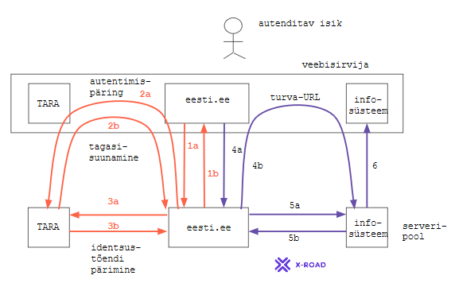

some **[ARHIVEERITUD]** text
# Autentimise edasiandmine
{: .no_toc}

- TOC
{:toc}

## Mida silmas pidada autentimise edasiandmisel

TARA ei toeta praegu ühekordset sisselogimist (SSO-d). Igasse TARA kasutavasse rakendussse tuleb autentida eraldi. Võib tekkida tahtmine autentimist edasi anda või jagada s.t teha nii, et kasutaja autenditakse ühes rakenduses, sealt edasiliikumisel teise rakendusse antakse "autenditud olek" kaasa. 

Kas autentimise edasiandmine on tehniliselt võimalik ja kuidas seda teha?
{: .note}

Autentimise edasiandmine on tehniliselt võimalik - TARA ei saa kätt ette panna - kuid peab hoolikalt jälgima, et seda tehakse turvaliselt. Autentimise edasiandmisel astub klientrakendus praktiliselt ise autentimisteenuse rolli. Autentimist ei tohi teha nii, et teise rakendusse viivale lingile paneme URL-i parameetrisse või ka HTTP päringu kehasse autenditusele viitava tõendi vms.

Kui autentimist soovitakse edasi anda, siis tuleb tagada võltspäringuründe (CSRF) vastane kaitse.
{: .note}

Võltspäringurünne on OWASP Top 10 oht. Just seesama, millepärast hoiatatakse kahtlastele linkidele vajutamise eest. Kuidas võltspäringukaitset rakendada vt [TARA eeskuju]( https://e-gov.github.io/TARA-Doku/TehnilineKirjeldus#52-v%C3%B5ltsp%C3%A4ringur%C3%BCnde-vastane-kaitse).

## Nn "Legacy" mustri kasutamine

Kas TARA kasutuselevõtmisel eesti.ee-s saab jätkata nn "legacy" autentimise kasutamist?
{: .note}

("Legacy" nime all tuntakse autentimismustrit, millega "sessioon antakse üle" ühelt infosüsteemilt teisele X-tee vahendusel. "Legacy" on kasutusel eesti.ee-s 3-4 infosüsteemi teenindamisel.) 

Jah, see on võimalik. eesti.ee senise autentimislahenduse saab TARA vastu välja vahetada nii, et "legacy"-t kasutava infosüsteemi jaoks ei muutu midagi.

Kasutusvoog hakkaks toimima nii, et kasutaja autendib end TARA-s (1. etapp) ja seejärel suunatakse ta infosüsteemi (2. etapp) (vt joonis 1). 

Joonis 1. Autentimisteenuse TARA ja "Legacy" autentimise ühitamine eesti.ee-s.

### Detailne kasutusvoog

 nr | toiming
----|---------
    | _Etapp 1. Autentimine TARA abil_
    | Lähteseis. Kasutaja on saabunud eesti.ee-sse.
1a  | Kasutaja vajutab nupule "Logi sisse" vms.
2a  | eesti.ee (serveripool) suunab kasutaja TARA-sse (autentimispäring).
    | TARA autendib kasutaja (joonisel mitte näidatud)
2b  | TARA suunab kasutaja eesti.ee-sse tagasi.
3a  | eesti.ee pärib TARA-st identsustõendi.
3b  | eesti.ee saab TARA-st identsustõendi.
    | Sellega on kasutaja autenditud.
    | _Etapp 2. "Sessiooni üleandmine"_
    | Lähteseis. Kasutaja on eesti.ee-sse sisse loginud (s.t autenditud).
4a  | Kasutaja vajutab nupule "Mine infosüsteemi" vms. Veebisirvijast läheb päring eesti.ee serverikomponendile.
5a  | eesti.ee serverikomponent saadab X-tee päringu infosüsteemi serverikomponendile. Päringus saadetakse kasutaja isikukood ja küsitakse luba infosüsteemi siseneda. Infosüsteemi saadetav isikukood on pärit TARA-st saadud identsustõendist. Identsustõendis on veel muid andmeid - isiku ees- ja perekonnanimi, kasutatud autentimismeetod jm. Nende edasisaatmine infosüsteemi ei oma mõtet - kui eesmärk on hoida voog infosüsteemile senisega võrreldes muutumatu.
5b  | Infosüsteem kontrollib, kas juurdepääsu andmiseks on alust, genereerib juhusliku sõne, lisab selle infosüsteemi URL-le ja saadab moodustatud URL-i ("turva-URL-i") eesti.ee-le.
4b  | eesti.ee saadab päringu 4a vastusega veebisirvijasse ümbersuunamiskorralduse (_redirect_), mille toimel kasutaja suunatakse infosüsteemist saadud URL-le.
6   | Infosüsteem kontrollib, kas saabunud URL on see, mida ta on väljastanud, loob kasutajale sessiooni ja saadab veebisirvijasse rakenduse avalehe.
    | Kasutaja alustab (sisselogitult) tööd infosüsteemis.

Märkus. Sammud 1a "Logi sisse" ja 4a "Mine infosüsteemi" saab ühitada. S.t infosüsteemi siseneda sooviv autentimata kasutaja saadatakse enne autentima.

### Turvahinnang

eesti.ee ja infosüsteem suhtlevad X-teel, seega omavad usaldusväärseid identiteete. Vahetatavad sõnumid (2a ja 2b) on allkirjastatud. URL-is sisalduv juhuslik URL, sisuliselt nonss, toimib taasesitusründe tõkendina. Skeemi ei saa siiski pidada turvaliseks, sest puudub võltspäringu (CSRF) vastane kaitse. Võrdluseks vt kuidas [võltspäringukaitset rakendatakse TARAs]( https://e-gov.github.io/TARA-Doku/TehnilineKirjeldus#52-v%C3%B5ltsp%C3%A4ringur%C3%BCnde-vastane-kaitse).
