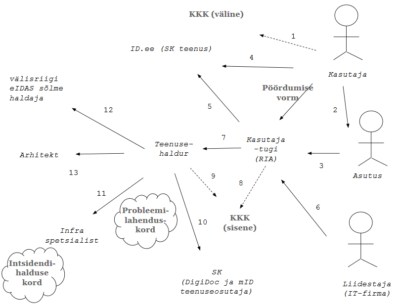

# Kasutaja probleemi lahendamine

Käesolev dokument esitab kommunikatsiooniteed kasutaja probleemi lahendamisel. Dokument ei käsitle turvaprobleemide lahendamist. Samuti ei käsitleta sidusteenuste haldajatega (SK, asutused, välisriikide eIDAS sõlmede haldajad) sõlmitavate lepingutega seotud kommunikatsiooni.

## Mõisted

***Kasutaja*** all mõistame siin: 1) ***lõppkasutajat*** e kasutajat kitsamas mõttes - isikut, keda TARA-teenuse abil autenditakse (esialgu eestlane, eIDAS-autentimise lisandumisel ka Eesti e-teenust kasutav välismaalane); 2) ***asutust***, kes TARA-teenust oma infosüsteemis lõppkasutaja autentimiseks kasutab; 3) ***liidestajat*** - asutuse ülesandel klientrakenduses TARA-ga liidestamise töid teostav sisemine arendaja või IT-firma.

***Kasutaja probleem*** on igasugune ummikseis, mida kasutaja TARA kasutamisel kogeb.

Vt ka [Sõnastik](Sonastik).

## Põhimõtted

1. Kasutaja iga probleem peab saama lahenduse.
2. Teenus tuleb maksimaalselt kujundada selliseks, et probleeme ennetada.
3. Probleemilahendust tuleb järjepidevalt automatiseerida, eesmärgiks on inimtöö osaluse vähendamine
4. Automatiseerimise eelduseks on probleemide klassifitseerimine.

## Kommunikatsiooniteed

|   nr   |  kirjeldus |
|--------|------------|
|    1a  |  Lõppkasutajale pakutakse teenuse dialoogis KKK-d. See on esmane, iseteeninduse põhimõttel toimib _troubleshooting_-u vahend. |
|    1b   | Kasutajale antakse teenuse dialoogis teada, et ta saab pöörduda abi saamiseks ID.ee (SK teenuse) poole. KKK järel on see teine soovitatav _troubleshooting_-u vahend. |
|    1c  |  Kasutaja võib pöörduda klientrakenduse haldaja poole. |
|    1d   | Kasutaja võib pöörduda RIA kasutajatoe poole. Pöördumise eelduseks on vormi täitmine, kus kasutaja kirjeldab probleemi ja selle konteksti. |
|    2    | Asutus võib pöörduda RIA kasutajatoe poole. |
|    3   | Liidestaja võib pöörduda mitmesuguste probleemidega (vajab abi liidestusjuhendi tõlgendamisel, ei suuda omapoolset otsa õigesti teostada jne). |
|    4   | RIA kasutajatukke võib jõuda pöördumisi, mida saab lahendada ID.ee. Kasutajatugi suunab pöördumise ID.ee-sse. |
|    5   | Kasutajatoe tähtsaim abivahend pöördumise menetlemisel on sisemine KKK. Sisemine KKK eesmärk on anda standardvastused standardprobleemidele. Sisemist KKK-d täiendatakse jooksvalt. Täiendamisel osalevad teenusehaldur, infra spetsialist ja arhitekt. |
|    6   | Mittestandardse probleemi (mida ei saa sisemise KKK abil lahendada) suunab kasutajatugi teenusehaldurile. |
|    7   | Sisemine KKK on ka teenusehalduri töövahend. |
|    8   | Kui on kahtlus, et probleem on TARA-teenuse poolt kasutatavas teenuses (SK DigiDocService, SK mID, hiljem ka SmartID ja pangalingid), siis suhtleb teenusehaldur SK või vastava muu teenusepakkujaga. |
|    9   | Kui on kahtlus, et probleem on tehnilises paigalduses, siis suhtleb teenusehaldur infra spetsialistiga. |
|   10   | Kui probleem viitab puudusele teenuse tehnilises lahenduses, siis suhtleb teenusehaldur arhitektiga |
|   11   | välismaalase autentimisel tekkinud probleemi lahendamisel suheldakse välisriigi eIDAS sõlme haldajaga. (Siin on veel palju ebaselgust). |

Kommunikatsiooniteed on esitatud järgneval joonisel. Joonisel on markeeritud ka intsidendihalduse kord ja "probleemilahenduskord". Viimane viitab kirjapandud tegutsemisjuhisele või protseduurile. Teenuse kvaliteetseks pakkumiseks peaks selline dokument kindlasti tekkima. 

