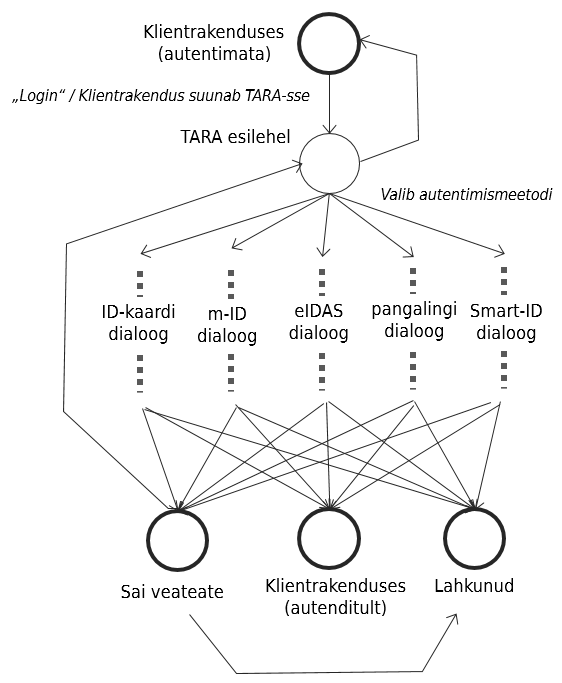

# Jõudlusanalüüs

## Jõudlusmudel

Jõudlusmudeli (_performance model_) all mõistame süsteemi ehituse läbilõiget, mis toob esile kasutaja süsteemis teenindamise teed, olekud ja üleminekud. Mudeli eesmärk on olla abiks jõudluse sihtmõõdikute püstitamisel ja tegeliku jõudluse mõõtmissüsteemi ülesehitamisel.

- Kasutajad saabuvad TARA-sse klientrakendustest.
- TARA esilehel valib kasutaja autentimismeetodi.
- Järgneb autentimisdialoog, vastavalt valitud meetodile.
- Autentimisdialoogides (5, kui pangalingid võtta eraldi, siis 10) sõltub jõudlus oluliselt välisteenuste (RIA eIDAS konnektorteenus ja selle taga olev välisriikide eIDAS-taristu) jõudlusest.
- Autentimisdialoog võib päädida kolme olekusse:
  - Kasutaja saadetakse (autenditult) klientrakendusse tagasi
  - Autentimisel tekkis viga; Kasutajale esitatakse veateada
  - Kasutaja katkestab autentimise (lahkub)

- Veateate saamisel on võimalik tagasi pöörduda TARA esilehele
- TARA esilehelt on võimalik tagasi pöörduda klientrakendusse ilma autentimata (kui klientrakendus on nii seadistatud)

Need on kasutaja liikumisteed TARAs.

## Jõudluseesmärgid

Jõudluseesmärgiks on püstitatud: TARA peab suutma teenindada 100 kasutajat/s. See tähendab:
- kasutajate voogu, kus iga sekund saabub 100 uut kasutajat; üheaegselt võib süsteemis olla kuni 30 000 kasutajat (arvestusega, et kasutaja autentimiseks kulub kuni 5 minutit)
- adekvaatseid lehelaadimisaegu (praktiliselt silmapilkselt)
- praktiliselt silmapilkseid töötlusaegu - selles osas, mis ei sõltu välisteenuste jõudlusest
- adekvaatset kasutaja teavitamist välisteenuste ebaadekvaatse jõudluse korral.

 

