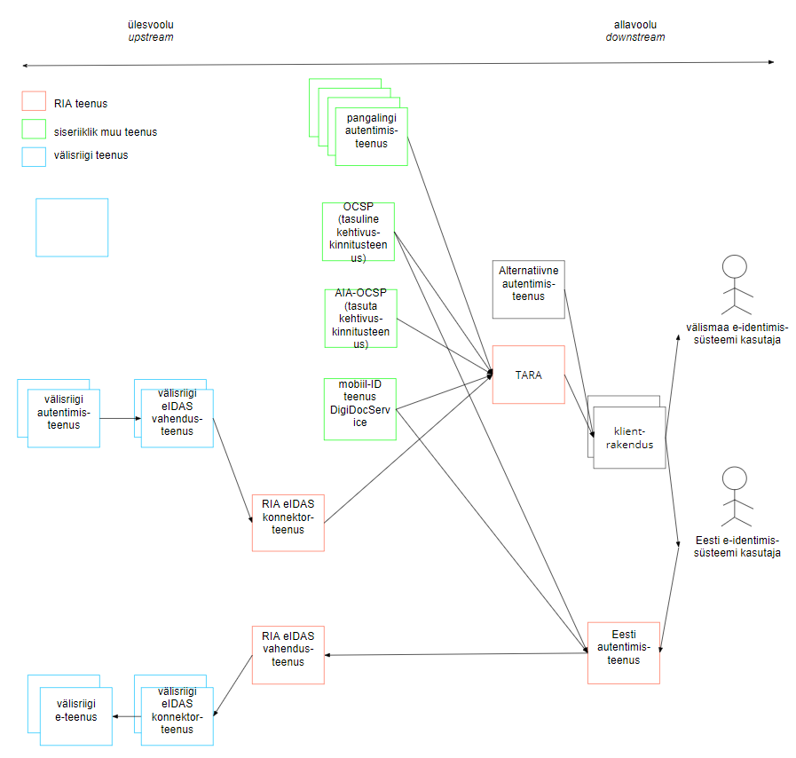

# Autentimisteenuse toimivus ja selle tagamine
{: .no_toc}

Priit Parmakson

29.04.2019

Sisukord

- TOC
{:toc}

## Ülevaade

Autentimise toimivus on e-teenuse käideldavuse seisukohalt kriitiline. Kui kasutajat ei saa autentida, siis ei saa ka personaliseeritud e-teenuse osutada.

Välisteenuste kasutamine võimaldab küll raha kokku hoida, kuid samas loob sõltuvuse välisest teenusepakkujast. Teenusepakkuja omakorda võib kasutada välisteenuseid - ja nende toimivusest sõltuda.

Välisteenuse tõrke võimalusega tuleb alati arvestada. Käideldavuse tõrget ei saa välistada, kuid kõik osapooled peavad rakendama meetmeid, et tõrgete esinemistõenäosust vähendada, tõrkeid avastada ja kiiresti lahendada.

Käesolev leht kirjeldab RIA autentimisteenuste teenustevõrku ja annab soovitusi autentimise kõrge käideldavuse tagamiseks.

Dokument on kavandi/ettepaneku staatuses.

## Teenusevõrk

Teenus võib olla sisendiks teisele teenusele. Teisele teenusele teenust osutavat teenust nimetatakse "ülesvoolu" (või "ülemjooksu", _upstream_) teenuseks. Teist teenust tarbivat teenust nimetatakse "allavoolu" (või "alamjooksu", _downstream_) teenuseks.

TARA kasutab mitmeid RIA-siseseid ja -väliseid teenuseid. Joonisel 1 on näidatud neist olulisimad.

Nooled näitavad teenuse osutamise suunda. Tegu on üldistatud joonisega. Teenust osutatakse tihti mitme HTTP-otspunkti kaudu. Näiteks autentimisteenusel TARA on autentimispäringu ja identsustõendi väljastamise otspunktid. eIDAS konnektor- ja vahendusteenustel on SAML metateabe otspunktid jne.

ID-kaardiga autentimisel kasutatakse kehtivuskinnitusteenust. Esimese valikuna pöördub TARA tasuta kehtivuskinnitusteenuse poole (AIA-OCSP, `aia.sk.ee/esteid20xx`, teenust osutab SK Identity Solutions AS). Kui tasuta teenuse kasutamine ebaõnnestub, siis proovib TARA tasulist teenust (`ocsp.sk.ee`, teenust osutab samuti SK Identity Solutions AS).

Mobiil-ID-ga autentimisel kasutab TARA mobiil-ID autentimisteenust [DigiDocService](http://sk-eid.github.io/dds-documentation/). (Teenust osutab SK ID Solutions AS).

Piiriülesel autentimisel pöördub TARA kõigepealt RIAs majutatud eIDAS konnektorteenuse poole. Konnektorteenus vahendab pöördumise välisriigi eIDAS vahendusteenuse poole. Sealt omakorda pöördutakse välisriigi autentimisteenusesse, kus kasutaja autenditakse.

Eesti autentimisteenus on RIA poolt osutatav teenus, millega autenditakse välisriigi e-teenust kasutav Eesti identimissüsteemi kasutaja. (Näiteks, kuid Eesti ID-kaardi omanik läheb Portugali e-teenusesse, siis suunatakse ta autentima Eesti autentimisteenusesse). Eesti autentimisteenust kasutav teenusvoog algab välisriigi e-teenusest. Välisriigi teenus pöördub välisriigi eIDAS konnektorteenuse poole. Viimane pöördub RIA eIDAS konnektorteenuse poole. Konnektorteenus pöördub Eesti autentimisteenuse poole. Eesti autentimisteenus võimaldab kasutaja autentida kas ID-kaardiga või mobiil-ID-ga. Vastavalt kasutab Eesti autentimisteenus tasulist kehtivuskinnitusteenust või mobiil-ID-ga autentimise teenust DigiDocService.

Märkus. Kavas on Eesti autentimisteenuses kasutusele võtta samasugune kehtivuskinnitusteenuse valikumeetod nagu TARAs (vaikimis kasutada tasuta teenust AIA-OCSP, viimase tõrke korral lülituda ümber tasulisele OCSP teenusele).

Eesti avalikus sektoris on hinnanguliselt sadu infosüsteemi. Kasutajale pakutakse mitut tuhat e-teenust. Kõigi nende ühendamine riigi autentimisteenusega (TARA-ga) paneks e-riigi sõltuma ühe tugiteenuse (TARA) "ülevalolekust". Sellise keskse nuripunkti (ingl _single point of failure_) tekkimine oleks suur risk.

Vaja on leida võimalused keskse nuripunkti riski maandamiseks.

## Elutukse pakkumine ja kasutamine

Elutukse (ingl _heartbeat_) on reaalajaline teave, mida teenus väljastab oma toimivusseisundi kohta.

Igal teenus peaks pakkuma elutukse otspunkti.
{: .note}

Tüüpiliselt pakutakse elutukset HTTP-otspunkti kaudu. Elutukse vorminguks ei ole 

Elutukse võib olla sisemiseks kasutamiseks või avalik. Sisemist elutukset kasutab teenuseosutaja ise. Kuna sisemine elutukse võib sisaldada tundlikku taristuteavet, siis seda teenuse tarbijatele ei avaldada. Avalik elutukse on kättesaadav teenuse tarbijatele või kogu maailmale.

Ülalkirjeldatud teenustevõrgus on elutukse pakkumise seis järgmine:

- TARA Server pakub sisemiseks kasutamiseks elutukset: [TARA heartbeat endpoint](https://github.com/e-gov/TARA-Server/blob/master/doc/Configuration.md#heartbeat). Koostatud on välise (avaliku) elutukse spetsifikatsioon, kuid välist elutukset veel ei pakuta.

- SK ID Solutions AS pakub oma teenustele avalikku elutukset: 
[SK ID Solutions AS Public Monitoring and Statistics Interface Specification](https://github.com/SK-EID/public-monitoring)

- eIDAS taristus ei ole elutukse pakkumine reguleeritud. Teenus kas on üleval või ei ole. Ligikaudset teenuse ülevaloleku kontrolli saaks teha pöördumisega SAML metateabe otspunkti poole, kuid tõenäoliselt sealt saadav teave ei oleks eriti usaldusväärne.

- pangad ei paku pangalingi autentimisteenusele elutukset.

Elutukse ei ole siiski universaalne lahendus. Elutuksel on mitmeid puudusi:
- elutukse poole pidev pöördumine koormab nii teenuse osutajat kui ka teenuse kasutajat
- elutukse õigsus ei ole garanteeritud. Teenus võib olla "maas", kuid elutukse järgi "OK". Elutukse korralik teostus nõuab enesediagnostika sisseehitamist teenusesse - see võib olla keeruline
- elutukse negatiivse vastuse käsitlemine peab olema läbimõeldud. Näiteks, ahvatlev on mõelda, et kavandatud teenusekatkestusi võiks teenusekasutajatele edastada masinloetaval kujul. Kuid teenusekasutaja peab teadma, et sellised teavitused võivad tulla ja suutma neid automiseeritult käsitleda. 

## Alternatiivteenuse kasutamine

Paljudel asutustel on loodud oma autentimislahendused. Asutuse oma autentimislahendusel võib olla võimalusi, mida TARA ei paku: seansihaldus, ühekordne sisselogimine (SSO), pääsuhaldus (autoriseerimine).

Asutus võib TARA lisada täiendava või alternatiivse autentimislahendusena asutuse olemasolevale või kavandatavale autentimislahendusele. See vähendab asutuse autentimislahenduse käideldavusriski.
{: .note}

Kui asutus otsustab võtta kasutusele TARA, siis käideldavusriski maandamise üks võte on alternatiivse autentimislahenduse võimaldamine. 
{: .note}

Peamise ja alternatiivse autentimislahenduse vahel ümberlülitamise võib teostada käsitsi (seadistamisega) või automaatselt. Automaatse ümberlülitamise võimaldamiseks on TARA-s kavas luua avalik elutukse.

