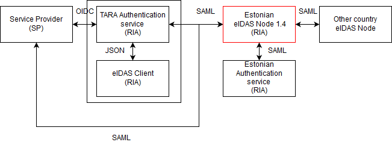
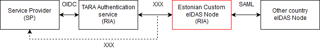

Estonian Information System Authority

# Migration to eIDAS Node 2.0 – Technical Analysis
{: .no_toc}

v 0.2  11.04.2018

written by: Priit Reiser, Nortal AS 
reviewed by: Priit Parmakson, EISA

- TOC
{:toc}

## Background

CEF Digital (responsible for maintaining the eIDAS-Node integration package) has released a new version of eIDAS-Node sample software (eIDAS-Node 2.0) which contains significant changes to its deployment architecture compared to previous version 1.4. 

As of 2.0, the eIDAS-Node no longer complies with the 1.4 release in terms of protocol use towards the national service- and identity provider’s. The SAML 2.0 protocol used extensively in version 1.4 has now been replaced by a sample JSON protocol for demo purposes and the decision for secure protocol selection and implementation responsibility is delegated to the member states.

## Goals

As suggested in the eIDAS-Node integration package release description, it is now expected that the member states implement the external interfaces of eIDAS-Node 2.0 themselves.

It raises a number of options as to what to do next, since the default client facing protocol in eIDAS-Node 2.0 (referred to as Simple Protocol) is not backward compatible with previous versions of eIDAS-Node releases.

The goal of this analysis is to give a quick overview of the options regarding the use and integration of CEF’s eIDAS-Node 2.0 sample software package into RIA’s current authentication architecture.

The following questions need to be addressed:

1.	Which service shall take the responsibility of interfacing with eIDAS-Node?
2.	What will be the communication protocols between the eIDAS-Node and member state? 

## OPTION 1 – Maintaining custom national connector and proxy services for eIDAS-Node, keeping SAML

New services should be developed using eIDAS-Node 2.0 sample components as a baseline. eIDAS specific SAML protocol should be used as in the 1.4 version.

Positive:
-	SAML allows more granular security if needed, which makes it possible to secure personal information at eIDAS protocol level (compared to more recent protocols like OIDC, OAuth, etc.).
- Work that has already been done has not gone to waste. For example, the work with national identity provider is nearly complete, some national institutions have almost completed their work interfacing with the eIDAS Connector service using SAML.
- Continue to use and update CEF sample software as it was intended (provided, that there will not be any more client breaking changes in the future)

Negative:
- The complexity that comes with SAML needs more hardening work to handle special cases. Especially if the connector service is accessed by national clients directly and not through central TARA authentication service. 
- More software components that will be heavily coupled with the CEF sample software need to be maintained.
- Solution will be dependent on CEF sample software and its maturity. Current lack of documentation has posed some misinterpretations and problems. 

## OPTION 2 – Start using TARA as the façade for the eIDAS clients (OpenID Connect)

TARA takes the responsibility for interfacing with the eIDAS-Node 2.0 (uses OpenID Connect as a security protocol). Integration can be done in several stages by introducing the TARA as a connector service first hand and replacing the SAML IdP service with TARA in later stages. 

Positive:
-	One central facade and access point for national clients creates a simpler system architecture. 
-	One security protocol for clients. Picking a small number of defined interface technologies helps integrate new consumers.
-	An opportunity to switch to a lighter and less complex protocol that does not add the integration complexities clients have to face with SAML. For example, clients do not need to concern themselves with XML and its schema complexities nor implement (and maintain) their own metadata providing and acquiring system (with eIDAS specific customizations).

Negative:
-	A lot of effort has been done already to connect clients to eIDAS-Node network through existing SAML protocol. Existing services based on SAML protocol must be modified. 
-	Although the sample connector service could be used as an internal microservice behind TARA, a custom proxy service still needs to be developed and maintained. The usage possibilities for eIDAS Sample Connector are only briefly assessed, this module is not intended for production by CEF.
-	Compared to SAML usage, personal information passed through OpenID Connect protocol will be protected by TLS/SSL channel and will no longer be protected by encryption at the service level. 

## OPTION 3 – Ignore the eIDAS-Node 2.0 release and continue to use version 1.4

Continue with 1.4 for now. Let the 2.0 release stabilize before adoption as the new architecture has introduced breaking changes to existing clients in multiple member states.

Positive:
-	eIDAS-Node 1.4 is a matured release. Lots of time and effort has been invested to test it and integration is almost complete. There are some known issues, but they are not critical.
-	Message format used between member states communication in eIDAS-Node 1.4 is compatible with 2.0 release. eIDAS-Node 1.4 can be used “AS IS” - no need to introduce new custom components/services into the system. 
-	No interruptions or breaking changes to national clients interfacing directly with the connector service.

Negative:
-	Need to start maintaining a fork of CEF-s code if the official support is dropped and security and/or other bug fixes need to be resolved. As CEF might support the old release in the near future, there might be need to merge changes. 
-	eIDAS-Node 1.4 makes extensive use of libraries that are no longer maintained which could lead to security issues in the future.
-	eIDAS-Node 1.4 can be used with minimum effort until the message format between member state communication remains unchanged. If the underlying message format is changed, then maintenance overhead increases significantly. Currently there are already proposals in discussion for the message format and other parts of eIDAS technical requirements.

## OPTION 4 – Phasing out eIDAS-Node 1.4 gradually in favor of 2.0

A mix of previous options. An alternative would be to use eIDAS-Node 1.4 only for the identity provider and to migrate the connector service to 2.0 (or vice versa – start with the national identity provider). 

Positive:
-	Gradual migration allows dealing with the migration problems step-by-step.

Negative:
-	Should still throw away a lot of work eventually.
-	Need to maintain two parallel eIDAS-Nodes.

## OPTION 5 – Abandon CEF sample implementation completely

Drop all sample implementations and build a custom implementation upon CEF specifications.

 
Positive:
-	Protocol is well-defined and specific. 
-	In control of development and internal architecture.

Negative:
-	Reinventing the wheel in most parts.
-	Most expensive option.
-	Lose the benefits of community effort.

## Summary

In conclusion, additional integration and development is required unless the decision is to stay on 1.4 release. 
Suggested short term actions: to meet the 2018 September deadline and be less invasive towards the national service providers, the preferred solution would be to keep the 1.4 release and its interfaces for the time being (OPTION 3). Ongoing integrations should be completed. 

Suggested long term actions: – Gradually phase out the eIDAS-Node 1.4 in favor of the new architecture (OPTION 4). In terms of end-to-end security, SAML has more advantages, but from the development perspective the use of more lightweight OIDC is preferred.

It should be strongly considered whether to maintain a separate SAML national identity provider. Now that the SAML is no longer mandatory, consider moving the IDP responsibilities to TARA to avoid duplication of responsibilities within the RIA infrastructure.

## Work Estimates

|  |	Connector service	| Proxy Service	| Additional development effort estimates |
|--|--------------------|---------------|-----------|
| OPTION 1	| New web service (SAML) + eIDAS-Node 2.0 | New web services (SAML) + eIDAS-Node 2.0 |	~ 90d |
| OPTION 2	| TARA (OIDC) + eIDAS-Node 2.0 sample connector + eIDAS-Node 2.0 | TARA (OIDC provider) + new web service (OIDC client) +  eIDAS-Node 2.0	| ~ 60d |
| OPTION 3	| eIDAS Client + eIDAS-Node 1.4 | RIA IDP + eIDAS-Node 1.4	| Currently no further development is required. |
| OPTION 4	| New web service (SAML) + eIDAS-Node 2.0 | eIDAS-Node 1.4	| Depends on the scope of the selected change |
| | eIDAS-Node 1.4	| New service (SAML) + eIDAS-Node 2.0	| Depends on the scope of the selected change |
| OPTION 5	| Custom eIDAS-Node | Custom eIDAS-Node |	~ 240d |

