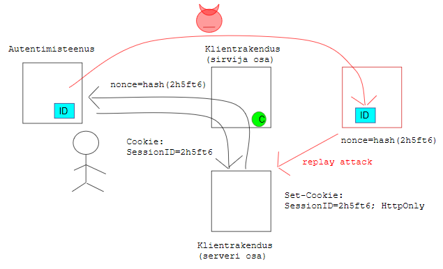

# Taasesitusrünne ja kaitse selle vastu

`nonce` ja `state` võivad OpenID Connect protokollis segadusse ajada.

`state` on kasutusel päringuvõltsimise (_cross-site request forgery_) vastumeetmena. `nonce` aga pakub kaitset taasesitusründe (_replay attack_) vastu. Kes ja mida taasesitab, seda ei ole protokollist nii lihtne välja lugeda. Uurime, kuidas taasesitusrünne välja näeb ja kuidas `nonce` aitab seda ära hoida.

- Klientrakendus koosneb kahest osast: serveriosa ja sirvija osa.  Autentimisteenus osutab klientrakendusele OpenID Connect protokolli kohast autentimisteenust.

- Autentimine algab sellega, et klientrakendus suunab kasutaja autentimisteenusesse. Seda tehakse HTTP ümbersuunamiskorraldusega (_redirect_).

- Autentimisteenuses kasutaja autenditakse ja suunatakse klientrakendusse tagasi (samuti HTTP ümbersuunamiskorraldusega).

- Autentimisteenus moodustab ja paneb tagasisuunamisel kaasa identsustõendi (_ID token_). Identsustõend on kinnitus, et kasutaja on autenditud (isik on tuvastatud).

- Ohumudel (_threat model_) lähtub võimalusest, et ***ründaja*** võib identsustõendile autentimisteenuses või tee peal ligi pääseda, andmeedastust pealt kuulata või tõendist koopia teha.

- Mis takistab ründajat tõendit oma süsteemist kliendirakenduse serveriosale esitamast (ja sellega identiteedivargust toime panemast)?

- `nonce` kasutamisel ei saa tõendi kätte saanud ründaja seda kasutada. Kuidas?
- Kliendirakenduse serveriosa lisab HTTP ümbersuunamiskorraldusse küpsise panemise käsu (_cookie header_): `Set-Cookie: SessionID=2h5ft6; HttpOnly`.

- Sirvija lisab selle käsu mõjul sessiooniküpsise `SessionID=2h5ft6`. `HttpOnly` tähendab, et küpsis ei ole nähtav klientrakenduse sirvijaosale, kui ründaja peaks ka sinna sisse murdma.

- See ei ole aga veel kõik. Klientrakendus arvutab sessiooniküpsisest `2h5ft6` räsi ja lisab selle HTTP ümbersuunamiskorralduse URL-i: `nonce=hash(2h5ft6)`.

- Autentimisteenus võtab nonssi väärtuse ja lisab selle identsustõendisse!

- Autentimisteenus saadab identsustõendi klientrakenduse serveriosale.

- Tagasi suunamisel haaratakse sirvijast kaasa ka küpsis! `Cookie: SessionID=2h5ft6`.

- Klientrakenduse serveriosa saab nüüd kontrollida, et identsustõend tuleb ikka sama sirvija kaudu, kust autentimisele suunamine teele läks.

- Kuidas ta seda teeb? Avab identsustõendi, võtab sealt nonssi `nonce`. Võtab küpsise `SessionID` väärtuse, arvutab sellest räsi `hash(2h5ft6)`. Räsi ja nonss peavad ühtima!

- Ründaja ei saa pealtkuulatud tõendit kasutada, sest tal ei ole sessiooniküpsist. Ründaja ei saa ka räsi aluselt küpsise väärtust tuletada.

Märgime veel, et tõendi taasesitusrünnet loetakse vastumeedet vajavaks ohuks OpenID Connect otsevoo (_Implicit Flow_) variandi korral. Volituskoodi (_Authorization Flow_) varianti puhul `nonce` ei ole protokollis nõutav, kuigi ka sellisel juhul võib ründaja autentimisteenusesse sisse murda või tõendi saatmist pealt kuulata. 

----

Vt ka [Võltspäringurünne ja kaitse selle vastu](Volts)