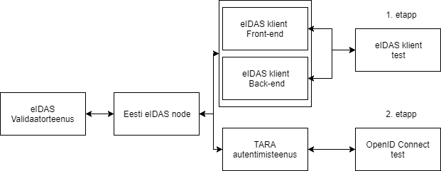
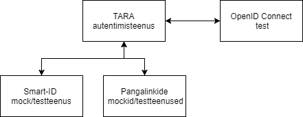
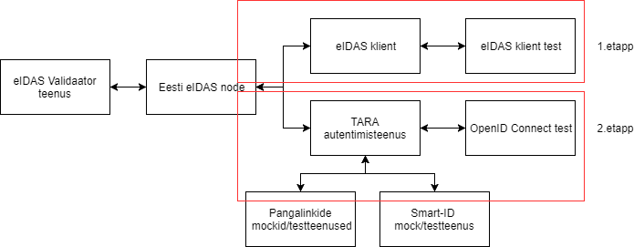
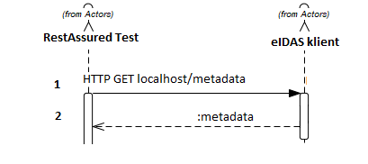
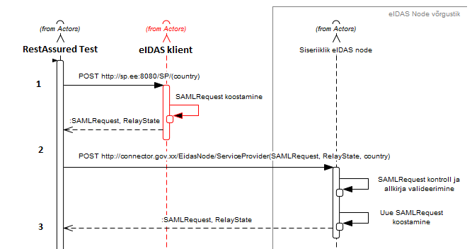
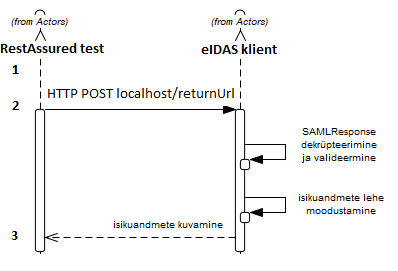
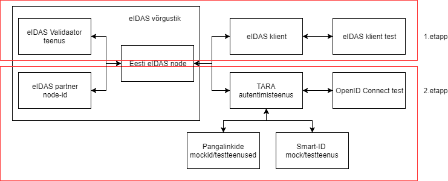

# QA strateegia

## Sissejuhatus

Selle dokumendi eesmärk on anda üldine ülevaade TARA projekti tarkvara arenduse kvaliteedi tagamise protsessist, tegevustest ja vahenditest.
Tegemist on "elusa" dokumendiga mida uuendatakse vastavalt projekti edenemisele. 

**Selles dokumendis ei käsitleta järgnevat:**
* Turvatestimist
* Jõudlustestimist
* Paigalduse testimist
* Tootestamist

## Keskkonnad ja infrastruktuur

Visioon on peamiselt kasutada kahte erinevat keskkonda: 
**Tsentraalne** - RIA taristusse paigaldatud eIDAS node, eIDAS klient ja TARA autentimisteenus. Uuendused paigaldatakse automaatselt kasutades Jenkinsit. Peamine eesmärk on teostada süsteemitestimist RIA IT profiilile vastavas keskkonnas, läbides muuhulgas kõik automaattestid. eIDAS node on ühendatud teiste riikide test eIDAS node-idega.

**Lokaalne** - arendaja arvutis üles seatav eIDAS node, eIDAS klient ja TARA autentimisteenus (kasutab Dockerit). Peamine eesmärk on hõlbustada arendust, probleemide uurimist ja koodi silumist. Väline liidestus teiste node-idega puudub.

**Hübriid** - eIDAS client on üles seatud välises infosüsteemis, ning liidestub RIA taristus asuva eIDAS node-i ja teiste riikide test eIDAS node-idega. Peamine eesmärk on teostada süsteemitestimist reaalsele süsteemi kasutusele omases keskkonnas.

## Arendusprotsess
Toodet arendatakse avatud koodiga arenduse põhimõtteid järgides kasutades GitHubi koodihoidlat. Kasutatakse kahte peamist haru:
* Master - tootestusvalmis kood koos vastava dokumentatsiooniga
* Develop - Arendatav kood

 
Joonis 1. Arendusprotsess

Arendusprotsessiks kasutatakse SCRUM-il põhinevat iteratiivset protsessi. Protsessil on järgmised olulised elemendid:

  * Tarkvara arendust hallatakse läbi töönimekirjade (backlog)
  * Kasutatakse kahe nädala pikkuseid sprinte
  * Toimuvad sprindi planeerimise ja lõpetamise koosolekud
  * Sprinte hallatakse läbi JIRA (sprint backlog)
  * Toimuvad hommikused meeskonna koosolekud
  * Toimuvad iganädalased projekti koosolekud lahtiste küsimuste arutamiseks ja sprintide planeerimiseks ning lõpetamiseks
  * Toimuvad retrospektiivid vähemalt korra kahe kuu jooksul
  * Töö lõpetamise tingimus (_definition of done_) arendustöö korral - arendustöö on läbinud koodi ülevaatuse, omab piisavat ühiktestide kaetust, piisavat dokumentatsiooni ning on läbinud nii arenduse kui vastuvõtu testimise. Piisava dokumentatsiooni põhikriteerium on, et “master” harus paiknevat koodi on alati võimalik kaasasolevat ehitus- ja paigaldusjuhendit järgides edukalt paigaldada RIA süsteemiadministraatorite poolt (kontroll teostatakse iga kord, kui toode tarnitakse testkeskkonda). Muude tööde korral lähtutakse töö iseloomust. “Done” staatusesse võib töid tõsta üksnes RIA osapool.

### Jira töövoog

Jira töövoo olekute kirjeldused:

  * Sprindi töönimekiri (To Do) - Antud sprindis teostatavad tööd
  * Töös olevad ülesanded (In Progress) - Hetkel töös olevad ülesanded
  * Ülevaatusel (In Review) - tehtud töö on ülevaatusel
  * Testimises (Test) - tehtud töö on arendaja poolsel testimisel
  * Vastuvõtu testimises (In Acceptance Test) -  tehtud töö on vastuvõtu testimisel või ülevaatusel
  * Lõpetatud (Done) - töö täidab lõpetamise tingimusi ning loetakse valminuks

### Jira tööülesannete nõuded vastavalt töö olekule

|Olek| Nõuded |
|-----|--------|
|Arenduse töönimekiri (backlog)|Arenduse töönimekirja võib sisestada tööülesandeid pealkirja tasemel mis kirjeldab ülesande peamist olemust. Enne sprindi planeerimist peab olema toote töönimekiri detailiseeritud tasemel mis võimaldab määrata tööde prioriteete ning anda ajahinnanguid.|
|Sprindi töönimekiri (To Do - sprint backlog)|Sprindi töönimekirjas olevad tööülesanded peavad omama ajahinnangut ning piisavalt detailset kirjeldust võimaldamaks teostada ülesande analüüsi. Erandiks võivad olla uurivad ülesanded, mille mahtu ei ole võimalik koheselt hinnata ning  mille maht täpsustub töö käigus.|
|Töös olevad ülesanded (In progress)|Töö käigus kirjeldatakse nõuded ning valitud lahendus. Kirjeldus peab olema piisavalt detailne võimaldamaks koodi ülevaatusel ja testimisel hinnata valminud töö vastavust nõuetele.|
|Ülevaatusel (In Review)|Ülevaatuse käigus parandatakse/täiendatakse ka tööülesande kirjeldust.|
|Testimises (Test)|Testimise käigus kirjeldatakse mida ja kuidas testiti. Hinnatakse tööülesande kirjeldust vastuvõtutestimise teostamiseks.|
|Vastuvõtu testimises (In Acceptance Test)|Märgitakse töö vastuvõetuks või tuuakse puuduste põhjendused|
|Lõpetatud (Done)|Töö vastab nõuetele|

## Kvaliteedi tagamise tegevused tarkvara arendusel

### Arendusprotsessi parendamine

Arendusprotsessi jälgitakse pidevalt ning kohandatakse vastavalt muutunud olukorrale. Oluliseks tagasisidestamiseks on retrospektiivid, kuid probleemidest tuleb teavitada koheselt.

### Ühiktestid

Uus funktsionaalsus peab olema kaetud ühiktestidega, piisav kaetus on antud funktsionaalsuse arendaja vastutada. Kaetuse määraks on 75% olulistest koodiridadest. Kood peab kompileeruma ning kõik ühiktestid tuleb läbida vigadeta, enne kui koodi võib lisada repositooriumi. Ühiktestide koodi arendatakse ning hallatakse samadest tööpõhimõtetest lähtudes (koodi stiil, parimad praktikad, ...) nagu tootekoodi.

### Staatiline testimine ja koodi ülevaatused

Staatilise analüüsi vahendina kasutatakse tsentraalses testkeskonnas SonarCube-i mis on liidestatud Jenkinsini töövooga. Lokaalselt kasutavad arendajad SonarLinti.

Kõik muudatused (kaasa arvatud ühiktestide muudatused) vaadatakse üle teise arendaja poolt. Ülevaatus peab jälgima koodi vastavust ka [mittefunktsionaalsetele nõuetele](https://e-gov.github.io/MFN/). Ülevaatusteks kasutatakse GitHubi "pull request" meetodit. Kõik koodi parendamise kommentaarid lisatakse GitHubi. Kood peab läbima ülevaatuse enne testimise algust.

## Testimine

### Testimise visioon

Eesmärk on automatiseerida testimise funktsionaalsust määral mis annab parimat kasu ajalises ning korduvkasutatavuse mõttes. Ühekordsed tegevused testitakse käsitsi, v.a kui nende automatiseerimine ei ole võimalik samaväärse ajakuluga.

### Testimise protsess
Testiplaani loomisel tuleb analüüsida testide jaotust ühik-, integratsiooni-, ning süsteemitestide vahel. Kuna tegu on keeruka süsteemiga mis koosneb mitmest välisest liidestusest mis ei ole meie kontrolli all, siis võib olla kiirem osad testid realiseerida ühiktestide tasemel.

 
Joonis 2. Automaatsete kontrollide protsess tsentraalses testkeskkonnas.

**Märkus:** Automaatsete kontrollide käivitamine lokaalselt täpsustub hiljem.

eIDAS autentimise automaatsed testid arendatakse kahes etapis:

**1.etapp - eIDAS kliendi testid**
Testitakse kliendi liidestatust Eesti eIDAS node-iga. SAML liidestuse peamine testimise etapp. Antud testid peavad tagama kasutatavate SAML komponentide õige toimimise. Testid peavad olema pidevalt kaasajastatud ka järgnevates etappides, kuna tagavad SAML liidese korrektse töö ning antud teste teistes etappides ei dubleerita.

**2.etapp - OpenID Connect testid**
Testitakse TARA võimekust konverteerida SAML liidesest tulevat infot OpenID Connect liidesesse. Eeldab SAML liidestuse korrektsust, mida testitakse esimeses etapis.

 
Joonis 3. eIDAS autentimise automaatsete testide etapid tsentraalses testkeskkonnas.

 
Joonis 4. TARA autentimisteenusele pangalinkide ning Smart-ID toe lisamise testimine.

### Veahaldus
Leitud vead raporteeritakse Jira veahaldussüsteemis ja nad läbivad sama elutsükli mis tööülesanded. Vead mis leitakse konkreetse tööülesande testimisel raporteeritakse kommentaarina tööülesande juures ning suunatakse tagasi arenduse etappi.

Vea raporteerimisel peavad olema kirjeldatud vähemalt järgmised elemendid:
* **Sammud vea kordamiseks** - Eeltingimused, sammud, ajalised piirangud, kui võimalik siis viide testijuhule või autotestile, 
* **Eeldatav tulemus** - Viide spetsifikatsioonile, standardile, ...
* **Tegelik tulemus** - Tulemuse kirjeldus
* **Lisad** - Vearaportile tuleb kaasata võimalikud abimaterjalid, logid, päringud, vastused, pildid, ...

Tähelepanu tuleb juhtida asjaolule, et avatud lähtekoodiga arenduse korral võidakse vigu raporteerida ka läbi GitHubi ning nendele tuleb reageerida.

### Integratsiooni testimine

Eesmärk:  testida erinevate komponentide liidestamist/koostööd.

 
Joonis 5. Integrarsioonitestid

**1.etapp eIDAS kliendi testimine**

eIDAS kliendi integratsiooni testimiseks kasutatakse RestAssured raamistikku, teste hoitakse koos eIDAS klient tootekoodiga vastavas repositooriumis. Teste käivitatakse automaatselt vastavalt Joonisel 2. näidatule.
RestAssured raamistikku kasutades asendatakse eIDAS kliendiga suhtlev veebilehitseja ning testitakse eIDAS kliendi SAML sõnumivahetust. Eelduseks on, et kasutatav pac4j teek on vastav SAML 2.0 protokollile ning testimisel keskendutakse eIDASest tingitud eripäradele.

eIDAS kliendil on järgnevad olulised funktsionaalsused mille testimine on esmatähtis ning mille automatiseerimine tundub mõtekas:
* Metaandmete publitseerimine
* Metaandmete lugemine
* Autentimise alustamine
* Autentimisvastuse saamine

 
Joonis 6. Metaandmete publitseerimise testimine

1) RestAssured raamistikus koostatakse metaandmete küsimise päring.
2) Vastusena saadud metaandmed valideeritakse.

**Lahtine küsimus**: Kuidas testime metaandmete lugemist (kas tulevad failist või tehakse päring)? "happy path" juhu saaks testida selliselt, et kui autentimise alustamine õnnestub siis on kõik ok? Metaandmete lugemisel tekkivad vead, timeoutid jms tuleks siiski testida. See oleks mõtekas teha unit testi tasemel?

 
Joonis 7. Autentimise alustamise testimine

1) RestAssured raamistikus koostatakse testandmetega päring. Reaalses rakenduses on kasutaja poolt valitud andmete hulk piiratud. Testimise eesmärgil võib vajalik olla eIDAS kliendi test režiimi loomine mis võimaldaks kõiki SAML parameetreid seadistada.
2) eIDAS kliendi poolt saadetud SAML päring valideeritakse RestAssured raamistikus. Valideerimise õnnestumisel saadetakse päring lokaalsesse eIDAS nodei.
3) eIDAS nodei vastus valideeritakse üldisel tasemel (uus SAML päring või veakood).

 
Joonis 8. Autentimisvastuse saamise testimine

1) Teostatakse "happy path" valideerimise alustuse voog.
2) Tagastatavad andmed saadetakse kas muutmatul kujul ("happy path" test) või modifitseeritud kujul (erijuhud) eIDAS klienti.
3) Kuvatavad isikuandmed või veakoodid valideeritakse.

Lisaks liidestuse automaatsele kontrollimisele tuleb käsitsi testida eIDAS kliendi näidis veebilehte:
* POST päringute korrektset tööd (kasutaja sekkumise vajadus/mittevajadus).
* Veebilehel info kuvamine ning kujundus.

**2. etapp - TARA autentimisteenuse testimine**

Täpsustub hiljem.

### Süsteemi testimine

Eesmärk: kasutuslugudes ja end-to-end stsenaariumite toimimises vigade leidmine.

 
Joonis 9. Süsteemitestid

**1.etapp eIDAS kliendi testimine**

Testitakse käsitsi, kaaluda võib "happy path" juhtude automatiseerimist. Peamine liidestumine testitakse kasutades eIDAS validaatorteenust. Andmete olemasolul tuleks kasutada ka teiste riikide eIDAS node testteenuseid. Oluline on tähelepanu pöörata võimalikele erinevustele isiku andmetes mida partnerriigid pakuvad.

**2.etapp TARA autentimisteenuse testimine**

Täpsustub hiljem.

### Vastuvõtu testimine

Eesmärk:  kontrollida toote või teenuse vastavust püstitatud nõuetele ja planeeritud otstarbele, st vastavust vastuvõtukriteeriumitele.

### Regressioonitestimine

Eesmärk: minimiseerida riski, et arendusega otseselt mitte seotud funktsionaalsustesse on  tekkinud tahtmatuid mõjutusi.

Regressioonitestimine viiakse läbi vastavalt regressiooninimekirjale.

