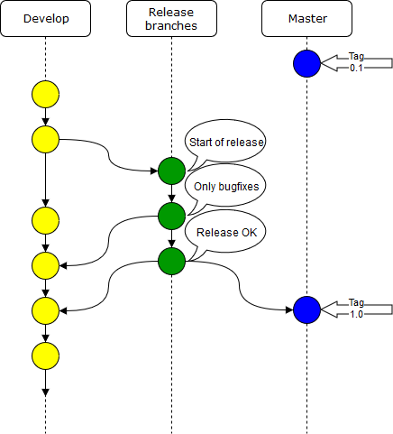
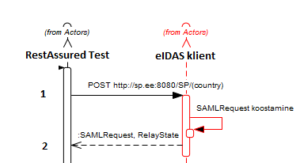

# [ARHIVEERITUD]

&#9888; Dokumenti ei ajakohastata. Palume siinsele teabele mitte tugineda.

# QA strateegia

- TOC
{:toc}

## Sissejuhatus

Selle dokumendi eesmärk on anda üldine ülevaade TARA projekti tarkvara arenduse kvaliteedi tagamise protsessist, tegevustest ja vahenditest.
Tegemist on "elusa" dokumendiga mida uuendatakse vastavalt projekti edenemisele. 

**Selles dokumendis ei käsitleta järgnevat:**
* Turvatestimist
* Jõudlustestimist
* Paigalduse testimist
* Tootestamist

NB! Antud dokumendis olevad joonised ei kajasta tegelikku TARA autentimisteenuse arhitektuuri, vaid on abstraktsioonid ilmestamaks kvaliteedi tagamisega seotud tegevusi.

## Keskkonnad ja infrastruktuur

Visioon on peamiselt kasutada kahte erinevat keskkonda: 
**Tsentraalne** - RIA taristusse paigaldatud eIDAS node, eIDAS klient ja TARA autentimisteenus. Uuendused paigaldatakse automaatselt kasutades Jenkinsit. Peamine eesmärk on teostada süsteemitestimist RIA IT profiilile vastavas keskkonnas, läbides muuhulgas kõik automaattestid. eIDAS node on ühendatud teiste riikide test eIDAS node-idega.

**Lokaalne** - arendaja arvutis üles seatav eIDAS node, eIDAS klient ja TARA autentimisteenus (kasutab Dockerit). Peamine eesmärk on hõlbustada arendust, probleemide uurimist ja koodi silumist. Väline liidestus teiste node-idega võib puududa.

## Arendusprotsess
Toodet arendatakse avatud koodiga arenduse põhimõtteid järgides kasutades GitHubi koodihoidlaid. 

 
Joonis 1. Arendusprotsess

Arendusprotsessiks kasutatakse SCRUM-il põhinevat iteratiivset protsessi. Protsessil on järgmised olulised elemendid:

  * Tarkvara arendust hallatakse läbi töönimekirjade (backlog)
  * Kasutatakse kahe nädala pikkuseid sprinte
  * Toimuvad sprindi planeerimise ja lõpetamise koosolekud
  * Sprinte hallatakse läbi JIRA (sprint backlog)
  * Toimuvad hommikused meeskonna koosolekud
  * Toimuvad iganädalased projekti koosolekud lahtiste küsimuste arutamiseks ja sprintide planeerimiseks ning lõpetamiseks
  * Toimuvad retrospektiivid vähemalt korra kahe kuu jooksul
  * Töö lõpetamise tingimus (_definition of done_) arendustöö korral - arendustöö on läbinud koodi ülevaatuse, omab piisavat ühiktestide kaetust, piisavat dokumentatsiooni ning on läbinud nii arenduse kui vastuvõtu testimise. Piisava dokumentatsiooni põhikriteerium on, et “master” harus paiknevat koodi on alati võimalik kaasasolevat ehitus- ja paigaldusjuhendit järgides edukalt paigaldada RIA süsteemiadministraatorite poolt (kontroll teostatakse iga kord, kui toode tarnitakse testkeskkonda). Muude tööde korral lähtutakse töö iseloomust. “Done” staatusesse võib töid tõsta üksnes RIA osapool.

**Jira töövoog**

Jira töövoo olekute kirjeldused:

  * Sprindi töönimekiri (To Do) - Antud sprindis teostatavad tööd
  * Töös olevad ülesanded (In Progress) - Hetkel töös olevad ülesanded
  * Ülevaatusel (In Review) - tehtud töö on ülevaatusel
  * Testimises (Test) - tehtud töö on arendaja poolsel testimisel
  * Vastuvõtu testimises (In Acceptance Test) -  tehtud töö on vastuvõtu testimisel või ülevaatusel
  * Lõpetatud (Done) - töö täidab lõpetamise tingimusi ning loetakse valminuks

**Jira tööülesannete nõuded vastavalt töö olekule**

|Olek| Nõuded |
|-----|--------|
|Arenduse töönimekiri (backlog)|Arenduse töönimekirja võib sisestada tööülesandeid pealkirja tasemel mis kirjeldab ülesande peamist olemust. Enne sprindi planeerimist peab olema toote töönimekiri detailiseeritud tasemel mis võimaldab määrata tööde prioriteete ning anda ajahinnanguid.|
|Sprindi töönimekiri (To Do - sprint backlog)|Sprindi töönimekirjas olevad tööülesanded peavad omama ajahinnangut ning piisavalt detailset kirjeldust võimaldamaks teostada ülesande analüüsi. Erandiks võivad olla uurivad ülesanded, mille mahtu ei ole võimalik koheselt hinnata ning  mille maht täpsustub töö käigus.|
|Töös olevad ülesanded (In progress)|Töö käigus kirjeldatakse nõuded ning valitud lahendus. Kirjeldus peab olema piisavalt detailne võimaldamaks koodi ülevaatusel ja testimisel hinnata valminud töö vastavust nõuetele.|
|Ülevaatusel (In Review)|Ülevaatuse käigus parandatakse/täiendatakse ka tööülesande kirjeldust.|
|Testimises (Test)|Testimise käigus kirjeldatakse mida ja kuidas testiti. Hinnatakse tööülesande kirjeldust vastuvõtutestimise teostamiseks.|
|Vastuvõtu testimises (In Acceptance Test)|Märgitakse töö vastuvõetuks või tuuakse puuduste põhjendused|
|Lõpetatud (Done)|Töö vastab nõuetele|

## Koodi versioneerimine

Koodiga töötamieks kasutatakse GitHubi harusid.
* Master - tootestusvalmis kood koos vastava dokumentatsiooniga. 
* Develop - arendatav kood
* Release - ajutine haru muudatuste testimiseks enne koodi masterisse mestimist.

Koodi versioneeritakse kasutades semantilist versioneerimist.

 
Joonis 2. Versioneerimine GitHubi harudes

## Kvaliteedi tagamise tegevused tarkvara arendusel

**Arendusprotsessi parendamine**

Arendusprotsessi jälgitakse pidevalt ning kohandatakse vastavalt muutunud olukorrale. Oluliseks tagasisidestamiseks on retrospektiivid, kuid probleemidest tuleb teavitada koheselt.

**Ühiktestid**

Uus funktsionaalsus peab olema kaetud ühiktestidega, piisav kaetus on antud funktsionaalsuse arendaja vastutada. Kaetuse määraks on 75% olulistest koodiridadest. Kood peab kompileeruma ning kõik ühiktestid tuleb läbida vigadeta, enne kui koodi võib lisada repositooriumi. Ühiktestide koodi arendatakse ning hallatakse samadest tööpõhimõtetest lähtudes (koodi stiil, parimad praktikad, ...) nagu tootekoodi.

**Staatiline testimine ja koodi ülevaatused**

Staatilise analüüsi vahendina kasutatakse tsentraalses testkeskonnas SonarCube-i mis on liidestatud Jenkinsini töövooga. Lokaalselt kasutavad arendajad SonarLinti.

Kõik muudatused (kaasa arvatud ühiktestide muudatused) vaadatakse üle teise arendaja poolt. Ülevaatus peab jälgima koodi vastavust ka [mittefunktsionaalsetele nõuetele](https://e-gov.github.io/MFN/). Ülevaatusteks kasutatakse GitHubi "pull request" meetodit. Kõik koodi parendamise kommentaarid lisatakse GitHubi. Kood peab läbima ülevaatuse enne testimise algust.

## Testimine

**Testimise visioon**

Eesmärk on automatiseerida testimise funktsionaalsust määral mis annab parimat kasu ajalises ning korduvkasutatavuse mõttes. Ühekordsed tegevused testitakse käsitsi, v.a kui nende automatiseerimine ei ole võimalik samaväärse ajakuluga.

**Testimise protsess**

Testiplaani loomisel tuleb analüüsida testide jaotust ühik-, integratsiooni-, ning süsteemitestide vahel. Kuna tegu on keeruka süsteemiga mis koosneb mitmest välisest liidestusest mis ei ole meie kontrolli all, siis võib olla kiirem osad testid realiseerida ühiktestide tasemel. Vastav seos testijuhtude ning testitasemete vahel tuleb kajastada testijuhtude kirjelduses.

 
Joonis 3. Automaatsete kontrollide protsess tsentraalses testkeskkonnas.

eIDAS TARA autentimise automaatsed testid arendatakse kahes etapis:

1.etapp - eIDAS kliendi testid
Testitakse kliendi liidestatust Eesti eIDAS node-iga. SAML liidestuse peamine testimise etapp. Antud testid peavad tagama kasutatavate SAML komponentide õige toimimise. Testid peavad olema pidevalt kaasajastatud ka järgnevates etappides, kuna tagavad SAML liidese korrektse töö ning antud teste teistes etappides ei dubleerita.

2.etapp - OpenID Connect testid
Testitakse TARA võimekust konverteerida SAML liidesest tulevat infot OpenID Connect liidesesse. Eeldab SAML liidestuse korrektsust, mida testitakse esimeses etapis.

 
Joonis 4. eIDAS autentimise automaatsete testide etapid tsentraalses testkeskkonnas.

Peale eIDAS võimekuse loomist testitakse siseriikle autentimisvahendeid. 
 
Joonis 5. TARA autentimisteenusele pangalinkide ning Smart-ID toe lisamise testimine.

**Veahaldus**
Leitud vead raporteeritakse Jira veahaldussüsteemis ja nad läbivad sama elutsükli mis tööülesanded. Vead mis leitakse konkreetse tööülesande testimisel raporteeritakse kommentaarina tööülesande juures ning suunatakse tagasi arenduse etappi.

Vea raporteerimisel peavad olema kirjeldatud vähemalt järgmised elemendid:
* Sammud vea kordamiseks** - Eeltingimused, sammud, ajalised piirangud, kui võimalik siis viide testijuhule või autotestile, 
* Eeldatav tulemus - Viide spetsifikatsioonile, standardile, ...
* Tegelik tulemus - Tulemuse kirjeldus
* Lisad - Vearaportile tuleb kaasata võimalikud abimaterjalid, logid, päringud, pildid, ...

Tähelepanu tuleb juhtida asjaolule, et avatud lähtekoodiga arenduse korral võidakse vigu raporteerida ka läbi GitHubi ning nendele tuleb reageerida.

**Integratsiooni testimine**

Eesmärk:  testida erinevate komponentide liidestamist/koostööd.

1.etapp eIDAS kliendi testimine

eIDAS kliendi integratsiooni testimiseks kasutatakse RestAssured raamistikku. Teste käivitatakse automaatselt vastavalt Joonisel 2. näidatule.
RestAssured raamistikku kasutades asendatakse eIDAS kliendiga suhtlev veebilehitseja ning testitakse eIDAS kliendi SAML sõnumivahetust. Eelduseks on, et kasutatav pac4j teek on vastav SAML 2.0 protokollile ning testimisel keskendutakse eIDASest tingitud eripäradele.

eIDAS kliendil on järgnevad olulised funktsionaalsused mille testimine on esmatähtis ning mille automatiseerimine tundub mõtekas:
* Metaandmete publitseerimine
* Metaandmete lugemine
* Autentimise alustamine
* Autentimisvastuse saamine

 
Joonis 6. Metaandmete publitseerimise testimine

1) RestAssured raamistikus koostatakse metaandmete küsimise päring.

2) Vastusena saadud metaandmed valideeritakse.

Metaandmete lugemist testitakse ühiktesti tasemel, kuna integratsioonitesti tasemel ei ole võimalik seda valideerida.

 
Joonis 7. Autentimise alustamise testimine

1) RestAssured raamistikus koostatakse testandmetega päring. Reaalses rakenduses on kasutaja poolt valitud andmete hulk piiratud. Testimise eesmärgil võib vajalik olla eIDAS kliendi test režiimi loomine mis võimaldaks kõiki SAML parameetreid seadistada.

2) eIDAS kliendi poolt saadetud SAML päring valideeritakse RestAssured raamistikus.

 
Joonis 8. Autentimisvastuse saamise testimine

1) Teostatakse ideaaljuhu valideerimise alustuse voog eIDAS kliendis nagu kirjeldatud autentimise alustamise punktis.

2) RestAssured raamistikus koostatakse SAML vastus mis saadetakse eIDAS kliendile.

3) eIDAS kliendi JSON vastus valideeritakse RestAssured raamistikus.

2.etapp - TARA autentimisteenuse testimine

TARA autentimisteenus koosneb erinevatest autentimisviisidest mis põhinevad kõik erinevatel tehnilistel autentimislahendustel.

* ID kaardiga autentimine - varasemalt arendatud ning testitud, ei kuulu integratsioonitestide skoopi.
* Mobiil ID autentimine - varasemalt arendatud ning testitud, ei kuulu integratsioonitestide skoopi.
* eIDAS autentimine - uus arendus, integratsioonitestide skoobis.
* Pangalinkide autentimine - uus arendus, integratsioonitestide skoobis.
* SmartID autentimine - uus arendus, integratsioonitestide skoobis.

Testimiseks kasutatakse RestAssured raamistikku. Teste käivitatakse automaatselt vastavalt Joonisel 2. näidatule. RestAssured raamistikku kasutades asendatakse TARA-ga liidestuv infosüsteem ning 
veebilehitseja ning simuleeritakse kasutajapoolseid päringuid.

eIDAS autentimise testimine

Testitakse TARA, eIDAS kliendi ning Eesti eIDAS nodei koostööd.

 
Joonis 9. eIDAS autentimise integratsioonitestid

Testitakse järgmised funktsionaalsused:

* eIDAS autentimise positiivne ja negatiivne voog
* eIDAS spetsiifiliste parameetrite toimimine 
* OpenID connect autentimisvastuse korrektsus

 
Joonis 10. eIDAS autentimise flow

Joonisel 10. kujutatud voog on lihtsustatud ning ei kajasta kõiki tegelikke päringuid. Eesmärk on anda ettekujutust testsüsteemi põhimõttest. Kogu liikumine erinevate osapoolte vahel toimub läbi HTTP redirect või POST käskude.

1) RestAssured raamistikus koostatakse OpenID Connect autentimise alustamise päring ning saadetakse TARA-le. Toimub mitu ümbersuunamist ning kuvatakse autentimisvahendite leht.

2) Valitakse eIDAS autentimise vahend. Toimub mitmeid ümbersuunamisi kuni Eesti eIDAS konnektorteenuseni.

3) RestAssured raamistik simuleerib välisriigi eIDAS node-i ja vastab Eesti eIDAS node-le SAML vastusega. Toimub mitmeid ümbersuunamisi ning test raamistikule tagastatakse autoriseerimiskood.

4) RestAssured raamistik küsib autoriseerimiskoodi kasutades identsustõendi. 

5) Toimub identsustõendi valideerimine.

Pangalinkide testimine

Testitakse TARA ning panga autentimisteenuse koostööd. Arvestama peab asjaoluga, et igal pangal võib olla liidestumisel eripärasid. Testimiseks luuakse juhitavad mockid. 

 
Joonis 11. Pangalingi autentimise integratsioonitestid

Testitakse järgmised funktsionaalsused:

* Pangalingi autentimise positiivne ja negatiivne voog
* OpenID connect autentimisvastuse korrektsus

SmartID testimine

Testitakse TARA ning SmartID autentimisteenuse koostööd.

 
Joonis 12. SmartID autentimise integratsioonitestid

Testitakse järgmised funktsionaalsused:

* SmartID autentimise positiivne ja negatiivne voog
* OpenID connect autentimisvastuse korrektsus

**Süsteemi testimine**

Eesmärk: kasutuslugudes ja täisvoo stsenaariumite toimimises vigade leidmine.

 
Joonis 13. Süsteemitestid

**Vastuvõtu testimine**

Eesmärk: kontrollida toote või teenuse vastavust püstitatud nõuetele ja planeeritud otstarbele, st vastavust vastuvõtukriteeriumitele.

**Regressioonitestimine**

Eesmärk: minimiseerida riski, et arendusega otseselt mitte seotud funktsionaalsustesse on  tekkinud tahtmatuid mõjutusi.

Regressioonitestimine viiakse läbi vastavalt regressiooninimekirjale.

## Mõistete seletused

ideaaljuhu voog - testjuht kus kasutatakse valiidset sisendit ning kasutusvoog läbitakse ilma vigadeta.
täisvoog - kasutusvoog kus läbitakse kõik süsteemi komponendid. Hõlmab nii positiivseid kui negatiivseid juhte.

## Muutelugu

| Versioon, kuupäev | Muudatus |
|-----------------|--------------|
| 1.1, 31.05.2018   | Struktuurilised parandused, autentimisvahendite testimine. |
