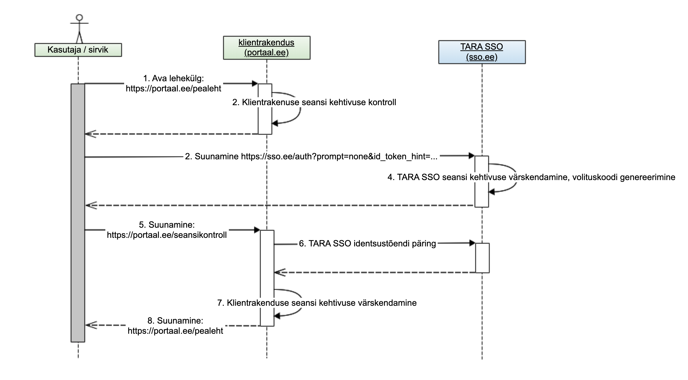

# Riigi SSO teenuse (GOVSSO) projektlahendus

- TOC
{:toc}

## Sõnastik

- OAuth – avatud standard kasutajate autoriseerimiseks. (Viited, [OAUTH])
- OIDC – OpenID Connect, standardne protokoll internetis kasutajate autentimiseks, baseerub OAuth 2.0 raamistikul.
- OIDF – OpenID Foundation, OpenID tehnoloogiate edendamist, arengut ja standardiseerimist juhtiv rahvusvaheline mittetulunduslik organisatsioon.
- SSO – _single-sign-on_ ehk ühekordne sisselogimine. Pääsu reguleerimise funktsioon, mis võimaldab kasutajal pöörduda üheainsa logimisega paljude eri ressursside poole. (Viited, [AKIT])
- TARA – Riigi autentimisteenus
- GOVSSO – ühekordse sisselogimise funktsionaalsus TARA teenuses (tehniliselt võib olla SSO funktsionaalsust pakkuv rakendus TARA teenuse ees)
- sirvik – lõppkasutaja masinasse paigaldatud tarkvara, mille kaudu inimene teenusepakkuja keskkonda (ja GOVSSO teenust) kasutab
- klientrakendus – TARA ja/või GOVSSO teenust tarbiv asutuse infosüsteem. Võib olla nii asutusesisene e-teenus kui ka asutusesisene SSO lahendus
- OP – OpenID Connect Provider ehk OIDC protokolli järgi teenust pakkuv server
- eeskanal – OIDC kliendi ja serveri vaheline suhtlus, kus sõnumid liiguvad läbi sirviku ja on lõppkasutajale nähtavad (_front-channel_)
- taustakanal – OIDC kliendi ja serveri vaheline suhtlus, kus sõnumid liiguvad klientrakenduse ja GOVSSO serveri vahel sirviku vahenduseta (_back-channel_)

## Eesmärk

Analüüsida ja pakkuda välja tehnilise lahenduse kirjeldus TARAs ühekordse sisselogimise (SSO) teenuse implementeerimiseks. SSO teenuse äriline eesmärk on riigi autentimisteenuses tasuliste autentimispäringute arvu vähendamine ja seeläbi riigi autentimisteenuse kulude optimeerimine. Korduvate autentimiste vähendamisega paraneb ka Riigi autentimisteenuse kasutusmugavus.

## TARA SSO kirjeldus ja analüüsi skoop

Analüüsi käigus valitakse TARA tehnilise lahendusega ja Eesti kontekstiga sobivad OIDC protokollistiku kasutusvood ja –elemendid. GOVSSOd käsitletakse keskse autentimise lahendusena ega uurita keskse autoriseerimise lahenduse aspekte. See tähendab, et SSO analüüsis ei vaadelda isiku erinevate esindusõigustega seotud nüansse, vaid keskendutakse n-ö kodaniku vaatele.

GOVSSO teenuse ülesanne ei ole välja vahetada asutuses juba kasutusel olevat ühekordse sisselogimise komponenti. Kasutajate autoriseerimise loogika tuleb endiselt lahendada asutuse või valdkonna sees. Keskse ligipääsuhalduse teostus on ka OIDC protokollistikus teostatav, kuid nõuab mahukamat detailset analüüsi asutuste ja valdkondade spetsiifiliste nõuete osas.

Rakendame GOVSSOs OIDC ja OAuth 2.0 tehnilisi protokolle. OIDC on avatud standard, mis on turul olnud pikka aega ning on toetatud laias hulgas standardteekides ja karbitoodetes. Käesoleva analüüsi eesmärk ei ole tõestada OIDC protokolli ja tema erinevate autentimisvoogude turvalisust. Seda teemat on varasemalt põhjalikult uuritud ning levinumad implementatsioonivead ja -ründed on hästi teada (Viited, [OAUTH THREAT], [SSO SECURITY]). Analüüsi eesmärk on rakendada OIDC protokolli tuumikspetsifikatsiooni ja selle seansihaldusega seotud laiendusi GOVSSO jaoks sobival moel. Tuleb leida keskse seansihalduse lahendus, mille puhu säiliks praeguse TARA teenuse kõrge turvatase, kuid mis oleks ka tehniliselt piisavalt paindlik.

Usaldusahela vaatest keskendume mudelile, kus GOVSSO on keskne autentimise seansi ja identiteedi hoidja ning GOVSSO klientideks asutused (kellel omakorda võib olla kasutusel oma sisemine SSO lahendus GOVSSO taga). Tehnilises analüüsis ega POC lahenduse skoobis ei keskenduta riigi autentimisteenuse födereeritud lahendusele, kus GOVSSO koos teiste alternatiivsete SSO lahendustega moodustaks OIDC hajutatud autentimisteenuse pakkujate võrgustiku (Viited, [OIDC Federated]).

Autentimisel luuakse kasutaja seadme (sirviku) ja GOVSSO komponendi vahel autentimise seanss, mille tunnus on salvestatud kasutaja seadmesse. Kogu SSO turvaahela seisukohast on kriitiline, et ligipääs sellele tunnusele on piiratud ja seansitõend hävitatakse, kui kasutaja on lõpetanud klientrakenduse ühenduse. Seansi tunnuse lekkimine on keskse seansihalduse vaatest kõige suurem risk, sest tunnuse lekkimine annab kuritahtlikule kasutajale loa siseneda kõikidesse SSOga liidestatud klientrakendustesse. Riski maandamiseks analüüsitakse ja koostatakse lisaks autentimisele seansi kehtivuse mudel, seansi kehtivuse kontrolli voog, seansi kehtivuse pikendamise voog ja seansi lõpetamise voog.

## GOVSSO nõuded

### TARA senise voo säilitamine

Kliendid, kellel pole keskse seansihalduse järele vajadust, peaksid saama jätkata TARA teenuse kasutamist senisel kujul. Igasugune lisaarendus olemasolevatele klientidele GOVSSO teenuse lisandumisega tuleks välistada. Seda kasutusjuhtu toetab valitud arhitektuuriline lahendus, kus GOVSSO komponent paigaldatakse TARA komponendist eraldi. GOVSSO toetamiseks vajalikud muudatused saab TARA protokollis teha ilma olemasolevate klientide liidest muutmata. SSO funktsionaalsuse toetamiseks on soovitatav TARA liideses sisendparameetrina implementeerida klientrakenduse identifikaatori vastuvõtmise võimalus. GOVSSO kasutab vastavat päringu välja, et edastada GOVSSO komponendist autentimispäringu saatnud klientrakenduse identifikaator TARA komponendile. Väli peab TARA protokollis olema mittekohustuslik ja lubatud kasutada ainult GOVSSO serveri edastatud päringute korral.

Kui tavapärases TARA autentimise voos tehakse eeldus, et klientrakendus on enne autentimise alustamist andnud kasutajale võimaluse tutvuda isikuandmete töötlemise reeglitega, siis SSO voos tekib oht, et kasutaja ei märka, kui tema andmed süsteemide vahel liiguvad. Tulenevalt asutuste ja infosüsteemide vaheliste isikuandmete töötlemise põhimõtete erisustest peab GOVSSO autentimise voos sisse tooma kasutaja volituse küsimise sammu. Volituse lehega säilib kasutajal võimalus sisselogimisest keelduda.

Uue SSO lahenduse välja töötamise üheks oluliseks nõudmiseks on võimalikult suur tagasiühilduvus olemasoleva TARA lahendusega. Keskse sisselogimisega TARA teenusest huvitatud asutused peaksid selle saama implementeerida võimalikult väikese vaevaga. Kuna olemas olev TARA teenus töötab OIDC protokollil ja on laialdaselt kasutusele võetud, on põhjendatud ka GOVSSO teenuse puhul järgida sama protokollistikku.

### Asutusteülene ja asutusesisene SSO

Analüüsi käigus keskendume riigi autentimisteenusele keskse seansihalduse funktsionaalsuse lisamisele. Riigi autentimisteenus tegeleb kasutaja autentimisega ega tegele kasutaja autoriseerimisega (tema esindusõigustega). See tähendab, et autentimisteenus keskendub pigem kodaniku vaatele, mitte niivõrd ametniku vaatele. Riikliku autentimisteenuse kontekstis ei oma suurt tähtsust, kas klientrakendused asuvad ühe asutuse piires või mitme erineva asutuse haldusalas. Riigi autentimisteenus saab kõikidele SSOga liidestatud klientrakendustele pakkuda autentimise ja seansihalduse teenust samadel alustel.

Koostatud protokolli ja vaadeldud arhitektuuri puhul on arvestatud, et kui asutuse või haldusala piires on erisused autentimisel tagastatavate andmete osas, peavad need olema lahendatud asutusesisese SSO abil. Näiteks tagastab praegune TARA teenus e-posti aadressi ainult siis, kui kasutaja valib autentimisvahendiks ID-kaardi. Kuna iga klientrakendus saab TARA autentimise päringuga juhtida autentimisvahendite valikut sõltumata teistest klientrakendustest, saavad klientrakendused üksteisest sõltumatult juhtida ka seda, millised isikuandmed identsustõendi koosseisu jõuavad. GOVSSO puhul paraku pärast seansi alguses tehtud autentimist enam isikuandmete koosseis muutuda ei saa. Kui SSO seanssi ei alustatud ID-kaardiga, pole e-posti aadressi sinna hiljem võimalik lisada. Sellest tulenevalt on protokolli koostamisel arvestatud, et GOVSSO klientrakendus võib olla nii asutusesisene SSO lahendus kui mistahes asutuse poolt pakutav teenuseportaal. GOVSSO server saaks vajadusel isikuandmeid klientrakendustele väljastada OIDC protokolli kohase kasutajainfo (UserInfo) otspunkti kaudu. See aga teeks GOVSSO protokolli keerukamaks ja suurendaks liidestamiskulu.

Intervjuudest riigiasutuste IT-spetsialistidega sai ka kinnitust, et asutusesisese lahenduse erisused puudutavad pigem autoriseerimist kui autentimist. Praegu on suurematel asutustel juba endal kasutusel kesksed autoriseerimise süsteemid. Autoriseerimise reeglite ühtlustamine riiklikul tasandil ei mahu GOVSSO skoopi ning nõuab eraldi põhjalikumat analüüsi valdkondade ja asutuste nõuete osas.

Märkus: analüüsi käigus käsitlesime alternatiivset SSO andmemudelit, mille puhul klientrakendusi saaks GOVSSOs omavahel grupeerida. Klientrakenduste grupi sees toimuks autentimine ainult üks kord ning grupist välja logides tühistatakse kõik selle grupiga seotud seansid. Kui grupi sees on ühe rakenduse kohta SSO seansi jooksul kasutaja juba andnud volituse sisse logida, siis teiste puhul seda enam küsima ei peaks. Sellise mudeli rakendamisel aga oleksime kaotanud eelise, mida pakub kasutaja volituse küsimise ühtlustatud loogika, mida kirjeldame peatükis "Kasutaja teavitamine enne isikuandmete jagamist klientrakendusega". Lähtudes GOVSSO kõrgetest turvanõuetest ja kasutusmugavusest, otsustasime selle mudeliga mitte edasi liikuda.

### eesti.ee seansi üleandmine

Riigiportaalis eesti.ee on varasemalt kasutatud nii-öelda seansi üleandmise funktsionaalsust (Viited, [TARA Legacy]). Vana seansi üleandmise protokoll ei ole standardiseeritud ja nõuab teenusepakkujalt märkimisväärset tarkvaraarendust. Seansi üleandmiseks vahetatakse taustakanalis (üle X-tee) autoriseerimise infot teenuste serverkomponentide vahel ning eduka autoriseerimise korral suunatakse kasutaja sirvik koos unikaalse autoriseerimiskoodiga teise teenusepakkuja portaali. Suunamise järel tekitatakse automaatselt kasutajat vastuvõtvas teenuses seanss. Loodud seanss ei ole tehniliselt enam eesti.ee seansiga ühenduses.

GOVSSOd implementeerides saab seansi üleandmise kasutusjuht täidetud. OIDC protokollil põhinev keskne seansihaldusteenus pakub sama funktsionaalsust juba standardiseeritud kujul. Seansi üleandmise eelduseks on, et mõlemad osapooled on liidestatud GOVSSO teenusega. Pakutud OpenID Connect profiili järgi pole eesti.ee seansi üleandmist tarvis eraldi kasutusjuhuna käsitleda.

### Piiriülese autentimise (eIDAS) ja GOVSSO kooskasutamine

GOVSSO teenuse näol on tegemist riigi autentimisteenuse vahendusteenusega. Kõik autentimise meetodid, mis on võimalikud TARA puhul, on võimalikud ka GOVSSO puhul. Kuna GOVSSO ei paku nii täpset autentimisvahendite valiku juhtimist kui praegune TARA protokoll, ei ole GOVSSO puhul ainult piiriülese autentimise lubamine enam võimalik (Viited: [TARA] "4.1.3 Autentimismeetodite valikuline kasutus" `eidasonly` skoobi parameeter). See tähendab, et autentimisvahendite valikus on eIDAS autentimine alati lubatud.

## Arhitektuuri kirjeldus

Plaanitav GOVSSO arhitektuur mõjutab olulisel määral analüüsitava protokolli disaini. Analüüsi käigus uurisime GOVSSO implementeerimiseks kahte alternatiivset arhitektuuri mudelit.

Esimeses variandis vaatlesime kõrgvaatelist arhitektuuri, milles seansihaldus on lahendatud olemasoleva TARA teenuse ja protokolli koosseisus. Lahenduse eeliseks on TARA ja GOVSSO arenduste ja halduse ühendamine. Liidestaja vaatest eksisteeriks üks riiklik OIDC teenusepakkuja ja liitumisel valitakse ära, millises mahus protokolli kasutatakse. Kõige kriitilisem on sellise lahenduse juures muudatuste tagasiühilduvus. OIDFi pakutavad seansihalduse spetsifikatsioonide kavandid on tagasiühilduvad OIDC põhiprotokolliga (Viited [OIDC Core]). Eelanalüüs tõi TARA kontekstis välja kaks olulist kitsaskohta:

1. TARA praeguses protokollis võimaldatakse autentimisvahendi valikut juhtida klientrakenduse poolelt. Juhtimine käib skoobi parameetri abil ja määratud skoobid on üksteist välistavad. Skoobi kaudu autentimisvahendi juhtimise muutmine tuleb GOVSSOs meie hinnangul eemaldada ja seeläbi poleks TARA autentimise voog enam tagasiühilduv. Seega kujutab niisugune muudatus otsest vastuolu analüüsi nõudega TARA olemasoleva voo säilitamise kohta. Täpsem probleemi kirjeldus on toodud peatükis "Autentimise tasemete valik GOVSSO autentimisel (LoA)".

2. Eelanalüüsi käigus selgus, et seansihalduse äriloogika lisamine TARA olemas olevasse protokolli seaks piiranguid TARA tulevikuarenduste osas. Mida keerulisemaks muutub autentimise loogika TARAs, seda keerulisem on leida karbitoodet või standardteeki, mis antud hübriidtöövoogu sobivalt ka implementeeriks. Seetõttu võib kogu TARA koos SSOga lahenduse arenduskulu hoopis tõusta nii GOVSSO implementeerija kui ka liidestaja jaoks.

Teise variandina vaatasime arhitektuuri mudelit, milles käsitletakse GOVSSO teenust eraldiseisva komponendina olemasoleva TARA teenuse ees.

Joonis 1: Riigi autentimisteenuse kõrgvaateline arhitektuur

Nende komponentide jaotus aitab kõige paremini tagada GOVSSO teenuse esimest kasutusjuhtu - TARA senise voo säilitamist. Kogu SSO funktsionaalsuse eraldiseisvasse rakendusse viimine tagab olemasoleva TARA voo ja protokolli maksimaalse sõltumatuse SSO teenuse arendustest. TARA teenuse vaatest on GOVSSO näol tegemist tavalise OIDC klientrakendusega. Suhtlus TARA ja GOVSSO vahel toimub üle OIDC protokolli ja on dikteeritud TARA arendustest. Arvestades, et OIDF pole kinnitanud ühtegi standardit seansihalduse kohta OIDC protokollis, on põhjendatud mitte rutata TARA protokollis mitte-standardsete muudatustesisseviimisega.

Asutuse vaatest on GOVSSO teenuse näol tegemist TARAst eraldi seisva OIDC teenusepakkujaga. GOVSSO teenus pakub eranditult ainult koos keskse seansihalduse toega OIDC teenust. See tähendab, et tavapärast TARA autentimise voogu ei ole võimalik selle teenuse kaudu kasutada. Kuna TARA ja GOVSSO vood esitavad klientrakenduste sisemisele seansihalduse keerukusele väga erinevaid nõudeid, näeme, et ühe klientrakenduse piires TARA ja GOVSSO ristkasutus ei ole praegu arvestatava tähtsusega kasutusjuhtude hulgas. Kui tulevikus tekib vajadus kasutada ühes klientrakenduses nii TARA kui ka GOVSSOd, tuleks kaaluda alternatiivseid arhitektuurilisi lahendusi, kus otsustuskoht ei ole lõppkasutaja käes. GOVSSO kasutatavuse testide tulemused tõid välja, et lõppkasutajad ei oska TARA ja GOVSSO vahel valikut teha.

Ei ole välistatud, et klientrakenduses tehakse GOVSSO tõrke korral automaatne siire TARA teenusele. Kuna GOVSSO teenus sõltub suuresti TARA teenuse käideldavusest ja TARA tõrke korral on suure tõenäosusega häiritud ka GOVSSO teenus, ei ole sellise lahenduse kasutamine ärikriitiliste teenuste puhul soovitatav. Ärikriitilistes klientrakendustes on sisselogimise tõrkekindluse suurendamiseks eelistatav lisaks GOVSSO-le teha liidestamine otse alternatiivsete autentimisteenuste pakkujatega (mobiil-ID, Smart-ID või muud teenused). Niisuguse soovituseni jõuti RIA tellitud eID infrastruktuuri tõrkekindluse analüüsis (Viited [EID FAILURE], 4. Prioritiseeritud ettepanekud).

Pakutud arhitektuuri nõrgaks küljeks võib lugeda TARA ja GOVSSO halduse keerukuse tõusu. Paratamatult hakkavad kummagi teenuse protokolli arendused omaette kulgema ja OIDC turvaparanduste korral tuleb teha muudatused mõlemas protokollis paralleelselt. Kahe kriitilise komponendi ülalpidamine suurendab haldusosakonna koormust.

Võrreldud mudelitest lugesime sobivamaks teise variandi. Eraldades TARA ja GOVSSO teenused, saame koostada protokolli, mis katab paremini GOVSSO kasutusjuhte. TARA liides ei pea muutuma ja täiendavat arendust TARA klientrakendustelt ei ole tarvis.

## GOVSSO OIDC protokoll

### Protokolli ülevaade

Kasutaja autentimine toimub OIDC volituskoodi voo järgi (Viited, [OIDC Core], 3.1. Authentication using the Authorization Code Flow). Seda voogu kasutab ka TARA server ja seda peetakse üldiselt kõige turvalisemaks. Standardprotokolliga võrreldes viime sisse mõned kohandused, et tõsta protokolli voo üldist turvalisust. Kohandused piirduvad mittekohustuslike parameetrite kohustuslikuna määramisega ning on tehtud arvestusega, et need on OIDC standardiga kooskõlas ja olemasolevate tarkvaradega konflikte ei tekita. Kohandused on eraldi märgistatud GOVSSO protokolli tehnilises kirjelduses.

Märgime siinkohal, et OIDC protokolli ei töötatud algselt välja keskse seansihalduse lahenduste tarvis. Keskendutud on kesksele sisselogimisele mitte kesksele väljalogimisele. Seansihalduse lisad (Viited, [OIDC Session], [OIDC Back]) OIDC protokollis on suhteliselt uued ja mitte üheski ametlikus OIDC vastavuse profiilis (Viited, [OIDC Conformance]) pole seansihalduse teemasid seni veel käsitletud. OIDC seansihalduse laiendused on praegu kavandi staatuses ja viimati tehti neis muudatusi kolme aasta eest. Ametlikud vastavustestid ja implementatsiooni juhend OIDC väljalogimise laienduste kohta on veel piloteerimisfaasis (Viited, [OIDC Conformance RPLogout], [OIDC Conformance OPLogout]). Sellegipoolest on nende spetsifikatsioonide tugi osas levinud OIDC teekides ja karbitoodetes juba praegu olemas (Viited, [OIDC CertOP], [OIDC CertRP]).

Põhiline erisus, mille SSO funktsionaalsus tavapärasele TARA töövoole lisab ongi kasutaja sirviku ja GOVSSO vahelise seansi haldus. SSO seansi tunnust hoitakse sirviku turvaküpsises. Küpsis on loetav ainult GOVSSO domeeni kontekstis, mis tähendab, et GOVSSO seansi staatuse kontroll nõuab OIDC protokollis alati kasutaja suunamist GOVSSO autentimise otspunktile (Viited, [OIDC Core], 3.1.2.  Authorization Endpoint). OIDC protokolli kasutusvoog baseerub täielikult kasutaja sirviku suunamisel, sest nii on garanteeritud, et ilma kasutaja seadmeta ei ole klientrakenduse poolelt võimalik seansi olekut mõjutada.

OIDFi koostatud kolmest seansihaldusega seotud spetsifikatsiooni kavandist rakendame GOVSSOs kahte: 

1. OpenID Connect Session Management (Viited, [OIDC Session]) - kirjeldab seansi lõpetamise ja seansi oleku kontrolli lahendust. Seansi oleku kontroll toimub sirvikusse laetud nähtamatu raami (iFrame) kaudu SSO seansi küpsise sisu kontrollil. Kuigi see lahendus aitaks mõnevõrra vähendada seansi oleku kontrolliga seotud päringuid GOVSSO pihta, ei saa seda lõplikult usaldusväärseks pidada. Sirvikut tuleb käsitleda kui mitteusaldusväärset allikat, kuna on hõlpsasti rünnatav kasutaja seadmesse paigaldatud pahavara poolt. Seda spetsifikatsiooni rakendame GOVSSOs ainult osaliselt. Järgime ainult punktis 5 kirjeldatud seansi lõpetamise voogu klientrakenduse poolt (Viited, [OIDC Session] "5. RP-Initiated logout"), sest seda mustrit kasutatakse ka taustakanali kaudu seansi lõpetamise spetsifikatsioonis (Viited, [OIDC Back]).
2. OpenID Connect Back-Channel Logout (Viited, [OIDC Back]) - kirjeldab seansi lõpetamise voogu, kus suhtlus klientrakenduse ja GOVSSO vahel käib läbi taustakanali (mitte läbi sirviku). GOVSSO saadab väljalogimisel kõikidele sama SSO seansiga seotud klientrakendustele allkirjastatud väljalogimise tõendi. Klientrakendus tuvastab välja logitava kasutaja tõendis olevate `sub` (subjekt) ja `sid` (seansi tunnus) väljade järgi (Viited, [OIDC Back] "2.4.  Logout Token"). Tõend on allkirjastatud sama võtmega, mida GOVSSO kasutab identsustõendi allkirjastamiseks.

Kuigi OIDF on avaldanud ka eeskanali kaudu seansi lõpetamise kavandi (Viited [OIDC Front]), GOVSSO raames selle voo tugi kohustuslik ei ole. Sõnumivahetus taustakanali kaudu katab paremini GOVSSO kasutusjuhte ja on tavapäraste veebirakenduste korral usaldusväärsem. Kui GOVSSO implementatsiooni käigus selgub, et eeskanali kaudu seansi lõpetamise tugi on teostatav vähese arenduskuluga (näiteks piisab ainult karbitoote konfiguratsiooni muutmisest), võib täiendava meetmena ka seda toetada. Kordame, et neis spetsifikatsioonides kirjeldatud OIDC protokolli täiendusi ei ole OIDF lõplikult kinnitatnud ja need võivad veel muutuda. Siiski on juba praegu nende spetsifikatsioonide kavandite järgi tehtud implementatsioonid olemas levinumates OIDC klienditeekides ja karbitoodetes (Viited: [OIDC Conformance RPLogout], [OIDC Conformance OPLogout], https://www.keycloak.org/, https://www.ory.sh/hydra/).  

### SSO seansi olemus ja olek

Tehnilisest aspektist tuleb GOVSSO protokollis arvestada, et kasutaja autentimise käigus luuakse seansse mitme osapoole vahel: GOVSSO serveri ja sirviku vahel luuakse SSO seanss ning sirviku ja klientrakenduse vahel luuakse klientrakenduse seanss. Lõppkasutaja jaoks mugava kasutusvoo loomiseks peavad kõik süsteemi osapooled omavahel tegema hulga lisatööd, et nende seansside olekuid sünkroniseerida. Joonisel 2 on välja toodud GOVSSO seansi osapooled ja peamised edastatavad andmeolemid.

Joonis 2: GOVSSO, klientrakenduse ja sirviku vahel liikuvad andmeolemid

GOVSSO seanss on sirvikupõhine. Iga uue autentimise korral tekitab GOVSSO uue unikaalse seansi, mis on seotud kasutaja sirvikuga sinna salvestatud SSO küpsise kaudu. SSO küpsise lugemise õigus on piiratud ainult GOVSSO domeenile. SSO seansi kehtivus on ajaliselt limiteeritud. SSO seansi kehtivuse jooksul saab GOVSSO väljastada klientrakendustele identsustõendeid ilma, et kasutaja peaks uuesti autentimisvahendit kasutama. SSO seansi kehtivust pikendatakse iga uue identsustõendi väljastamisel.

SSO seansist tuleb eraldi käsitleda klientrakenduse ja sirviku vahelist seanssi. Nimetame seda klientrakenduse seansiks. Klientrakenduse seanss luuakse, kui klientrakendus on GOVSSO teenuselt kätte saanud kasutaja korrektse identsustõendi. Klientrakenduse seansi kehtivus sõltub identsustõendi kehtivusajast. Enne identsustõendi aegumist peab klientrakendus suunama kasutaja sirviku GOVSSO teenuse autentimise otspunkti poole uue identsustõendi väljastamise päringuga. Uue identsustõendi saamisel võib pikendada klientrakenduse seansi kehtivust.

Joonis 3: SSO andmeolemite kõrgvaateline mudel

Joonisel 3 on kujutatud GOVSSO seansiga seotud andmeolemite mudel koos minimaalsete atribuutidega iga olemi kohta. Mudelil olevad sirvikus salvestatud olemid on märgistatud rohelisega. GOVSSO serveri pool salvestatud olemid on märgistatud sinisega. Iga GOVSSO seanss on seotud ühe konkreetse SSO seansi küpsisega. Korraga saab ühe kasutajaagendiga olla seotud üks GOVSSO seanss. Kasutajaagendi all peetakse silmas sirvikut või muud klientrakenduse tarbimiseks kasutatavat komponenti. Ühes füüsilises seadmes (mobiiltelefon, arvuti) võib korraga olla mitu sõltumatut kasutajaagenti, millel kõigil on oma unikaalne GOVSSO seanss. Näiteks kasutaja avab arvutis mitu sirvikut (Firefox ja Chrome) või samas sirvikus mitu anonüümset akent ("incognito mode"). GOVSSO seanss on alati seotud kindla subjektiga (isikukoodi alusel). Iga GOVSSO seansi kohta eksisteerib üks või enam GOVSSO klientrakenduse seanssi. Klientrakenduse seansi tunnus seob ühe GOVSSO seansi raames autenditud klientrakenduste seansid ja klientrakendustele väljastatud identsustõendite info.

Klientrakenduse seanss lõpeb, kui:

- kasutaja logib klientrakendusest välja;
- klientrakendusel ei õnnestu GOVSSO serverilt uue identsustõendi pärimine ja vana tõend aegub;
- GOVSSO server saadab klientrakendusele väljalogimise tõendi (näiteks olukorras, kus kasutaja on mõnest teisest klientrakendusest väljalogimisega lõpetanud GOVSSO seansi);
- klientrakenduse seansi kehtivusaeg on ületatud või seanss lõpetatakse tehnilistel põhjustel.

GOVSSO seanss lõpeb, kui:

- klientrakendus suunab kasutaja sirviku GOVSSO väljalogimise otspunktile ja kasutaja nõustub lõpetama kõik GOVSSO seansiga seotud klientrakenduse seansid;
- GOVSSO seansi kehtivusaeg ületatakse (seansi raames pole teatud aja jooksul väljastatud ühtegi uut identsustõendit ja SSO seansi kehtivuse lõpp on kätte jõudnud).

On võimalik, et SSO seanss tühistatakse GOVSSO serveri poolel enne identsustõendi kehtivuse lõppu. Tavatingimustel rakendub sellistel juhtudel GOVSSO taustakanali kaudu seansi lõpetamise voog (Viited [OIDC Back]), mille käigus saadab GOVSSO kõikidele sama SSO seansiga seotud klientrakendustele väljalogimise tõendi. Paraku ei ole OIDC protokolli tasandil garanteeritud, et kõik väljalogimise tõendid ka kohale jõuavad ja korrektselt ära töödeldakse. Kui väljalogimise tõend klientrakenduseni ei jõua, tekib oht, et klientrakenduse seanssi ei lõpetata pärast SSO seansi tühistamist piisavalt kiiresti. Ohu vältimiseks on GOVSSO identsustõendi kehtivusaeg piisavalt lühike - soovitatavalt mitte üle 15 minuti. See tagab, et klientrakendused kontrollivad GOVSSO seansi kehtivust umbes 15-minutilise intervalliga.

Signaal GOVSSO seansi lõppemiseks klientrakenduse poolelt saab GOVSSO teenusesse saabuda ainult läbi eeskanali (kasutaja sirviku suunamisel GOVSSO väljalogimise otspunktile). See tähendab, et seansi tühistamine on võimalik ainult kasutaja osalusel. See tagab, et tehniline viga või klientrakenduse seansi aegumine ühe klientrakenduse tagasüsteemis (_back-end_) ei kutsu esile kogu SSO seansi tühistamist. Selleks et kasutaja SSO seansi lõpetada saaks, peab vähemalt üks SSO seansiga seotud klientrakendustest kasutaja seadmes veel avatud olema. Kui kasutaja on sulgenud kõik klientrakendused ja sirviku ilma väljalogimise nuppu vajutamata, tühistab GOVSSO server SSO seansi maksimaalselt 15 minuti jooksul.

GOVSSO eeldab kõikidelt klientrakendustelt OIDC protokolli toetamist. Klientrakendused peavad seansihalduseks olema võimelised vastu võtma, töötlema, kontrollima ja tagastama kasutajate identsustõendeid. Sellest lähtuvalt on GOVSSO puhul eeldatud, et OAuth 2.0 protokolli järgset kasutajainfo otspunkti implementeerida pole tarvis. GOVSSO väljastab koos identsustõenditega ka ligipääsutõendeid (_access_token_), kuid SSO protokolli voogudes ligipääsutõendi kasutamist ette nähtud ei ole. 

### Autentimistasemete valik GOVSSO autentimisel (LoA)

GOVSSO seansihalduse juures tuleb erilist tähelepanu pöörata erinevatele eIDAS autentimistasemetele. Kuigi eIDAS lõi ühtse arusaama piiriülese usalduse tehnilise teostuse osas, ei ole määruse sisuline pool tavakasutajale kõige kergemini mõistetav (Lisa 4: Kasutatavuse testimise raport, "Teenus nõuab kõrgema autentimistasemega vahendiga uuesti autentimist"). Mida rohkem autentimistasemega seotud keerukust tavakasutaja eest ära peidame, seda parem on kasutusmugavus.

Kasutaja vaatest on kõige selgem ja arusaadavam, kui GOVSSO seanss on võrdsustatav autentimise sündmusega. See tähendab, et autentimise sündmuse kohta tekib seanss ja selle seansi piires autentimistase ei muutu. Kui klientrakendus nõuab, et kasutaja oleks autenditud kõrgema usaldustasemega, siis tähendab see GOVSSO seansi tühistamist ja uue seansi loomist kõrgema tasemega autentimisvahendit kasutades.

Praeguses TARA autentimise skeemis on autentimisvahendite usaldusväärsuse tõlgendamine iga TARAga liituva asutuse pädevuses. Asutused saavad oma infosüsteemi ISKE taseme järgi ise hinnata, milliseid autentimisvahendeid nad kasutaja autentimiseks aktsepteerivad, ning TARA autentimispäringu skoobi parameetri ('scope') kaudu juhtida, milliseid autentimisvahendeid kasutajale kuvatakse. Paraku ei ole sama autentimisvahendite valiku dünaamikat võimalik rakendada GOVSSO protokollis, kuna erinevate klientrakenduste autentimissündmused on nüüd seotud. Kui iga klientrakendus saaks väga kitsalt määrata, millist autentimisvahendit seansi loomiseks lubatakse, tekitatakse kasutajale seeläbi väga palju korduvaid autentimisi ja GOVSSO kasutusmugavus oleks rikutud.

Vaatame näiteks olukorda, kus klientrakendused esitavad mittekattuvaid skoobi parameetreid. Klientrakendus 1 määrab autentimise skoobiks `scope=openid mid` ehk lubab autentida ainult mobiil-IDga. Kasutaja autendib mobiil-IDd kasutades. Klientrakendus 2 määrab autentimise skoobiks `scope=openid idcard` ehk lubab autentida ainult ID-kaardiga. Näeme, et kuigi kasutaja on autentinud siseriiklikult sama usaldustasemega autentimisvahendit kasutades, peaks kummagi rakenduse pöördumisel GOVSSOsse alati nõudma kasutajalt uut autentimist, sest skoobid ei kattu.

Kuna GOVSSO peab pakkuma keskset seansihaldusteenust kõikidele klientidele samadel alustel, soovitame GOVSSO skeemis autentimisvahendite valiku juhtimiseks lähtuda ainult autentimisvahendite eIDASe usaldustasemetest. Klientrakendus annab GOVSSO sisendisse ainult nõutud autentimistaseme (`acr_values` parameeter autentimispäringu kehas) ja GOVSSO otsustab vastavalt sellele, milliseid autentimisvahendeid TARA kasutajale kuvama peaks. Autentimistase on sama kogu seansi vältel. Niisuguse muudatuse kohta saime positiivse tagasiside ka analüüsi käigus läbi viidud vestlustest riigiasutuste arhitektidega.

Märgime, et kui tulevikus siiski tekib tarvidus GOVSSO kaudu autentimisel klientrakenduse poolelt autentimisvahendite valikut täpsemalt juhtida, võiks skoobi parameetri asemel võtta kasutusele mõne alternatiivse päringu parameetri. Praeguse TARA protokolli skoobi parameetri kasutus on OAuth 2.0 spetsifikatsiooniga vastuolus (Viited, [OAUTH] 3.3. "Access Token Scope"), sest skoobid tohivad olla üksteist täiendavad, mitte vastanduvad. OIDC standardi lahendus kirjeldab skoobi parameetrit kui privileegide nimekirja, mida klientrakendus OIDC serverilt tellib. Privileegide põhjal saab klientrakendus ligipääsu vastavalt rohkemale või vähemale hulgale kliendi isiklikest andmetest. Kuigi OIDC standard ei käsitle täpsemalt skoopide äriloogilist tähendust ega omavahelisi seoseid, soovitame vältida käsitlust, kus skoobi parameetri võimalikud väärtused on üksteist välistavad (vt eespool kirjeldatud näidet). Lisaks tuleb arvestada, et kui seansi raames skoop muutub, rakendub see kõikidele sama seansiga seotud klientrakendustele. Seeläbi võib skoobi muudatus anda juba autenditud klientrakendustele ligipääsu täiendavatele isikuandmetele, mida kasutaja volituse või teavituse lehel ei kajastatud. GOVSSO lõplikus implementatsioonis võib kaaluda keerukama seansi kehtivuse mudelit (näiteks nii-öelda seansi uuendamist, "step-up authentication"), kuid autentimise toiminguga kaasnevast ligipääsu muudatustest peab ka lõppkasutajal olema selge arusaam.

### Kasutaja teavitamine enne isikuandmete jagamist klientrakendusega

Isikuandmete kaitse aspektist on ülimalt oluline, et erinevate klientrakenduste vahel liikudes oleks kasutajal arusaam millal, kes ja mis eesmärgil tema isiklikke andmeid töötleb. OIDC protokoll ütleb selgelt, et vahetult pärast autentimist ja enne klientrakendusele informatsiooni jagamist peab autoriseerimise server (TARA ja/või GOVSSO) pärima volituse (_authorization consent_) isikuandmete jagamiseks klientrakendusega (Viited [OIDC Core] "3.1.2.4.  Authorization Server Obtains End-User Consent/Authorization"). Standardis pole volituse küsimise reaalse teostuse osa siiski väga süvitsi kirjeldatud.

Vaatame näitena praegust TARA teenust, millele kehtib sama OIDC standardi punkt. Kasutaja volitus on TARAs lahendatud kaudselt, protseduuriliste reeglitega. Iga asutus/teenus/klientrakendus teavitab kasutajat isikuandmete töötlemise reeglitest enne TARAsse suunamist. Kuna igale autentimisele eelneb ka TARA teenuse poolel kasutaja sisendi küsimine (tavaliselt autentimisvahendi valimine ja PINi sisestamine), siis pole ohtu, et kasutaja oleks isikuandmete jagamisest klientrakendusega ebapiisavalt informeeritud. Lisaks säilib kasutajal võimalus andmete jagamisest keelduda, katkestades autentimise protsessi. Sama mustrit võime kasutada ka GOVSSO esimese autentimise puhul. Kui kasutaja on klientrakenduse poolel piisavalt informeeritud, võime GOVSSOs autentimise sündmuse lugeda piisavaks kasutaja informeerimiseks.

GOVSSO kontekstis ei saa seansi alguses toimunud autentimise toimingut siiski lugeda piisavaks kasutaja informeerimiseks kogu GOVSSO seansi kestvusel. Kui SSO seansi kestel töödeldaks kõiki järgmisi autentimispäringuid automaatselt, tekiks oht, et isikuandmed liiguvad GOVSSOst välja ilma kasutaja volituseta. Näiteks olukorras, kus kasutaja on SSO seansi raames autenditud ja sisenenud klientrakendusse A, kus on mittetahtlikult vajutanud lingile, mis viitab klientrakendusse B, mille peale klientrakendus B suunab kasutaja otse GOVSSOsse. Kui niisuguses olukorras töötleks GOVSSO klientrakendus B autentimispäringu ära ilma igasuguse vaheleheta, puuduks kasutajal võimalus klientrakendusele B isikuandmete jagamisest keelduda.

Sellest tulenevalt peab GOVSSO iga SSO seansi jooksul, enne iga unikaalse klientrakendusega isikuandmete jagamist, kasutajalt vastava volituse küsima. Minimaalne info, mida kasutaja volituse lehel kuvada:

- isikuandmeid päriva klientrakenduse või asutuse inimloetav tunnus või nimi (soovitatavalt ka klientrakenduse või asutuse logo, näiteks rakenduse avalik ikoon, "favicon");
- loend isikuandmetest mida klientrakendusele jagatakse.

Volituse lehe kuvamine täidab mitut olulist eesmärki:

- informeerib kasutajat selle kohta, millistesse klientrakendustesse seansi raames sisse logitakse;
- annab kasutajale võimaluse klientrakenduse autentimisest keelduda, misläbi piiratakse GOVSSOga liitunud klientrakendustel kasutajate jälitamist;
- blokeerib osa ründeid, kus lehe võltsimise või aktiivsisu süstimise kaudu õnnestuks SSOs autenditud kasutajat ilma volituseta sisse logida teise rünnatavasse klientrakendusse.

Volituse andmine või sellest keeldumine salvestatakse GOVSSO teenuse logis. Eraldi andmeolemina volituse pikaajaline salvestamine nõutud ei ole. Kui kasutaja keeldub isikuandmete jagamisest, tuleb kasutaja tagasi suunata klientrakenduse ebaõnnestunud sisselogimiste otspunkti. Kui kasutajal eksisteeris GOVSSO teenuses kehtiv seanss (seotud mõne teise klientrakendusega), siis seda seanssi tühistama ei pea.

Tavakasutuse korral kuvatakse volituse lehte SSO seansi raames kasutajale üks kord iga unikaalse klientrakenduse kohta. Kasutatavuse testimise käigus kinnitati, et volituse vahelehe kuvamise vajalikkus oli kasutajatele mõistetav.

### GOVSSO identsustõendi kaitsmine GET päringutes

GOVSSO protokollis üritasime maksimaalses ulatuses vältida avatud isikuandmete liikumist läbi klientrakenduse kasutajaliidese komponendi. Isikuandmed liiguvad GOVSSO serverile identsustõendi koosseisus ja alati ainult taustakanali kaudu (klientrakenduse serveri ja GOVSSO tõendi väljastuse otspunkti otsesuhtluse kaudu). See on ka üks põhjustest, miks GOVSSO puhul toetame ainult OIDC standardi volituskoodi voogu.

Paraku on OIDC protokolli praeguses versioonis sees kaks kohta, kus isiku identsustõendi liikumine läbi kasutajaliidese on vajalik. Seansi oleku kontrolli voos ja seansi lõpetamisel klientrakendusest väljalogimisel peab klientrakendus GOVSSO poole pöördumisel päringuga kaasa panema viimase talle teada oleva kasutaja identsustõendit (`id_token_hint` parameeter). Identsustõendi lisamine tagab, et SSO seanssi saavad hallata ainult need klientrakendused, millel on piisavalt konteksti vastava GOVSSO seansi ja selle raames väljastatud identsustõendi kohta. Kuna mõlemad päringud toimuvad sirviku suunamise kaudu, ei saa vältida identsustõendi ja seeläbi ka krüpteerimata isikuandmete liikumist klientrakenduse kasutajaliidese poole.

Mainitud päringud tehakse enamasti HTTP GET meetodil, mistõttu oleks soovitatav päringusse lisatavat identsustõendi sisu lekkimise eest kaitsta. OIDC standardis on kirjeldatud, et seansi oleku kontrolli päringu koosseisus saadetav identsustõend võib olla enne saatmist klientrakenduse serveri poolel krüpteeritud GOVSSO serveri avaliku võtme jaoks (Viited, [OIDC Core] "3.1.2.1. Authentication Request"). Paraku pole sama täpsustust tehtud väljalogimise päringu kohta (Viited, [OIDC Session] "5. RP-Initiated Logout"). Seega ei saa praeguses staadiumis väita, et standardi järgi oleks identsustõendi krüpteerimine alati toetatud. Analüüsi käigus uurisime kahte karbitoodet, mis on väljendanud oma tuge OIDC seansihalduse toe kohta (KeyCloak ja ORY Hydra) ja kummagi puhul ei olnud identsustõendi krüpteerimine klientrakendusest GOVSSOsse saatmisel toetatud.

Arvestades eelkirjeldatut ja nõuet püsida OIDC spetsifikatsiooni piirides, ei rakendatud GOVSSO protokollis nõuet identsustõendid krüpteerida. Lekkimise ohu maandamiseks peab klientrakenduse serveri ja sirviku vaheline suhtlus käima üle turvatud kanali (TLS). Jääkrisk on, et klientrakenduse kasutajaliidese kaudu on võimalik identsustõendi sisu ikkagi kätte saada.

## Liitumine GOVSSO teenusega

### Kohustuslikud lisaandmed liitumislepingus

Liitumiseks GOVSSO teenusega tuleb teenusepakkujal lisaks tavapärasele TARA teenusega liitumise lepingule edastada mõned täiendavad parameetrid.

1. Taustakanali väljalogimise URL  (Viited [OIDC Back] "2.2 Indicating RP Support for Back-Channel Logout", `backchannel_logout_uri` parameeter). See on kasutaja väljalogimise teavituste otspunkt klientrakenduse poolel. Ligipääs URLile võib olla piiratud ainult GOVSSO serverile, kuid lisaks peab klientrakendus alati tegema kõik vajalikud kontrollid väljalogimise tõendi kohta.
2. Valik, kas väljalogimise tõendisse peaks GOVSSO lisama autentimise seansi identifikaatori. (Viited [OIDC Back] "2.2 Indicating RP Support for Back-Channel Logout", `backchannel_logout_session_required` parameeter). See parameeter võimaldab klientrakendusel tuvastada täpse klientrakenduse seansi, mis tuleks tühistada. Vajalik teenuste puhul, mis ise sisemiselt võimaldavad mitut paralleelset klientrakenduse seanssi sama kasutaja kohta (asutuses paiknev sisemine SSO lahendus).
3. Suhtlus GOVSSO ja klientrakenduse taustakanali väljalogimise otspunktiga peab olema krüpteeritud. Klientrakendused peavad rakendama transpordikihi protokolli (TLS) ja ligipääsu võib piirata IP-põhiselt ainult GOVSSO serverile. Kui klientrakendus kasutab enda signeeritud sertifikaati, tuleb ka see liitumislepingus kokku leppida. Soovitatav on, et kasutatava sertifikaadi on väljastanud GOVSSOle usaldusväärne sertifikaadi väljastaja.
4. Klientrakenduse logo URL (või logo fail). GOVSSO voogude kasutatavuse testimise käigus selgus, et paljud kasutajad (ka mõned keskmise IT-teadlikkusega kasutajatest) ei tunneta riigi autentimisteenust eraldiseisva teenusena. Puudub arusaam, et kasutaja suunatakse ühest keskkonnast teise. Selle puuduse kõrvaldamiseks ja kasutajale autentimisest selgema arusaama tekitamiseks on ülimalt soovitatav, et nii TARA kui ka GOVSSO lehtedel kuvatakse kasutajale päringu algatanud klientrakenduse nimi ja logo.

## SSO kasutusvoogude kirjeldused

### Autentimise voog

Joonis 4: Kasutaja autentimise voog GOVSSOs

1. Kasutaja algatab sirvikus klientrakendusse sisselogimise.
2. Klientrakendus suunab sirviku GOVSSO autentimise otspunktile.
3. GOVSSO kontrollib, kas sellel kasutajal juba eksisteerib sobiv GOVSSO seanss. Seanss eksisteerib, kui on täidetud kõik järgmised tingimused:
    1. kasutaja sirvikus on olemas GOVSSO seansi küpsis;
    2. SSO seansi küpsises olevale seansitunnusele leidub kehtiv seansi kirje GOVSSO serveris;
    3. autentimispäringus nõutud autentimistase kattub SSO seansi autentimistasemega (st SSO seanss tekitati sama või kõrgema autentimise tasemega vahendit kasutades. `acr_values` parameetri sisu peab vastama seansi juures salvestatud acr parameetri väärtusele). Kui sobiv GOVSSO seanss juba eksisteerib, saab TARAga autentimise vahele jätta ja jätkata punktist 8.
4. Sirvik suunatakse riigi autentimisteenusesse TARA.
5. Kasutaja autendib ennast TARA teenuses, kasutades ühte oma autentimisvahenditest. TARA autentimise protsessi käsitletakse täpsemalt TARA spetsifikatsioonis (Viited, [TARA]).
6. Eduka autentimise järel suunab TARA server sirviku tagasi GOVSSO serverisse koos TARA volituskoodiga.
7. GOVSSO kasutab saadud volituskoodi TARA teenuselt kasutaja TARA identsustõendi pärimiseks.
8. GOVSSO kuvab kasutajale isikuandmete jagamise volituse lehe.
9. Kasutaja volitab isikuandmete jagamise klientrakendusele.
10. GOVSSO tekitab seansihoidlasse uue seose klientrakenduse ja SSO seansi vahel. Sirvik suunatakse tagasi klientrakendusse, pannes kaasa GOVSSO volituskoodi.
11. Klientrakendus pöördub GOVSSO poole, et volituskoodi abil pärida kasutaja GOVSSO identsustõend.
12. Luuakse klientrakenduse seanss ja kasutajale kuvatakse klientrakenduse pealeht.

### SSO seansi oleku kontrolli voog

Pärast edukat autentimist väljastab GOVSSO klientrakendusele kasutaja identsustõendi. Identsustõendil on kindel määratud kehtivus ja see on limiidiks ka klientrakenduse seansi kehtivuse seadmisel. Kui klientrakendus soovib oma seansi kehtivust pikendada, tuleb tal GOVSSO teenuselt pärida uus identsustõend. Eelmise identsustõendi aegumisel tuleb klientrakenduse seanss lõpetada.

Uue identsustõendi saab väljastada vana identsustõendi põhjal selle kehtivusaja jooksul, kasutajalt sisendit küsimata. Päringu saab teha klientrakenduse kasutajaliidesesse peidetud raami või skripti päringuga. Kriitiline on, et nii sirvik kui GOVSSO server teeksid rangelt päringu turvakontrolle:

- järgitakse allikatevahelise ressursside ühiskasutuse päiseid (CORS) veendumaks, et päring saadetakse õigelt ja GOVSSOs registreeritud klientrakenduse domeenilt. See on suuresti veebiserverite ja tänapäevastesse sirvikutesse sisse ehitatud funktsionaalsus, kuid lõpliku implementatsiooni korral tuleb vastav loogika kindlasti ka automaattestidega katta.
- päring peab sisaldama eelmist väljastatud identsustõendit `id_token_hint` parameetri väärtusena. See aitab tuvastada, et eelmine identsustõend on päringu teostaja valduses.
- lisaks teha kõik täiendavad identsustõendi kontrollid vastavalt OpenID Connect (Viited, [OIDC Core] "3.1.3.7. ID Token Validation") ja OAuth 2.0 (Viited [OAUTH]) protokollidele.

**Erinevalt OIDC protokolli tavamustrist loeme GOVSSO protokollis seansi oleku kontrolli päringu kehas eelmise identsustõendi saatmise kohustuslikuks.** Vana identsustõend annab GOVSSO teenusele võimaluse enne klientrakendusele andmete saatmist kontrollida ka subjekti samasust. See tähendab, GOVSSO kontrollib, kas eelmise identsustõendi subjekt kattub hetkel GOVSSOs sisse logitud subjektiga.

Joonis 5: Klientrakenduse seansi oleku kontroll ja GOVSSO seansi kehtivuse pikendamine uue identsustõendi päringuga

1. GOVSSOs autenditud ja klientrakenduses sisselogitud kasutaja suunab sirviku klientrakenduse otspunktile `https://portaal.ee/pealeht`.
2. Klientrakendus kontrollib klientrakenduse seansiga seotud identsustõendi kehtivust. Kuna identsustõendi kehtivuse lõpuni on jäänud alla minuti, algatatakse klientrakenduse seansiga seotud identsustõendi värskendamine.
3. Klientrakendus suunab sirviku GOVSSO autentimise otspunktile. Päringu parameetri `prompt=none` abil annab klientrakendus teada, et tegemist on seansi oleku kontrolli päringuga ning kasutajalt mingit sisendit küsida ei tohiks. Lisaks peab klientrakendus edastama päringuga viimase talle teada oleva identsustõendi `id_token_hint` parameetri väärtusena. 
4. GOVSSO kontrollib saadud päringu sisu.
    1. GOVSSO võrdleb GOVSSO seansis salvestatud identsustõendit vastu päringuga saadetud identsustõendit. GOVSSO tohib vastata korrektse volituskoodiga ainult juhul, kui SSO seanss on kehtiv ja seansiga seotud kasutaja tunnus (subjekt) kattub saadetud identsustõendi subjektiga (`sub`). Kui kehtivat seanssi ei leita või SSO seansis olevad viited (_claims_) ei vasta eelmisele identsustõendile, tuleb tagastada viga vastavalt OIDC Core spetsifikatsioonile (Viited, [OIDC Core], 3.1.2.6.  Authentication Error Response). Näiteks GOVSSO vastuskoodi `login_required` saamise korral võib klientrakendus järeldada, et kasutajal puudub kehtiv SSO seanss ja tuleks algatada uus autentimise päring vastavalt GOVSSO autentimise voole.
    2. GOVSSO määrab SSO seansi kehtivuse lõppajaks `hetke_aeg + 15 minutit`.
5. GOVSSO suunab sirviku tagasi klientrakenduse URLile. Päringuga antakse kaasa uus volituskood ja käsklus sirvikus GOVSSO seansi küpsise kehtivust pikendada.
6. Klientrakendus pöördub GOVSSO teenuse poole uue kasutaja identsustõendi pärimiseks.
7. Klientrakendus kontrollib saadud identsustõendi sisu, salvestab selle klientrakenduse seansi juurde ja pikendab klientrakenduse seansi kehtivust.
8. Sirvik suunatakse portaali otspunktile `https://portaal.ee/pealeht`.

### SSO seansi lõpetamine klientrakendusest väljalogimisel

Kui kasutaja avaldab soovi GOVSSO seansi raames sisse logitud klientrakendusest välja logida, tuleb ka GOVSSO serveris vastava klientrakenduse ja SSO seansi seos tühistada. OIDC protokolli standardvoog näeb ette, et väljalogimisel tühistatakse kõigepealt klientrakenduse seanss ning seejärel suunatakse sirvik SSO väljalogimise otspunktile. SSO väljalogimise otspunktis võib pakkuda kasutajale valiku tühistada kogu GOVSSO seanss või konkreetne GOVSSO klientrakenduse seanss.

Joonis 6: Klientrakenduse algatatud väljalogimise voog GOVSSO serveri poolel

1. Autenditud kasutaja suunab sirviku klientrakenduse väljalogimise otspunktile `https://portaal.ee/logivalja`.
2. Klientrakendus tühistab klientrakenduse seansi (sõltub klientrakenduse implementatsioonist, kas see toiming kujutab endast klientrakenduse seansi küpsise kustutamist või mingit muud rakenduse spetsiifilist toimingut).
3. Klientrakendus suunab sirviku GOVSSO väljalogimise otspunktile. Suunamispäringuga antakse kaasa:
    1. viimane teada olev kasutaja identsustõend (`id_token_hint` parameetriga),
    2. klientrakendusse tagasisuunamise otspunkti aadress (`post_logout_redirect_uri` parameetriga).
4. GOVSSO tuvastab SSO seansi küpsise järgi aktiivse SSO seansi ning kontrollib, et aktiivse SSO seansiga seotud kasutaja (subjekt) kattub päringuga saabunud identsustõendis oleva subjekti (`sub`) väite väärtusega (st logitakse õige kasutaja). Kui ei, siis jätkata sammuga 8.
5. Kui GOVSSO seansiga on seotud rohkem kui üks klientrakenduse seanss, kuvatakse kasutajale GOVSSO väljalogimise vaheleht järgmiste valikutega:
    1. "Tühistada ainult konkreetse klientrakendusega seotud GOVSSO klientrakenduse seanss",
    2. "Tühistada kõik aktiivse GOVSSO seansiga seotud GOVSSO klientrakenduste seansid". Vastasel juhul vahelehte ei kuvata ja jätkatakse punktiga 6.
6. GOVSSO teeb sisemiselt järgmised sammud tühistamisele kuuluvate SSO klientrakenduste seansside tühistamiseks. 
    1. Saadab väljalogimise tõendi kõikidele klientrakendustele, mille GOVSSO klientrakenduse seanss tuleb tühistada (vastavalt kasutaja valikule punktis 5). Täpsemalt on klientrakenduste teavitamise protsess kirjeldatud peatükis "Seansi lõpetamine GOVSSO algatusel".
7. Kui pärast GOVSSO klientrakenduste seansside tühistamist ei ole SSO seansiga seotud mitte ühtegi klientrakenduse seanssi, tühistab GOVSSO oma seansihoidlas kõik vastava SSO seansiga seotud andmed ja lisab tagasisuunamise päringule GOVSSO seansi küpsise kustutamise käsu.
8. GOVSSO suunab sirviku klientrakenduse tagasisuunamise otspunktile (`post_logout_redirect_uri` parameetri väärtus).
9. Klientrakendus kuvab kasutaja väljalogimise õnnestumise teate.

### Seansi lõpetamine GOVSSO algatusel

Iga kord kui GOVSSO seanss lõpeb, tuleb sellest teavitada ka seotud klientrakendusi. GOVSSO saadab klientrakendustele päringu lõpetamise teate koos allkirjastatud väljalogimistõendiga. Väljalogimistõend on tehniliselt väga sarnane identsustõendiga ja allkirjastatud sama võtmega, millega GOVSSO allkirjastab identsustõendeid (Viited [OIDC Back] "2.4.  Logout Token"). Väljalogimistõend väljastatakse konkreetsele klientrakendusele (`aud`), sisaldab konkreetse kasutaja identifikaatorit (`sub`) ja on korduvkasutamise vastu turvatud ühekordse tõendi tunnuse abil (`jti`). Pärast väljalogimistõendi kontrollimist on klientrakendus kohustatud vastava kasutaja (`sub`) seansi klientrakenduses tühistama.

Kui klientrakendus seda toetab, lisab GOVSSO väljalogimise tõenditele täiendavalt GOVSSO seansi tunnuse väite `sid`. See tunnus on klientrakenduse spetsiifiline ja edastatakse nii identsus- kui väljalogimistõendi koosseisus. Märgime, et tegemist ei ole globaalse GOVSSO seansitunnusega, mis on salvestatud GOVSSO seansi küpsisesse. Tegemist on GOVSSO genereeritud unikaalse tunnusega, mis võimaldab luua seose konkreetsele klientrakendusele sama GOVSSO seansi raames väljastatud identsus- ja väljalogimistõendite vahel. Selle välja kasutamine on soovitatav juhul, kui klientrakendus soovib sama kasutaja jaoks hoida paralleelseid klientrakenduse seansse erinevates seadmetes (sirvikutes). Klientrakendus peab selle funktsionaalsuse toetamisest teada andma GOVSSOga liitumise hetkel, edastades GOVSSOga liitumise avaldusel `backchannel_logout_session_required` muutuja väärtuse `true` (vt ptk "Liitumine GOVSSO teenusega").

GOVSSO teeb sisemiselt iga klientrakenduse kohta järgmised seansi tühistamise toimingud:

1. kustutab GOVSSO klientrakenduse seansi kirje SSO seansi juurest (nii blokeeritakse uued autentimispäringud sama GOVSSO seansi raames),
2. kustutab GOVSSO klientrakenduse seansiga seotud ja hetkel aktiivsed volituskoodid (nii blokeeritakse uute identsustõendite väljastamine juba välja saadetud volituskoodide alusel),
3. saadab klientrakendusele taustakanali kaudu allkirjastatud väljalogimistõendi.

## Skoobivälised märkused

### GOVSSO teenuse arvelduse lisanduv keerukus

GOVSSO teenuse kaudu tehtavate päringute loendamise ja hinnastamise mudel nõuab lõplikus realiseeritavas lahenduses eraldi käsitlust. Enam pole klientrakenduste pöördumised RIA suunas üks ühele seostatavad päringutega tasuliste autentimisteenuste pihta (mobiil-ID, OCSP, Smart-ID jne). SSO seansi kogukulu ja klientrakendusele esitatava arve suurus hakkab sõltuma vähemalt järgmistest parameetritest:

- SSO seansi loomisel valitud autentimise vahendist, vahendite loetelu sõltub klientrakenduse poolt nõutavast autentimise tasemest;
- kasutajate töövoost – erinevate süsteemide tekitatud seansi alustamiste päringute arvud võivad olla tasakaalust väljas. Näiteks kasutaja alustab seanssi alati - riigiportaalist eesti.ee ja liigub sealt edasi teistesse portaalidesse juba autenditud kasutajana;
- mitu korda on kasutaja sama SSO seansi jooksul ühte klientrakendusse autentinud.
GOVSSO tulevase implementatsiooni käigus vajab teenuse hinnastamine ja raporteerimine kindlasti eraldi täpsemat analüüsi.

### GOVSSO klientrakenduste konfiguratsiooni haldus RIA poolel

GOVSSO arenduse käigus tuleb leida lahendus TARA ja GOVSSOga liitunud kliendibaaside seostamiseks. Info GOVSSO autentimise algatanud klientrakenduse kohta peab jõudma ka TARA vaadetesse. Variandid selle lahendamiseks sõltuvad suuresti lõplikust implementatsioonist. Kui kliendibaaside vahel seost tekitada ei õnnestu, tuleb kaaluda TARA protokolli muutmist selliselt, et GOVSSO saaks klientrakenduse nime ja logo TARAle edastada.

### GOVSSO autentimisvahendite usaldustasemete määramine

GOVSSO teenusega liidestatavad klientrakendused peavad hakkama lähtuma samadest autentimisvahendite turvatasemetest. Sellest tulenevalt peaks riigi autentimisteenuse pakkuja omalt poolt määrama igale läbi GOVSSO (ja kaudselt ka läbi TARA) kasutatavale autentimisvahendile usaldustaseme. Usaldustase tuleks lisada väljastatud identsustõenditesse. Praegune TARA teenus teeb seda osaliselt. TARA lisab autentimise usaldustaseme klassifikaatori (`acr` väide) identsustõendisse ainult piiriülese autentimise käigus.

Kui TARA teenus autentimistaset ise kaasa ei pane, tuleb otsus langetada GOVSSO poolel. Enne GOVSSO implementeerimist on tarvis ära teha autentimisvahendite usaldustasemete määramine. Tegemist on protseduurilise küsimusega ja väljub selle analüüsi skoobist. Kolmest intervjuust kolmel korral tõid riigiasutuste IT-spetsialistid välja, et autentimisvahendite usaldustaseme määramisel oodatakse sisendit pigem GOVSSO teenuse pakkujalt.

## Kokkuvõte

Analüüsi käigus pakuti välja riikliku autentimisteenuse seansihalduse protokoll, mis on kasutajale võimalikult mugav ja turvaline. Protokolli koostamisel on rakendatud maksimaalses ulatuses OIDC standardprotokolli osi, et lahendus oleks ühilduv laia hulga karbitoodetega ega nõuaks ootamatult suurt pingutust liidestajatelt.

Lihtsustatult öeldes paigaldatakse keskse autentimisteenuse poolt kasutaja seadmesse SSO salavõti, mis võimaldab sellest seadmest kasutaja nimel siseneda kõikidesse liidestatud klientrakendustesse. Protokolli disainis on rõhku pandud võtme kaitsmisele ja selle õigeaegsele kustutamisele. Otsustuskohtades, kus olid kaalul kasutajamugavus ja turvalisus, sai otsus langetatud pigem viimase kasuks. 

Keskse seansihalduse korral nõutakse, et kõik liidestatud klientrakendused lähtuvad samadest printsiipidest seansi kestuse ja usaldusväärsuse tagamisel. Kõik kasutaja SSO seansiga seotud klientrakendused annavad perioodiliselt teada kasutaja aktiivsusest klientrakenduses. Kasutaja mitteaktiivsus peab põhjustama ka kasutaja keskse autentimise seansi tühistamise. SSO seansi staatuse muutmiseks peab klientrakendus esitama sama seansi jooksul eelnevalt talle väljastatud identsustõendi.

## Viited

1. [TARA] TARA tehniline kirjeldus - [https://e-gov.github.io/TARA-Doku/TehnilineKirjeldus](https://e-gov.github.io/TARA-Doku/TehnilineKirjeldus)
2. [OIDC Core] OpenID Connect Core 1.0 - [https://openid.net/specs/openid-connect-core-1_0.html](https://openid.net/specs/openid-connect-core-1_0.html)
3. [OIDC Session] OpenID Connect Session Management 1.0 - [https://openid.net/specs/openid-connect-session-1_0.html](https://openid.net/specs/openid-connect-session-1_0.html)
4. [OIDC Front] OpenID Connect Front-Channel Logout 1.0 [https://openid.net/specs/openid-connect-frontchannel-1_0.html](https://openid.net/specs/openid-connect-frontchannel-1_0.html)
5. [OIDC Back] OpenID Connect Back-Channel Logout 1.0 [https://openid.net/specs/openid-connect-backchannel-1_0.html](https://openid.net/specs/openid-connect-backchannel-1_0.html)
6. [OAUTH] OAuth 2.0 raamistik ja seotud protokollid - [https://oauth.net/2/](https://oauth.net/2/)
7. [TARA Legacy] Autentimise edasiandmine - [https://github.com/e-gov/TARA-Doku/blob/master/Edasiandmine.md](https://github.com/e-gov/TARA-Doku/blob/master/Edasiandmine.md)
8. [OIDC Federated] OpenID Connect Federation - [https://openid.net/specs/openid-connect-federation-1_0.html](https://openid.net/specs/openid-connect-federation-1_0.html)
9. [OIDC Conformance] OpenID Connect Conformance Profiles v3.0 - [https://openid.net/wordpress-content/uploads/2018/06/OpenID-Connect-Conformance-Profiles.pdf](https://openid.net/wordpress-content/uploads/2018/06/OpenID-Connect-Conformance-Profiles.pdf)
10. [AKIT] Andmekaitse ja infoturbe leksikon - [https://akit.cyber.ee/](https://akit.cyber.ee/)
11. [PKCE] Proof Key for Code Exchange by OAuth Public Clients - [https://tools.ietf.org/html/rfc7636](https://tools.ietf.org/html/rfc7636)
12. [OIDC Conformance RPLogout] Logout Conformance Testing for RPs - [https://openid.net/certification/logout_rp_testing/](https://openid.net/certification/logout_rp_testing/)
13. [OIDC Conformance OPLogout] Logout Conformance Testing for OPs - [https://openid.net/certification/logout_op_testing/](https://openid.net/certification/logout_op_testing/])
14. [OIDC CertOP] Certified OpenID Providers for Logout Profiles - [https://openid.net/certification/#Logout_OPs](https://openid.net/certification/#Logout_OPs)
15. [OIDC CertRP] Certified OpenID Relying Parties for Logout Profiles - [https://openid.net/certification/#Logout_RPs](https://openid.net/certification/#Logout_RPs)
16. [JWK] JSON Web Key (JWK) - [https://tools.ietf.org/html/rfc7517#section-4.1](https://tools.ietf.org/html/rfc7517#section-4.1)
17. [OAUTH THREAT] OAuth 2.0 Security Best Current Practice (draft-ietf-oauth-security-topics-15) - [https://tools.ietf.org/html/draft-ietf-oauth-security-topics-15](https://tools.ietf.org/html/draft-ietf-oauth-security-topics-15)
18. [SSO SECURITY] SoK: Single Sign-On Security - An Evaluation of OpenID Connect - [https://ieeexplore.ieee.org/document/7961984](https://ieeexplore.ieee.org/document/7961984)
19. [EID FAILURE] eID infrastruktuuri tõrkekindluse analüüs. Uuringu aruanne. RIA, 10. juuni 2020. a.
