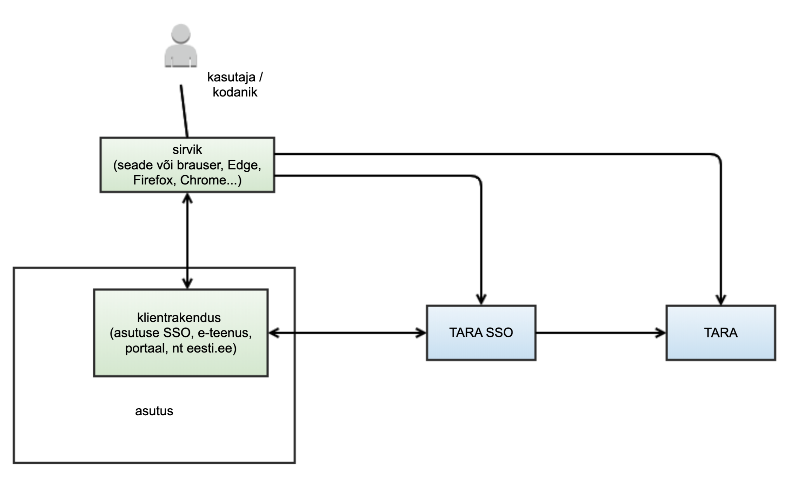

# Ühekordse sisselogimise (SSO) projektlahendus

- TOC
{:toc}

## Sõnastik

- OAuth – avatud standard kasutajate autoriseerimiseks. (Viited, [OAUTH])
- OIDC – OpenID Connect, standardne protokoll internetis kasutajate autentimiseks, baseerub OAuth 2.0 raamistikul.
- OIDF – OpenID Foundation, OpenID tehnoloogiate edendamist, arengut ja standardiseerimist juhtiv rahvusvaheline mittetulunduslik organisatsioon.
- SSO – _single-sign-on_ ehk ühekordne sisselogimine. Pääsu reguleerimise funktsioon, mis võimaldab kasutajal pöörduda üheainsa logimisega paljude eri ressursside poole. (Viited, [AKIT])
- TARA – Riigi autentimisteenus
- TARA SSO – ühekordse sisselogimise funktsionaalsus TARA teenuses (tehniliselt võib olla SSO funktsionaalsust pakkuv rakendus TARA teenuse ees)
- sirvik – lõppkasutaja masinasse paigaldatud tarkvara, mille kaudu inimene teenusepakkuja keskkonda (ja TARA SSO teenust) kasutab
- klientrakendus – TARA ja/või SSO teenust tarbiv asutuse infosüsteem. Võib olla nii asutusesisene e-teenus kui ka asutusesisene SSO lahendus
- OP – OpenID Connect Provider ehk OIDC protokolli järgi teenust pakkuv server
- eeskanal – OIDC kliendi ja serveri vaheline suhtlus, kus sõnumid liiguvad läbi sirviku ja on lõppkasutajale nähtavad (_front-channel_)
- taustakanal – OIDC kliendi ja serveri vaheline suhtlus, kus sõnumid liiguvad klientrakenduse ja TARA SSO serveri vahel sirviku vahenduseta (_back-channel_)

## Eesmärk

Analüüsida ja pakkuda välja tehnilise lahenduse kirjeldus TARAs ühekordse sisselogimise (SSO) teenuse implementeerimiseks. SSO teenuse äriline eesmärk on riigi autentimisteenuses tasuliste autentimispäringute arvu vähendamine ja seeläbi riigi autentimisteenuse kulude optimeerimine. Korduvate autentimiste vähendamisega paraneb ka Riigi autentimisteenuse kasutusmugavus.

## TARA SSO kirjeldus ja analüüsi skoop

Analüüsi käigus valitakse TARA tehnilise lahendusega ja Eesti kontekstiga sobivad OIDC protokollistiku kasutusvood ja –elemendid. TARA SSOd käsitletakse keskse autentimise lahendusena ega uurita keskse autoriseerimise lahenduse aspekte. See tähendab, et SSO analüüsis ei vaadelda isiku erinevate esindusõigustega seotud nüansse, vaid keskendutakse n-ö kodaniku vaatele.

TARA SSO teenuse ülesanne ei ole välja vahetada asutuses juba kasutusel olevat ühekordse sisselogimise komponenti. Kasutajate autoriseerimise loogika tuleb endiselt lahendada asutuse või valdkonna sees. Keskse ligipääsuhalduse teostus on ka OIDC protokollistikus teostatav, kuid nõuab mahukamat detailset analüüsi asutuste ja valdkondade spetsiifiliste nõuete osas.

Rakendame TARA SSOs OIDC ja OAuth 2.0 tehnilisi protokolle. OIDC on avatud standard, mis on turul olnud pikka aega ning on toetatud laias hulgas standardteekides ja karbitoodetes. Käesoleva analüüsi eesmärk ei ole tõestada OIDC protokolli ja tema erinevate autentimisvoogude turvalisust. Seda teemat on varasemalt põhjalikult uuritud ning levinumad implementatsioonivead ja -ründed on hästi teada (Viited, [OAUTH THREAT], [SSO SECURITY]). Analüüsi eesmärk on rakendada OIDC protokolli tuumikspetsifikatsiooni ja selle seansihaldusega seotud laiendusi TARA SSO jaoks sobival moel. Tuleb leida keskse seansihalduse lahendus, mille puhu säiliks praeguse TARA teenuse kõrge turvatase, kuid mis oleks ka tehniliselt piisavalt paindlik.

Usaldusahela vaatest keskendume mudelile, kus TARA SSO on keskne autentimise seansi ja identiteedi hoidja ning TARA SSO klientideks asutused (kellel omakorda võib olla kasutusel oma sisemine SSO lahendus TARA SSO taga). Tehnilises analüüsis ega POC lahenduse skoobis ei keskenduta riigi autentimisteenuse födereeritud lahendusele, kus TARA SSO koos teiste alternatiivsete SSO lahendustega moodustaks OIDC hajutatud autentimisteenuse pakkujate võrgustiku (Viited, [OIDC Federated]).

Autentimisel luuakse kasutaja seadme (sirviku) ja TARA SSO komponendi vahel autentimise seanss, mille tunnus on salvestatud kasutaja seadmesse. Kogu SSO turvaahela seisukohast on kriitiline, et ligipääs sellele tunnusele on piiratud ja seansitõend hävitatakse, kui kasutaja on lõpetanud klientrakenduse ühenduse. Seansi tunnuse lekkimine on keskse seansihalduse vaatest kõige suurem risk, sest tunnuse lekkimine annab kuritahtlikule kasutajale loa siseneda kõikidesse SSOga liidestatud klientrakendustesse. Riski maandamiseks analüüsitakse ja koostatakse lisaks autentimisele seansi kehtivuse mudel, seansi kehtivuse kontrolli voog, seansi kehtivuse pikendamise voog ja seansi lõpetamise voog.

## TARA SSO nõuded

**TARA senise voo säilitamine**

Kliendid, kellel pole keskse seansihalduse järele vajadust, peaksid saama jätkata TARA teenuse kasutamist senisel kujul. Igasugune lisaarendus olemasolevatele klientidele TARA SSO teenuse lisandumisega tuleks välistada. Seda kasutusjuhtu toetab valitud arhitektuuriline lahendus, kus TARA SSO komponent paigaldatakse TARA komponendist eraldi. TARA SSO toetamiseks vajalikud muudatused saab TARA protokollis teha ilma olemasolevate klientide liidest muutmata. SSO funktsionaalsuse toetamiseks on soovitatav TARA liideses sisendparameetrina implementeerida klientrakenduse identifikaatori vastuvõtmise võimalus. TARA SSO kasutab vastavat päringu välja, et edastada TARA SSO komponendist autentimispäringu saatnud klientrakenduse identifikaator TARA komponendile. Väli peab TARA protokollis olema mittekohustuslik ja lubatud kasutada ainult TARA SSO serveri edastatud päringute korral.

Kui tavapärases TARA autentimise voos tehakse eeldus, et klientrakendus on enne autentimise alustamist andnud kasutajale võimaluse tutvuda isikuandmete töötlemise reeglitega, siis SSO voos tekib oht, et kasutaja ei märka, kui tema andmed süsteemide vahel liiguvad. Tulenevalt asutuste ja infosüsteemide vaheliste isikuandmete töötlemise põhimõtete erisustest peab TARA SSO autentimise voos sisse tooma kasutaja volituse küsimise sammu. Volituse lehega säilib kasutajal võimalus sisselogimisest keelduda.

Uue SSO lahenduse välja töötamise üheks oluliseks nõudmiseks on võimalikult suur tagasiühilduvus olemasoleva TARA lahendusega. Keskse sisselogimisega TARA teenusest huvitatud asutused peaksid selle saama implementeerida võimalikult väikese vaevaga. Kuna olemas olev TARA teenus töötab OIDC protokollil ja on laialdaselt kasutusele võetud, on põhjendatud ka TARA SSO teenuse puhul järgida sama protokollistikku.

**Asutusteülene ja asutusesisene SSO**

Analüüsi käigus keskendume riigi autentimisteenusele keskse seansihalduse funktsionaalsuse lisamisele. Riigi autentimisteenus tegeleb kasutaja autentimisega ega tegele kasutaja autoriseerimisega (tema esindusõigustega). See tähendab, et autentimisteenus keskendub pigem kodaniku vaatele, mitte niivõrd ametniku vaatele. Riikliku autentimisteenuse kontekstis ei oma suurt tähtsust, kas klientrakendused asuvad ühe asutuse piires või mitme erineva asutuse haldusalas. Riigi autentimisteenus saab kõikidele SSOga liidestatud klientrakendustele pakkuda autentimise ja seansihalduse teenust samadel alustel.

Koostatud protokolli ja vaadeldud arhitektuuri puhul on arvestatud, et kui asutuse või haldusala piires on erisused autentimisel tagastatavate andmete osas, peavad need olema lahendatud asutusesisese SSO abil. Näiteks tagastab praegune TARA teenus e-posti aadressi ainult siis, kui kasutaja valib autentimisvahendiks ID-kaardi. Kuna iga klientrakendus saab TARA autentimise päringuga juhtida autentimisvahendite valikut sõltumata teistest klientrakendustest, saavad klientrakendused üksteisest sõltumatult juhtida ka seda, millised isikuandmed identsustõendi koosseisu jõuavad. TARA SSO puhul paraku pärast seansi alguses tehtud autentimist enam isikuandmete koosseis muutuda ei saa. Kui SSO seanssi ei alustatud ID-kaardiga, pole e-posti aadressi sinna hiljem võimalik lisada. Sellest tulenevalt on protokolli koostamisel arvestatud, et TARA SSO klientrakendus võib olla nii asutusesisene SSO lahendus kui mistahes asutuse poolt pakutav teenuseportaal. TARA SSO server saaks vajadusel isikuandmeid klientrakendustele väljastada OIDC protokolli kohase kasutajainfo (UserInfo) otspunkti kaudu. See aga teeks TARA SSO protokolli keerukamaks ja suurendaks liidestamiskulu.

Intervjuudest riigiasutuste IT-spetsialistidega sai ka kinnitust, et asutusesisese lahenduse erisused puudutavad pigem autoriseerimist kui autentimist. Praegu on suurematel asutustel juba endal kasutusel kesksed autoriseerimise süsteemid. Autoriseerimise reeglite ühtlustamine riiklikul tasandil ei mahu TARA SSO skoopi ning nõuab eraldi põhjalikumat analüüsi valdkondade ja asutuste nõuete osas.

Märkus: analüüsi käigus käsitlesime alternatiivset SSO andmemudelit, mille puhul klientrakendusi saaks TARA SSOs omavahel grupeerida. Klientrakenduste grupi sees toimuks autentimine ainult üks kord ning grupist välja logides tühistatakse kõik selle grupiga seotud seansid. Kui grupi sees on ühe rakenduse kohta SSO seansi jooksul kasutaja juba andnud volituse sisse logida, siis teiste puhul seda enam küsima ei peaks. Sellise mudeli rakendamisel aga oleksime kaotanud eelise, mida pakub kasutaja volituse küsimise ühtlustatud loogika, mida kirjeldame peatükis "Kasutaja teavitamine enne isikuandmete jagamist klientrakendusega". Lähtudes TARA SSO kõrgetest turvanõuetest ja kasutusmugavusest, otsustasime selle mudeliga mitte edasi liikuda.

**eesti.ee seansi üleandmine**

Riigiportaalis eesti.ee on varasemalt kasutatud nii-öelda seansi üleandmise funktsionaalsust (Viited, [TARA Legacy]). Vana seansi üleandmise protokoll ei ole standardiseeritud ja nõuab teenusepakkujalt märkimisväärset tarkvaraarendust. Seansi üleandmiseks vahetatakse taustakanalis (üle X-tee) autoriseerimise infot teenuste serverkomponentide vahel ning eduka autoriseerimise korral suunatakse kasutaja sirvik koos unikaalse autoriseerimiskoodiga teise teenusepakkuja portaali. Suunamise järel tekitatakse automaatselt kasutajat vastuvõtvas teenuses seanss. Loodud seanss ei ole tehniliselt enam eesti.ee seansiga ühenduses.

TARA SSOd implementeerides saab seansi üleandmise kasutusjuht täidetud. OIDC protokollil põhinev keskne seansihaldusteenus pakub sama funktsionaalsust juba standardiseeritud kujul. Seansi üleandmise eelduseks on, et mõlemad osapooled on liidestatud TARA SSO teenusega. Pakutud OpenID Connect profiili järgi pole eesti.ee seansi üleandmist tarvis eraldi kasutusjuhuna käsitleda.

**Piiriülese autentimise (eIDAS) ja TARA SSO kooskasutamine**

TARA SSO teenuse näol on tegemist riigi autentimisteenuse vahendusteenusega. Kõik autentimise meetodid, mis on võimalikud TARA puhul, on võimalikud ka TARA SSO puhul. Kuna TARA SSO ei paku nii täpset autentimisvahendite valiku juhtimist kui praegune TARA protokoll, ei ole TARA SSO puhul ainult piiriülese autentimise lubamine enam võimalik (Viited: [TARA] "4.1.3 Autentimismeetodite valikuline kasutus" 'eidasonly' skoobi parameeter). See tähendab, et autentimisvahendite valikus on eIDAS autentimine alati lubatud.

## Arhitektuuri kirjeldus

Plaanitav TARA SSO arhitektuur mõjutab olulisel määral analüüsitava protokolli disaini. Analüüsi käigus uurisime TARA SSO implementeerimiseks kahte alternatiivset arhitektuuri mudelit.

Esimeses variandis vaatlesime kõrgvaatelist arhitektuuri, milles seansihaldus on lahendatud olemasoleva TARA teenuse ja protokolli koosseisus. Lahenduse eeliseks on TARA ja TARA SSO arenduste ja halduse ühendamine. Liidestaja vaatest eksisteeriks üks riiklik OIDC teenusepakkuja ja liitumisel valitakse ära, millises mahus protokolli kasutatakse. Kõige kriitilisem on sellise lahenduse juures muudatuste tagasiühilduvus. OIDFi pakutavad seansihalduse spetsifikatsioonide kavandid on tagasiühilduvad OIDC põhiprotokolliga (Viited [OIDC Core]). Eelanalüüs tõi TARA kontekstis välja kaks olulist kitsaskohta:

1. TARA praeguses protokollis võimaldatakse autentimisvahendi valikut juhtida klientrakenduse poolelt. Juhtimine käib skoobi parameetri abil ja määratud skoobid on üksteist välistavad. Skoobi kaudu autentimisvahendi juhtimise muutmine tuleb TARA SSOs meie hinnangul eemaldada ja seeläbi poleks TARA autentimise voog enam tagasiühilduv. Seega kujutab niisugune muudatus otsest vastuolu analüüsi nõudega TARA olemasoleva voo säilitamise kohta. Täpsem probleemi kirjeldus on toodud peatükis "Autentimise tasemete valik TARA SSO autentimisel (LoA)".

2. Eelanalüüsi käigus selgus, et seansihalduse äriloogika lisamine TARA olemas olevasse protokolli seaks piiranguid TARA tulevikuarenduste osas. Mida keerulisemaks muutub autentimise loogika TARAs, seda keerulisem on leida karbitoodet või standardteeki, mis antud hübriidtöövoogu sobivalt ka implementeeriks. Seetõttu võib kogu TARA koos SSOga lahenduse arenduskulu hoopis tõusta nii TARA SSO implementeerija kui ka liidestaja jaoks.

Teise variandina vaatasime arhitektuuri mudelit, milles käsitletakse TARA SSO teenust eraldiseisva komponendina olemasoleva TARA teenuse ees.

Joonis 1: Riigi autentimisteenuse kõrgvaateline arhitektuur

Nende komponentide jaotus aitab kõige paremini tagada TARA SSO teenuse esimest kasutusjuhtu - TARA senise voo säilitamist. Kogu SSO funktsionaalsuse eraldiseisvasse rakendusse viimine tagab olemasoleva TARA voo ja protokolli maksimaalse sõltumatuse SSO teenuse arendustest. TARA teenuse vaatest on TARA SSO näol tegemist tavalise OIDC klientrakendusega. Suhtlus TARA ja TARA SSO vahel toimub üle OIDC protokolli ja on dikteeritud TARA arendustest. Arvestades, et OIDF pole kinnitanud ühtegi standardit seansihalduse kohta OIDC protokollis, on põhjendatud mitte rutata TARA protokollis mitte-standardsete muudatustesisseviimisega.

Asutuse vaatest on TARA SSO teenuse näol tegemist TARAst eraldi seisva OIDC teenusepakkujaga. TARA SSO teenus pakub eranditult ainult koos keskse seansihalduse toega OIDC teenust. See tähendab, et tavapärast TARA autentimise voogu ei ole võimalik selle teenuse kaudu kasutada. Kuna TARA ja TARA SSO vood esitavad klientrakenduste sisemisele seansihalduse keerukusele väga erinevaid nõudeid, näeme, et ühe klientrakenduse piires TARA ja TARA SSO ristkasutus ei ole praegu arvestatava tähtsusega kasutusjuhtude hulgas. Kui tulevikus tekib vajadus kasutada ühes klientrakenduses nii TARA kui ka TARA SSOd, tuleks kaaluda alternatiivseid arhitektuurilisi lahendusi, kus otsustuskoht ei ole lõppkasutaja käes. TARA SSO kasutatavuse testide tulemused tõid välja, et lõppkasutajad ei oska TARA ja TARA SSO vahel valikut teha.

Ei ole välistatud, et klientrakenduses tehakse TARA SSO tõrke korral automaatne siire TARA teenusele. Kuna TARA SSO teenus sõltub suuresti TARA teenuse käideldavusest ja TARA tõrke korral on suure tõenäosusega häiritud ka TARA SSO teenus, ei ole sellise lahenduse kasutamine ärikriitiliste teenuste puhul soovitatav. Ärikriitilistes klientrakendustes on sisselogimise tõrkekindluse suurendamiseks eelistatav lisaks TARA SSO-le teha liidestamine otse alternatiivsete autentimisteenuste pakkujatega (mobiil-ID, Smart-ID või muud teenused). Niisuguse soovituseni jõuti RIA tellitud eID infrastruktuuri tõrkekindluse analüüsis (Viited [EID FAILURE], 4. Prioritiseeritud ettepanekud).

Pakutud arhitektuuri nõrgaks küljeks võib lugeda TARA ja TARA SSO halduse keerukuse tõusu. Paratamatult hakkavad kummagi teenuse protokolli arendused omaette kulgema ja OIDC turvaparanduste korral tuleb teha muudatused mõlemas protokollis paralleelselt. Kahe kriitilise komponendi ülalpidamine suurendab haldusosakonna koormust.

Võrreldud mudelitest lugesime sobivamaks teise variandi. Eraldades TARA ja TARA SSO teenused, saame koostada protokolli, mis katab paremini TARA SSO kasutusjuhte. TARA liides ei pea muutuma ja täiendavat arendust TARA klientrakendustelt ei ole tarvis.

## TARA SSO OIDC protokoll

**Protokolli ülevaade**

Kasutaja autentimine toimub OIDC volituskoodi voo järgi (Viited, [OIDC Core], 3.1. Authentication using the Authorization Code Flow). Seda voogu kasutab ka TARA server ja seda peetakse üldiselt kõige turvalisemaks. Standardprotokolliga võrreldes viime sisse mõned kohandused, et tõsta protokolli voo üldist turvalisust. Kohandused piirduvad mittekohustuslike parameetrite kohustuslikuna määramisega ning on tehtud arvestusega, et need on OIDC standardiga kooskõlas ja olemasolevate tarkvaradega konflikte ei tekita. Kohandused on eraldi märgistatud TARA SSO protokolli tehnilises kirjelduses.

Märgime siinkohal, et OIDC protokolli ei töötatud algselt välja keskse seansihalduse lahenduste tarvis. Keskendutud on kesksele sisselogimisele mitte kesksele väljalogimisele. Seansihalduse lisad (Viited, [OIDC Session], [OIDC Back]) OIDC protokollis on suhteliselt uued ja mitte üheski ametlikus OIDC vastavuse profiilis (Viited, [OIDC Conformance]) pole seansihalduse teemasid seni veel käsitletud. OIDC seansihalduse laiendused on praegu kavandi staatuses ja viimati tehti neis muudatusi kolme aasta eest. Ametlikud vastavustestid ja implementatsiooni juhend OIDC väljalogimise laienduste kohta on veel piloteerimisfaasis (Viited, [OIDC Conformance RPLogout], [OIDC Conformance OPLogout]). Sellegipoolest on nende spetsifikatsioonide tugi osas levinud OIDC teekides ja karbitoodetes juba praegu olemas (Viited, [OIDC CertOP], [OIDC CertRP]).

Põhiline erisus, mille SSO funktsionaalsus tavapärasele TARA töövoole lisab ongi kasutaja sirviku ja TARA SSO vahelise seansi haldus. SSO seansi tunnust hoitakse sirviku turvaküpsises. Küpsis on loetav ainult TARA SSO domeeni kontekstis, mis tähendab, et TARA SSO seansi staatuse kontroll nõuab OIDC protokollis alati kasutaja suunamist TARA SSO autentimise otspunktile (Viited, [OIDC Core], 3.1.2.  Authorization Endpoint). OIDC protokolli kasutusvoog baseerub täielikult kasutaja sirviku suunamisel, sest nii on garanteeritud, et ilma kasutaja seadmeta ei ole klientrakenduse poolelt võimalik seansi olekut mõjutada.

OIDFi koostatud kolmest seansihaldusega seotud spetsifikatsiooni kavandist rakendame TARA SSOs kahte: 

1. OpenID Connect Session Management (Viited, [OIDC Session]) - kirjeldab seansi lõpetamise ja seansi oleku kontrolli lahendust. Seansi oleku kontroll toimub sirvikusse laetud nähtamatu raami (iFrame) kaudu SSO seansi küpsise sisu kontrollil. Kuigi see lahendus aitaks mõnevõrra vähendada seansi oleku kontrolliga seotud päringuid TARA SSO pihta, ei saa seda lõplikult usaldusväärseks pidada. Sirvikut tuleb käsitleda kui mitteusaldusväärset allikat, kuna on hõlpsasti rünnatav kasutaja seadmesse paigaldatud pahavara poolt. Seda spetsifikatsiooni rakendame TARA SSOs ainult osaliselt. Järgime ainult punktis 5 kirjeldatud seansi lõpetamise voogu klientrakenduse poolt (Viited, [OIDC Session] "5. RP-Initiated logout"), sest seda mustrit kasutatakse ka taustakanali kaudu seansi lõpetamise spetsifikatsioonis (Viited, [OIDC Back]).
2. OpenID Connect Back-Channel Logout (Viited, [OIDC Back]) - kirjeldab seansi lõpetamise voogu, kus suhtlus klientrakenduse ja TARA SSO vahel käib läbi taustakanali (mitte läbi sirviku). TARA SSO saadab väljalogimisel kõikidele sama SSO seansiga seotud klientrakendustele allkirjastatud väljalogimise tõendi. Klientrakendus tuvastab välja logitava kasutaja tõendis olevate 'sub' (subjekt) ja 'sid' (seansi tunnus) väljade järgi (Viited, [OIDC Back] "2.4.  Logout Token"). Tõend on allkirjastatud sama võtmega, mida TARA SSO kasutab identsustõendi allkirjastamiseks.

Kuigi OIDF on avaldanud ka eeskanali kaudu seansi lõpetamise kavandi (Viited [OIDC Front]), TARA SSO raames selle voo tugi kohustuslik ei ole. Sõnumivahetus taustakanali kaudu katab paremini TARA SSO kasutusjuhte ja on tavapäraste veebirakenduste korral usaldusväärsem. Kui TARA SSO implementatsiooni käigus selgub, et eeskanali kaudu seansi lõpetamise tugi on teostatav vähese arenduskuluga (näiteks piisab ainult karbitoote konfiguratsiooni muutmisest), võib täiendava meetmena ka seda toetada. Kordame, et neis spetsifikatsioonides kirjeldatud OIDC protokolli täiendusi ei ole OIDF lõplikult kinnitatnud ja need võivad veel muutuda. Siiski on juba praegu nende spetsifikatsioonide kavandite järgi tehtud implementatsioonid olemas levinumates OIDC klienditeekides ja karbitoodetes (Viited: [OIDC Conformance RPLogout], [OIDC Conformance OPLogout], https://www.keycloak.org/, https://www.ory.sh/hydra/).  

**SSO seansi olemus ja olek**

Tehnilisest aspektist tuleb TARA SSO protokollis arvestada, et kasutaja autentimise käigus luuakse seansse mitme osapoole vahel: TARA SSO serveri ja sirviku vahel luuakse SSO seanss ning sirviku ja klientrakenduse vahel luuakse klientrakenduse seanss. Lõppkasutaja jaoks mugava kasutusvoo loomiseks peavad kõik süsteemi osapooled omavahel tegema hulga lisatööd, et nende seansside olekuid sünkroniseerida. Joonisel 2 on välja toodud TARA SSO seansi osapooled ja peamised edastatavad andmeolemid.

Joonis 2: TARA SSO, klientrakenduse ja sirviku vahel liikuvad andmeolemid

TARA SSO seanss on sirvikupõhine. Iga uue autentimise korral tekitab TARA SSO uue unikaalse seansi, mis on seotud kasutaja sirvikuga sinna salvestatud SSO küpsise kaudu. SSO küpsise lugemise õigus on piiratud ainult TARA SSO domeenile. SSO seansi kehtivus on ajaliselt limiteeritud. SSO seansi kehtivuse jooksul saab TARA SSO väljastada klientrakendustele identsustõendeid ilma, et kasutaja peaks uuesti autentimisvahendit kasutama. SSO seansi kehtivust pikendatakse iga uue identsustõendi väljastamisel.

SSO seansist tuleb eraldi käsitleda klientrakenduse ja sirviku vahelist seanssi. Nimetame seda klientrakenduse seansiks. Klientrakenduse seanss luuakse, kui klientrakendus on TARA SSO teenuselt kätte saanud kasutaja korrektse identsustõendi. Klientrakenduse seansi kehtivus sõltub identsustõendi kehtivusajast. Enne identsustõendi aegumist peab klientrakendus suunama kasutaja sirviku TARA SSO teenuse autentimise otspunkti poole uue identsustõendi väljastamise päringuga. Uue identsustõendi saamisel võib pikendada klientrakenduse seansi kehtivust.

Joonis 3: SSO andmeolemite kõrgvaateline mudel

Joonisel 3 on kujutatud TARA SSO seansiga seotud andmeolemite mudel koos minimaalsete atribuutidega iga olemi kohta. Mudelil olevad sirvikus salvestatud olemid on märgistatud rohelisega. TARA SSO serveri pool salvestatud olemid on märgistatud sinisega. Iga TARA SSO seanss on seotud ühe konkreetse SSO seansi küpsisega. Korraga saab ühe kasutajaagendiga olla seotud üks TARA SSO seanss. Kasutajaagendi all peetakse silmas sirvikut või muud klientrakenduse tarbimiseks kasutatavat komponenti. Ühes füüsilises seadmes (mobiiltelefon, arvuti) võib korraga olla mitu sõltumatut kasutajaagenti, millel kõigil on oma unikaalne TARA SSO seanss. Näiteks kasutaja avab arvutis mitu sirvikut (Firefox ja Chrome) või samas sirvikus mitu anonüümset akent ("incognito mode"). TARA SSO seanss on alati seotud kindla subjektiga (isikukoodi alusel). Iga TARA SSO seansi kohta eksisteerib üks või enam TARA SSO klientrakenduse seanssi. Klientrakenduse seansi tunnus seob ühe TARA SSO seansi raames autenditud klientrakenduste seansid ja klientrakendustele väljastatud identsustõendite info.

Klientrakenduse seanss lõpeb, kui:

- kasutaja logib klientrakendusest välja;
- klientrakendusel ei õnnestu TARA SSO serverilt uue identsustõendi pärimine ja vana tõend aegub;
- TARA SSO server saadab klientrakendusele väljalogimise tõendi (näiteks olukorras, kus kasutaja on mõnest teisest klientrakendusest väljalogimisega lõpetanud TARA SSO seansi);
- klientrakenduse seansi kehtivusaeg on ületatud või seanss lõpetatakse tehnilistel põhjustel.

TARA SSO seanss lõpeb, kui:

- klientrakendus suunab kasutaja sirviku TARA SSO väljalogimise otspunktile ja kasutaja nõustub lõpetama kõik TARA SSO seansiga seotud klientrakenduse seansid;
- TARA SSO seansi kehtivusaeg ületatakse (seansi raames pole teatud aja jooksul väljastatud ühtegi uut identsustõendit ja SSO seansi kehtivuse lõpp on kätte jõudnud).

On võimalik, et SSO seanss tühistatakse TARA SSO serveri poolel enne identsustõendi kehtivuse lõppu. Tavatingimustel rakendub sellistel juhtudel TARA SSO taustakanali kaudu seansi lõpetamise voog (Viited [OIDC Back]), mille käigus saadab TARA SSO kõikidele sama SSO seansiga seotud klientrakendustele väljalogimise tõendi. Paraku ei ole OIDC protokolli tasandil garanteeritud, et kõik väljalogimise tõendid ka kohale jõuavad ja korrektselt ära töödeldakse. Kui väljalogimise tõend klientrakenduseni ei jõua, tekib oht, et klientrakenduse seanssi ei lõpetata pärast SSO seansi tühistamist piisavalt kiiresti. Ohu vältimiseks on TARA SSO identsustõendi kehtivusaeg piisavalt lühike - soovitatavalt mitte üle 15 minuti. See tagab, et klientrakendused kontrollivad TARA SSO seansi kehtivust umbes 15-minutilise intervalliga.

Signaal TARA SSO seansi lõppemiseks klientrakenduse poolelt saab TARA SSO teenusesse saabuda ainult läbi eeskanali (kasutaja sirviku suunamisel TARA SSO väljalogimise otspunktile). See tähendab, et seansi tühistamine on võimalik ainult kasutaja osalusel. See tagab, et tehniline viga või klientrakenduse seansi aegumine ühe klientrakenduse tagasüsteemis (back-end) ei kutsu esile kogu SSO seansi tühistamist. Selleks et kasutaja SSO seansi lõpetada saaks, peab vähemalt üks SSO seansiga seotud klientrakendustest kasutaja seadmes veel avatud olema. Kui kasutaja on sulgenud kõik klientrakendused ja sirviku ilma väljalogimise nuppu vajutamata, tühistab TARA SSO server SSO seansi maksimaalselt 15 minuti jooksul.

TARA SSO eeldab kõikidelt klientrakendustelt OIDC protokolli toetamist. Klientrakendused peavad seansihalduseks olema võimelised vastu võtma, töötlema, kontrollima ja tagastama kasutajate identsustõendeid. Sellest lähtuvalt on TARA SSO puhul eeldatud, et OAuth 2.0 protokolli järgset kasutajainfo otspunkti implementeerida pole tarvis. TARA SSO väljastab koos identsustõenditega ka ligipääsutõendeid (access_token), kuid SSO protokolli voogudes ligipääsutõendi kasutamist ette nähtud ei ole. 

**Autentimistasemete valik TARA SSO autentimisel (LoA)**

TARA SSO seansihalduse juures tuleb erilist tähelepanu pöörata erinevatele eIDAS autentimistasemetele. Kuigi eIDAS lõi ühtse arusaama piiriülese usalduse tehnilise teostuse osas, ei ole määruse sisuline pool tavakasutajale kõige kergemini mõistetav (Lisa 4: Kasutatavuse testimise raport, "Teenus nõuab kõrgema autentimistasemega vahendiga uuesti autentimist"). Mida rohkem autentimistasemega seotud keerukust tavakasutaja eest ära peidame, seda parem on kasutusmugavus.

Kasutaja vaatest on kõige selgem ja arusaadavam, kui TARA SSO seanss on võrdsustatav autentimise sündmusega. See tähendab, et autentimise sündmuse kohta tekib seanss ja selle seansi piires autentimistase ei muutu. Kui klientrakendus nõuab, et kasutaja oleks autenditud kõrgema usaldustasemega, siis tähendab see TARA SSO seansi tühistamist ja uue seansi loomist kõrgema tasemega autentimisvahendit kasutades.

Praeguses TARA autentimise skeemis on autentimisvahendite usaldusväärsuse tõlgendamine iga TARAga liituva asutuse pädevuses. Asutused saavad oma infosüsteemi ISKE taseme järgi ise hinnata, milliseid autentimisvahendeid nad kasutaja autentimiseks aktsepteerivad, ning TARA autentimispäringu skoobi parameetri ('scope') kaudu juhtida, milliseid autentimisvahendeid kasutajale kuvatakse. Paraku ei ole sama autentimisvahendite valiku dünaamikat võimalik rakendada TARA SSO protokollis, kuna erinevate klientrakenduste autentimissündmused on nüüd seotud. Kui iga klientrakendus saaks väga kitsalt määrata, millist autentimisvahendit seansi loomiseks lubatakse, tekitatakse kasutajale seeläbi väga palju korduvaid autentimisi ja TARA SSO kasutusmugavus oleks rikutud.

Vaatame näiteks olukorda, kus klientrakendused esitavad mittekattuvaid skoobi parameetreid. Klientrakendus 1 määrab autentimise skoobiks 'scope=openid mid' ehk lubab autentida ainult mobiil-IDga. Kasutaja autendib mobiil-IDd kasutades. Klientrakendus 2 määrab autentimise skoobiks 'scope=openid idcard' ehk lubab autentida ainult ID-kaardiga. Näeme, et kuigi kasutaja on autentinud siseriiklikult sama usaldustasemega autentimisvahendit kasutades, peaks kummagi rakenduse pöördumisel TARA SSOsse alati nõudma kasutajalt uut autentimist, sest skoobid ei kattu.

Kuna TARA SSO peab pakkuma keskset seansihaldusteenust kõikidele klientidele samadel alustel, soovitame TARA SSO skeemis autentimisvahendite valiku juhtimiseks lähtuda ainult autentimisvahendite eIDASe usaldustasemetest. Klientrakendus annab TARA SSO sisendisse ainult nõutud autentimistaseme ('acr_values' parameeter autentimispäringu kehas) ja TARA SSO otsustab vastavalt sellele, milliseid autentimisvahendeid TARA kasutajale kuvama peaks. Autentimistase on sama kogu seansi vältel. Niisuguse muudatuse kohta saime positiivse tagasiside ka analüüsi käigus läbi viidud vestlustest riigiasutuste arhitektidega.

Märgime, et kui tulevikus siiski tekib tarvidus TARA SSO kaudu autentimisel klientrakenduse poolelt autentimisvahendite valikut täpsemalt juhtida, võiks skoobi parameetri asemel võtta kasutusele mõne alternatiivse päringu parameetri. Praeguse TARA protokolli skoobi parameetri kasutus on OAuth 2.0 spetsifikatsiooniga vastuolus (Viited, [OAUTH] 3.3. "Access Token Scope"), sest skoobid tohivad olla üksteist täiendavad, mitte vastanduvad. OIDC standardi lahendus kirjeldab skoobi parameetrit kui privileegide nimekirja, mida klientrakendus OIDC serverilt tellib. Privileegide põhjal saab klientrakendus ligipääsu vastavalt rohkemale või vähemale hulgale kliendi isiklikest andmetest. Kuigi OIDC standard ei käsitle täpsemalt skoopide äriloogilist tähendust ega omavahelisi seoseid, soovitame vältida käsitlust, kus skoobi parameetri võimalikud väärtused on üksteist välistavad (vt eespool kirjeldatud näidet). Lisaks tuleb arvestada, et kui seansi raames skoop muutub, rakendub see kõikidele sama seansiga seotud klientrakendustele. Seeläbi võib skoobi muudatus anda juba autenditud klientrakendustele ligipääsu täiendavatele isikuandmetele, mida kasutaja volituse või teavituse lehel ei kajastatud. TARA SSO lõplikus implementatsioonis võib kaaluda keerukama seansi kehtivuse mudelit (näiteks nii-öelda seansi uuendamist, "step-up authentication"), kuid autentimise toiminguga kaasnevast ligipääsu muudatustest peab ka lõppkasutajal olema selge arusaam.

**Kasutaja teavitamine enne isikuandmete jagamist klientrakendusega**

Isikuandmete kaitse aspektist on ülimalt oluline, et erinevate klientrakenduste vahel liikudes oleks kasutajal arusaam millal, kes ja mis eesmärgil tema isiklikke andmeid töötleb. OIDC protokoll ütleb selgelt, et vahetult pärast autentimist ja enne klientrakendusele informatsiooni jagamist peab autoriseerimise server (TARA ja/või TARA SSO) pärima volituse (_authorization consent_) isikuandmete jagamiseks klientrakendusega (Viited [OIDC Core] "3.1.2.4.  Authorization Server Obtains End-User Consent/Authorization"). Standardis pole volituse küsimise reaalse teostuse osa siiski väga süvitsi kirjeldatud.

Vaatame näitena praegust TARA teenust, millele kehtib sama OIDC standardi punkt. Kasutaja volitus on TARAs lahendatud kaudselt, protseduuriliste reeglitega. Iga asutus/teenus/klientrakendus teavitab kasutajat isikuandmete töötlemise reeglitest enne TARAsse suunamist. Kuna igale autentimisele eelneb ka TARA teenuse poolel kasutaja sisendi küsimine (tavaliselt autentimisvahendi valimine ja PINi sisestamine), siis pole ohtu, et kasutaja oleks isikuandmete jagamisest klientrakendusega ebapiisavalt informeeritud. Lisaks säilib kasutajal võimalus andmete jagamisest keelduda, katkestades autentimise protsessi. Sama mustrit võime kasutada ka TARA SSO esimese autentimise puhul. Kui kasutaja on klientrakenduse poolel piisavalt informeeritud, võime TARA SSOs autentimise sündmuse lugeda piisavaks kasutaja informeerimiseks.

TARA SSO kontekstis ei saa seansi alguses toimunud autentimise toimingut siiski lugeda piisavaks kasutaja informeerimiseks kogu TARA SSO seansi kestvusel. Kui SSO seansi kestel töödeldaks kõiki järgmisi autentimispäringuid automaatselt, tekiks oht, et isikuandmed liiguvad TARA SSOst välja ilma kasutaja volituseta. Näiteks olukorras, kus kasutaja on SSO seansi raames autenditud ja sisenenud klientrakendusse A, kus on mittetahtlikult vajutanud lingile, mis viitab klientrakendusse B, mille peale klientrakendus B suunab kasutaja otse TARA SSOsse. Kui niisuguses olukorras töötleks TARA SSO klientrakendus B autentimispäringu ära ilma igasuguse vaheleheta, puuduks kasutajal võimalus klientrakendusele B isikuandmete jagamisest keelduda.

Sellest tulenevalt peab TARA SSO iga SSO seansi jooksul, enne iga unikaalse klientrakendusega isikuandmete jagamist, kasutajalt vastava volituse küsima. Minimaalne info, mida kasutaja volituse lehel kuvada:

- isikuandmeid päriva klientrakenduse või asutuse inimloetav tunnus või nimi (soovitatavalt ka klientrakenduse või asutuse logo, näiteks rakenduse avalik ikoon, "favicon");
- loend isikuandmetest mida klientrakendusele jagatakse.

Volituse lehe kuvamine täidab mitut olulist eesmärki:

- informeerib kasutajat selle kohta, millistesse klientrakendustesse seansi raames sisse logitakse;
- annab kasutajale võimaluse klientrakenduse autentimisest keelduda, misläbi piiratakse TARA SSOga liitunud klientrakendustel kasutajate jälitamist;
- blokeerib osa ründeid, kus lehe võltsimise või aktiivsisu süstimise kaudu õnnestuks SSOs autenditud kasutajat ilma volituseta sisse logida teise rünnatavasse klientrakendusse.

Volituse andmine või sellest keeldumine salvestatakse TARA SSO teenuse logis. Eraldi andmeolemina volituse pikaajaline salvestamine nõutud ei ole. Kui kasutaja keeldub isikuandmete jagamisest, tuleb kasutaja tagasi suunata klientrakenduse ebaõnnestunud sisselogimiste otspunkti. Kui kasutajal eksisteeris TARA SSO teenuses kehtiv seanss (seotud mõne teise klientrakendusega), siis seda seanssi tühistama ei pea.

Tavakasutuse korral kuvatakse volituse lehte SSO seansi raames kasutajale üks kord iga unikaalse klientrakenduse kohta. Kasutatavuse testimise käigus kinnitati, et volituse vahelehe kuvamise vajalikkus oli kasutajatele mõistetav.

**TARA SSO identsustõendi kaitsmine GET päringutes**

TARA SSO protokollis üritasime maksimaalses ulatuses vältida avatud isikuandmete liikumist läbi klientrakenduse kasutajaliidese komponendi. Isikuandmed liiguvad TARA SSO serverile identsustõendi koosseisus ja alati ainult taustakanali kaudu (klientrakenduse serveri ja TARA SSO tõendi väljastuse otspunkti otsesuhtluse kaudu). See on ka üks põhjustest, miks TARA SSO puhul toetame ainult OIDC standardi volituskoodi voogu.

Paraku on OIDC protokolli praeguses versioonis sees kaks kohta, kus isiku identsustõendi liikumine läbi kasutajaliidese on vajalik. Seansi oleku kontrolli voos ja seansi lõpetamisel klientrakendusest väljalogimisel peab klientrakendus TARA SSO poole pöördumisel päringuga kaasa panema viimase talle teada oleva kasutaja identsustõendit ('id_token_hint' parameeter). Identsustõendi lisamine tagab, et SSO seanssi saavad hallata ainult need klientrakendused, millel on piisavalt konteksti vastava TARA SSO seansi ja selle raames väljastatud identsustõendi kohta. Kuna mõlemad päringud toimuvad sirviku suunamise kaudu, ei saa vältida identsustõendi ja seeläbi ka krüpteerimata isikuandmete liikumist klientrakenduse kasutajaliidese poole.

Mainitud päringud tehakse enamasti HTTP GET meetodil, mistõttu oleks soovitatav päringusse lisatavat identsustõendi sisu lekkimise eest kaitsta. OIDC standardis on kirjeldatud, et seansi oleku kontrolli päringu koosseisus saadetav identsustõend võib olla enne saatmist klientrakenduse serveri poolel krüpteeritud TARA SSO serveri avaliku võtme jaoks (Viited, [OIDC Core] "3.1.2.1. Authentication Request"). Paraku pole sama täpsustust tehtud väljalogimise päringu kohta (Viited, [OIDC Session] "5. RP-Initiated Logout"). Seega ei saa praeguses staadiumis väita, et standardi järgi oleks identsustõendi krüpteerimine alati toetatud. Analüüsi käigus uurisime kahte karbitoodet, mis on väljendanud oma tuge OIDC seansihalduse toe kohta (KeyCloak ja ORY Hydra) ja kummagi puhul ei olnud identsustõendi krüpteerimine klientrakendusest TARA SSOsse saatmisel toetatud.

Arvestades eelkirjeldatut ja nõuet püsida OIDC spetsifikatsiooni piirides, ei rakendatud TARA SSO protokollis nõuet identsustõendid krüpteerida. Lekkimise ohu maandamiseks peab klientrakenduse serveri ja sirviku vaheline suhtlus käima üle turvatud kanali (TLS). Jääkrisk on, et klientrakenduse kasutajaliidese kaudu on võimalik identsustõendi sisu ikkagi kätte saada.
