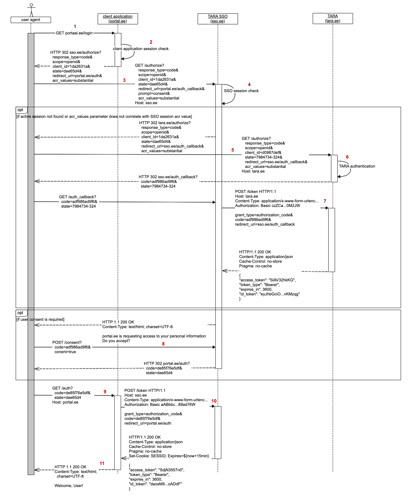

# Riikliku SSO tehniline spetsifikatsioon ja protokolli kirjeldus

Analüüsi käigus koostati TARA SSO OpenID Connect profiili tehniline spetsifikatsioon. Spetsifikatsioon kirjeldab päringute struktuuri ja kohustuslikud päringu kontrolli reeglid.
Ühtlasi tuuakse välja TARA SSO spetsiifilised protokolli täiendused.

<p style='text-align:left;'></p>

- TOC
{:toc}

## Overview

This document describes the technical characteristics of the TARA single-sign-on (SSO) service protocol and includes advice for implementing client application interfaces. TARA SSO protocol was designed following the best practices of OpenID Connect protocol and is heavily influenced of the current TARA service protocol (References: TARA). As a result, a large part of this document is identical to TARA service technical specification.

TARA SSO service will provide the same authentication means and similar flow as provided by TARA service. The actual authentication of users is still done in TARA service. TARA SSO will add an authentication session management functionality on top of the existing service. For the client application perspective TARA SSO will be a separate OIDC provider next to the existing TARA service.

The terminology in this document follows the terminology used in TARA technical specification (References: TARA).

## OpenID Connect compliance

TARA SSO protocol has been designed to follow the OpenID Connect protocol standard as closely as possible. The intent is to create a protocol that is compatible with a wide range of OpenID Foundation certified OIDC client applications and standard libraries. OIDC is by itself a very diverse protocol, providing multiple different workflows for a wide array of use-cases. To limit the scope of the development required to implement TARA SSO service and client applications, the full scope of OIDC protocol will not be supported. This chapter describes the main customizations that are done to TARA SSO as compared to the full OIDC protocol:

- The service supports only the authorization code flow of OIDC. The authorization code flow is deemed the most secure option and is thus appropriate for public services.
- All information about an authenticated user is transferred to the application in an ID token.
- The eIDAS assurance level is also transferred to the application (in the `acr` claim, using custom claim values `high`, `substantial`, `low`).
- The requested minimum authentication level of assurance is selected by the client application in the beginning of TARA SSO session (on initial authentication).
- Available authentication methods are provided based on the requested minimum authentication level of assurance.
- TARA SSO supports only a single default scope that will return person authentication data: given name, family name, date_of_birth, email, person identifier. The - scope remains the same during the entire TARA SSO authentication session.
- Single-sign-on (SSO) is supported. Client applications are expected to perform session status checks to keep the authentication session alive.
- Central logout is supported according to OIDC Back-Channel logout specification (References, OIDC-BACK).
- Client applications must always prove knowledge of previous identity token to check session status or end session in TARA SSO. Different from OIDC standard protocol, the `id_token_hint` parameter is usually described as a mandatory parameter in TARA SSO requests.

## SSO session

TARA SSO will create an SSO session for each successful user authentication and stores it in its internal session storage. The SSO session is used to store user personal information and various parameters about the authentication request (for example authentication time, authentication level of assurance, authentication method used). The authentication information and parameters are not allowed to change during the authentication session.

The SSO session is linked to the user agent via a session cookie. The user is allowed to create a single SSO session per user agent but may create concurrent sessions across multiple user agents.

SSO session has a limited validity period of 15 minutes. During the SSO session validity period the user is not required to re-authenticate themselves while logging into different client applications. Instead they are given the option of using the authentication information stored in SSO session. TARA SSO issues identity tokens as proof of an active SSO session. The identity token contains the user personal information as well as the session information. All issued identity tokens are linked to an SSO session via a session id (`sid`) claim and have the same validity period as the SSO session.

The SSO session validity period is extended every time a new client application authentication request is received, or an existing authenticated client application performs an SSO session update request. Every time an SSO session update request occurs, the session validity period is updated to `currentTime + 15 minutes`. This means that all client applications are contributing to keep the SSO session valid for the duration the user is still using the client applications.

SSO session expires when no new authentication requests or session update requests have been received in the last 15 minutes. This is a safety feature assuring that user SSO session is not kept alive too long after the user has finished using the client applications.

The SSO session may also be terminated before the end of its expiry time by the user. When the user initiates a logout from one client application the client application must inform TARA SSO of the logout event. The user is then given an option to terminate the SSO session and log out of all client applications related to the same SSO session.

## TARA SSO process flows

### Authentication process

In order to log a user into a client application, the client application must acquire an identity token from TARA SSO. The identity token will contain relevant user personal information as well as information of the SSO session. If the SSO session does not exist prior to the authentication request, a new session is created. If the session already exists but its level of assurance is lower than requested in the new request, then the previous SSO session will be terminated and a new SSO session will be created.

<p style='text-align:left;'></p>

1. User requests protected page from client application.
2. Client application checks whether the user has logged into the client application.
3. Since the user is not authenticated in the client application, the client application will construct a TARA SSO authentication request URL and redirects user agent to it.
4. TARA SSO checks whether there is a valid SSO session for given user agent. 
    1. If SSO session exists and its level of assurance is equal or higher than requested the process will continue from step 8.
    2. Otherwise TARA SSO will automatically terminate the existing session and the process continues from step 5.
5. SSO session does not exist, therefore, TARA SSO needs the user to be authenticated with TARA service. TARA SSO constructs a valid TARA authentication request and redirects user agent to it.
6. User is securely authenticated in TARA service. The detailed authentication process is described in TARA technical specification (References: TARA). Once the user has been authenticated TARA will redirect the user agent back to TARA SSO with the TARA authorization code.
7. TARA SSO uses the authorization code to acquire a user identity token from TARA service. This request happens in TARA SSO backend system. TARA SSO will store the user identification information in its session storage.
8. TARA SSO will optionally display a user consent form. This form is displayed only when a previous SSO session was used for authentication. Meaning that in step 4a a valid existing session was found.
9. TARA SSO will construct its own authorization code and redirects the user agent back to client application URL.
10. The client application will use the authorization code to acquire a TARA SSO identity token. This is done in client application backend by sending an identity token request to TARA SSO.
11. TARA SSO will respond to the client application with a TARA SSO identity token. TARA SSO will also internally update the SSO session expiration time to `currentTime + 15 minutes`. The client application now has the user authentication information and can display the protected page.

### SSO session update process

Once the user has been authenticated and an SSO session created, the client application must periodically perform SSO session update requests to keep the SSO session alive. In TARA SSO protocol this is done by acquiring a new token from TARA SSO service. TARA SSO session update requests are very similar to authentication requests. The only difference is that TARA SSO will not display any graphical page to the user when the user agent is redirected. To differentiate SSO session update requests from SSO authentication requests, the client application will a `prompt` parameter to the request (`prompt=none`). 

SSO Session update request can be made only when the client application knows the previous identity token and a valid SSO session exists. Client application must prove that it has knowledge of the SSO session context by including the previous user identity token with each session update request. This is a security measure and helps to assure that TARA SSO and client application have the same knowledge about the logged in user.

If the SSO session update request fails for any reason, then the client application must perform a new SSO authentication process to get a new identity token.

<p style='text-align:left;'></p>

1. User wants to access protected content in client application.
2. Client application verifies whether user has active client application session and that client application session storage contains a valid (not expired) TARA SSO identity token.
3. Client application finds that user identity token is about to expire and redirects user agent to TARA SSO with a valid SSO session update request. The request must include the identity token and a `prompt=none` parameter.
4. TARA SSO validates the request
    1. Verifies that an SSO session is still active for user agent
    2. Verifies that the SSO session subject matches the subject in the received identity token.
5. If all validations passed, TARA SSO will issue a new authorization code to the client application.
6. Using the authorization code, the client application makes an identity token request to TARA SSO. Tara responds with a new identity token and a directive for the user agent to update SSO session cookie expiration date to `currentTime + 15 minutes`.
7. Client application stores identity token with into its session storage and shows protected content to user.

### Logout process

It is expected that client applications terminate TARA SSO session as soon as the user has finished using client application(s). If a user has requested to log out of a client application, then information about this event must be sent to TARA SSO as well. TARA SSO will either terminate the SSO session automatically (if only one other client application is linked to the same SSO session) or display a logout consent form. The consent form allows user to log out of all client applications at once or just the single application.

After a successful logout the user agent is redirected back to the client application. If a technical error occurs or the logout request is invalid (`redirect_uri` does not match identity token client registered redirect URLs), then the user is redirected to TARA SSO default error page.

<p style='text-align:left;'></p>

1. User requested to log out of client application
2. Client application does its internal application session termination procedures.
3. Client application redirects user agent to TARA SSO logout URL. The redirect must include the previous identity token and a redirect URI where the user agent must be redirected to after logout.
4. TARA SSO validates the logout request. If the identity token is not linked to the active SSO session of given user agent, then nothing is done, and the user agent is redirected back to the `redirect_uri`. TARA SSO will unlink the client application from SSO session in its session store.
5. If more client applications are linked to the same SSO session, then TARA SSO will show a logout consent page.
6. User can either select to log out of only the client application that made the logout request or from all client applications that are linked to the same SSO session.
7. If the user selected to log out from all client applications, TARA SSO will send a back-channel logout request to each linked client application and unlink client applications from TARA SSO session.
8. If no client applications remain linked to SSO session, TARA SSO will terminate the session. User has been logged out of all client applications.
9. User agent is redirected back to the `redirect_uri` of the client application which initiated the logout procedure.

### Back-channel logout notifications

Each TARA SSO client application must declare support to the OIDC Back-Channel logout specification. Each client must provide a back-channel logout endpoint URL as part of their registration information. TARA SSO will send an out-of-band POST request to client application back-channel logout endpoint every time an SSO session ends.

The logout request contains a logout token. The logout token must be validated according to OIDC Back-Channel logout specification (References: OIDC-BACK "2.6.  Logout Token Validation").  After receiving a valid logout token from the TARA SSO, the client application locates the session(s) identified by the `iss` and `sub` Claims and/or the `sid` Claim. The client application then clears any state associated with the identified session(s). If the identified user is already logged out at the client application when the logout request is received, the logout is considered to have succeeded.

If the logout succeeded, the RP MUST respond with HTTP 200 OK.

Access to the back-channel logout endpoint should be restricted. Only TARA SSO needs to have access to given endpoint.

## Tokens

### Identity token

In TARA SSO protocol the identity token is a used as a certificate of the fact of authentication was performed. The identity token has a concrete issuance and expiration date between which it is to be considered valid.

The identity token is issued in JSON Web Token (References: JWT).

**Example TARA SSO identity token:**

````
{
  "jti": "663a35d8-92ec-4a8d-95e7-fc6ca90ebda2",
  "iss": "https://tara-sso-demo.eesti.ee/",
  "aud": [
    "sso-client-1"
  ],
  "exp": 1591709871,
  "iat": 1591709811,
  "sub": "EE60001018800",
  "profile_attributes": {
    "date_of_birth": "2000-01-01",
    "family_name": "O’CONNEŽ-ŠUSLIK TESTNUMBER",
    "given_name": "MARY ÄNN"
  },
  "amr": "mID",
  "acr": "high",
  "at_hash": "AKIDtvBT2JS_02tkl_DvuA",
  "auth_time": 1591709810,
  "nonce": "POYXXoyDo49deYC3o5_rG-ig3U4o-dtKgcym5SyHfCM",
  "sid": "f5ab396c-1490-4042-b073-ae8e003c7258",
  "state": "1OnH3qwltWy81fKqcmjYTqnco9yVQ2gGZXws/DBLNvQ=",
  "email": "60001018800@eesti.ee",
  "email_verified" : false
}

````
**Identity token claims**

| Identity token element (claim)   | example           |     explanation       |
|----------------------------------|------------------ |-----------------------|
| sub | `"sub": "EE60001018800"` | The identifier of the authenticated user (personal identification code or eIDAS identifier) with the prefix of the country code of the citizen (country codes based on the ISO 3166-1 alpha-2 standard). The subject identifier format is set by TARA authentication service id token (References: Technical specification#TARA "4.3.1 Identity token") |
| state | `"state": "1OnH3qwltWy81fKqcmjYTqnco9yVQ2gGZXws/DBLNvQ="` | Security element. The authentication request’s state parameter value. |
| aud | `"aud": [
"sso-client-1"
]

or

"aud": "sso-client-1"` | Unique ID of a client application in TARA SSO client database. ID belongs to the client that requested authentication (the value of `client_id` field is specified upon directing the user to the authentication process).
String or array of strings. A single aud value is present in TARA SSO tokens. |
| state | `"state": "1OnH3qwltWy81fKqcmjYTqnco9yVQ2gGZXws/DBLNvQ="` | Security element. The authentication request’s state parameter value. |
