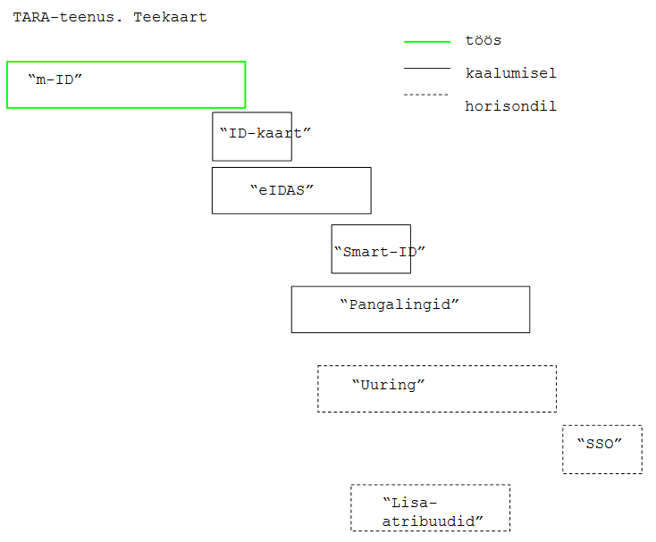

Teekaart markeerib teenuse arendamise suunad, ärinõuded ja neid teostavad tööpaketid ning  arendusjärgud.

Töös, kaalumisel ja horisondil on tööpaketid:

|    tööpakett | selgitus  | maht (orientiir) |
|--------------|-----------|------------------|
| ***"m-ID"*** | Tarkvaraarendus: 1) OpenID Connect serveri kohandamine ja ülespanek; 2) testeesmärgilise makettrakenduse koostamine; 3) mobiil-ID-ga autentimise komponendi teostus. Arenduse osana: dokumentatsiooni koostamine ja tarkvara testimine. Teenuse käitamiseks vajaliku dokumentatsiooni koostamine (vt detailsemalt allpool, jaotises "I arendusjärk"). | 4-6 nädalat |
| ***"ID-kaart"*** | ID-kaardiga autentimise lisamine, koos dokumentatsiooni vastava täiendamisega ja testimisega. | 2 nädalat |
| ***"eIDAS"*** | eIDAS autentimise lisamine, sh liidestamine RIA eIDAS konnektorteenusega; koos dokumentatsiooni vastava täiendamisega ja testimisega. | 4 nädalat |
| ***"Smart-ID"*** | Smart-ID autentimise lisamine; koos dokumentatsiooni vastava täiendamisega ja testimisega. | 2 nädalat |
| ***"Pangalingid"*** | Pangalink-autentimise lisamine; koos dokumentatsiooni vastava täiendamisega ja testimisega. (3 panka). | 2 nädalat |
| ***"Uuring"*** | Ühekordse sisselogimise (Single Sign-On, SSO) teenusele lisamise vajalikkuse ja teostatavuse uuring. Sisaldab _Proof of Concept" (PoC) lahenduse teostust ja selle hindamist. PoC ja hindamine v-o tellitakse eraldi.  | 2 nädalat PoC, 2 nädalat hindamine |
| ***"SSO"*** | Ühekordse sisselogimise (SSO) teenusele lisamine, lähtudes eelnevalt tehtud uuringu tulemustest. Sisaldab uuringus tehtud PoC lahenduse viimistlemist, dokumenteerimist ja testimist. | 2 nädalat |
| ***"Lisaatribuudid"*** | Teenuse laiendamine täiendavate atribuutide pakkumisega. Nt päring äriregistrisse esindusõiguse kindlakstegemiseks, päring Rahvastikuregistrisse, võimalik, et päring Personali- ja palgaandmete andmekogusse (SAP-i). | 2 nädalat |
| ***Erakliendid*** | Tehnilised ja protseduurilised täiendused, mis võimaldavad teenust pakkuda ka erasektorile (teenuse kasutuse arvestus, arveldamine jms) |  |

## I arendusjärk (valmis)

| teetähis | tööd | tulemus | orienteeruv, minimaalne ajakava |
|----------|------|---------|--------------|
| MVP/PoC  | Arendaja: 1) paneb üles OpenID Connect serveri; 2) koostab testimiseks vajaliku makettrakenduse ja 3) mobiil-ID-ga autentimise komponendi. | Töötav tarkvara, mis realiseerib eesmärgiks seatud kasutusloo; käideldavus v-o madal; dokumentatsioon v.o mittetäielik. | 2 nädalat |
| Tarkvara toodanguvalmis | RIA ja CGI koostöös: 1) testivad põhjalikult; 2) koostavad SLA ja teevad vajalikud tööd selle saavutamiseks (klaster); 3) viimistlevad dokumentatsiooni | Tarkvara testitud, tootmisse paigaldamiseks valmis, korralik dokumentatsioon | 2 nädalat |
| Asutustele suunatud kommunikatsiooni-pakett valmis | RIA: 1) avaldab teenuse – teabematerjal + liidestumisjuhend; 2) edaspidi toetab liidestujaid tööde kavandamisel | Liitumiseks vajalik teave sihtrühmale edastatud; kommunikatsioonipaketti on vähemalt ühe asutuse peal testitud | 1 nädal |
| Testteenus avatud | RIA: 1) paneb üles keskkonna, mille vastu liidestujad saavad oma arendusi testida; 2) edaspidi teenindab liidestujaid liideste testimisel (konf-ne jms) | Liitujad saavad oma liideseid testteenuse vastu testida | 1 nädal |
| Teenuse avamine toodangus | RIA: 1) avab teenuse toodangukeskkonna; 2) edaspidi laseb teenusekasutajad (pärast testide läbimist) toodangusse | | 1 nädal |

Arendustööd: 
1)	OpenID Connect serveri ülespanek (joonisel „OpenID Connect liidese haldur“) 
valida sobiv teek, võiks olla Java-põhine; otsus kooskõlastada Tellijaga. Seadistada ja täiendada teeki nii, et tarkvara teostab esmase autentimise kasutusloo [kavand]. 
2)	Makettrakenduse loomine 
koostada RIA rakendus, mis etendab autentimisteenust kasutavat Eesti e-teenust. Makettrakenduse eesmärk on testida loodavat RIA autentimisteenust. Selleks valida sobiv OpenID Connect kliendi teek. Ei pea olema Java. 
3)	mobiil-ID autentija loomine 
teostada komponent, mis teostab Eesti mobiil-ID-ga autentimise. Siduda mobiil-ID autentija  ja OpenID Connect liidese haldur tervikuks. 
Arvestada edasise tööde järjekorraga, vt joonis ja [kavand]: 1) kasutusloo autentimise olemasolu kontroll teostamine; 2) kasutusloo väljalogimine teostamine; 3) komponentide Seansihaldur ja selle koosseisus Seansihoidla teostamine; 4) komponendi Isikutuvastusportaal teostamine (võimaldab kasutajal valida mitme autentimismeetodi vahel); 5) liidestamine eIDAS konnektorteenusega (vajalik välismaalaste autentimisel). 

## II arendusjärk (töös)

Eesmärk: lisada TARA-le ID-kaardiga autentimise funktsionaalsus

Tööd: 
1 täiendada liitumisjuhendit ja tehnilist kirjeldust. (uue autentimismeetodi kood - "idcard"). 
2 täiendada autentimise kasutajaliidest - autentimismeetodi valik 
3 ID-kaardiga autentimise komponent (serdi võtmine F5-st) 
TARA-Server (CAS) muudatused päringut x509 sertifikaadi lugemiseks ning töötlemiseks (info lugemine sertifikaadilt ja atribuutide lisamine ID Tokenisse) 
4 kehtivuskinnituse päring (OCSP) 
5 testistrateegia, -plaani ja -testide vastav täiendamine 
6 täiendada nii, et saaks tagastada eIDAS autentimistaset. Igale autentimismeetodile peab konfiguratsioonis saama omistada autentimistaseme. Esialgu on nii m-ID kui ka ID-kaardi autentimistase määratlemata. Autentimistase esitatakse identsustõendis (v.a kui autentimistase on määratlemata). 
7 makettrakenduse täiendamine nii, et testimine oleks hõlpsam (makettrakendus kuvab sirvijas identsustõendi) 
8 _hardening_-tegevused - mitmesugused läbivaatused, ülekontrollid ja vajadusel tarkvara täiendused, suunaga teenuse turvalisuse tagamisele. 

-----

[Teekaardi lähtejoonis](https://docs.google.com/drawings/d/1t-SfFV4VYMjPjjEav-ZL4TPNgYZE1Ko9XU6Y94Ypbw8/edit) (Google Docs)
