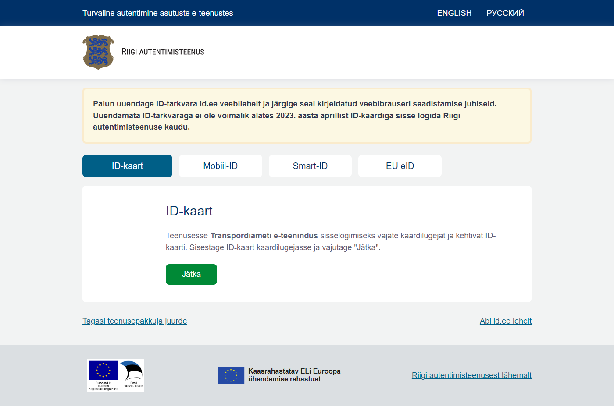

# Uudised

**03.09.2025**
## Alates 09.09.2025 piiratakse TARA toodangukeskkonnas (`tara.ria.ee`) identsustõendipäringud klientrakenduste IP-aadresside järgi

Alates 09.09.2025 keelatakse TARA toodangukeskkonnas identsustõendipäringute (POST https://tara.ria.ee/oidc/token) sooritamine IP-aadressidelt, mis ei ole kliendi konfiguratsiooniga määratud. Kui klientrakenduse _back-end_'ist `tara.ria.ee` poole väljuva võrguliikluse IP-aadresse on soov muuta, tuleb kirjutada [klient@ria.ee](mailto:klient@ria.ee) ja täpsustada enda klientrakenduse `client_id` väärtus ja uued konfiguratsiooniväärtused. IP-aadresside määramine on täpsemalt kirjeldatud tehnilise kirjelduse peatükis [4 Klientrakenduse konfiguratsioon TARA poolel](TehnilineKirjeldus#4-klientrakenduse-konfiguratsioon-tara-poolel).

TARA demokeskkonnas (`tara-test.ria.ee`) kirjeldatud konfiguratsioonielementi ei eksisteeri ja on lubatud identsustõendipäringute sooritamine kõikidelt IP-aadressidelt. Vastavalt [TARA ehk OpenID Connect protokollile](TehnilineKirjeldus#43-identsust%C3%B5endip%C3%A4ring) on identsustõendipäringul nõutud korrektsete `client_id` ja `client_secret` esitamine, nii TARA demokeskkonnas kui ka TARA toodangukeskkonnas. IP-aadresside piirang toodangukeskkonnas on `client_secret`-it täiendav kaitsemeede - kliendil on võimalik määrata klientrakendusest väljuva võrguliikluse IP-aadresside nimekiri/vahemik sellise täpsusega nagu klientrakenduse võrguarhitektuurist tulenevalt on võimalik ja nagu klientrakenduse riskianalüüs lubab.

**07.05.2025**
## Alates 30.04.2025 on TARA demokeskkonnas (`tara-test.ria.ee`) võimalik testida autentimist Thales testkaartidega
TARA demokeskkond (`tara-test.ria.ee`) võimaldab alates 30.04.2025 testida autentimist Thales testkaartidega. Täpsem informatsioon uute Thales testkaartide tellimise ja kasutamise kohta on leitav [id.ee](https://www.id.ee/artikkel/thales-id-kaart/) artiklist.

Oluline on meeles pidada, et uute Thales testkaartide kasutamiseks tuleb paigaldada Thalese testkaardi toega ID-tarkvara ning antud kaardi autentimise ja allkirjastamise sertifikaadid tuleb laadida [https://ocsp-test.eidpki.ee/ui/](https://ocsp-test.eidpki.ee/ui/) keskkonda GOOD olekuga.

TARA ja GovSSO-ga liidestunud infosüsteeme uue Thales ID-kaardi kasutuselevõtt ei mõjuta, kuid autentimise toimimist on siiski soovitatav üle testida. Kui teie infosüsteem teostab peale autentimist ka allkirjastamist, tuleb kindlasti testida ka allkirjastamise toimimist.

Uued Thales ID-kaardid tulevad kasutusele 2025. aasta novembris, kuid soovitatav on testida võimalikult varakult.

___

**25.04.2024**
## 02.05.2024 vahetub TLS sertifikaat `tara-test.ria.ee` keskkonnas ja 13.05.2024 vahetub `tara.ria.ee` keskkonnas.
• Palume klientidel, kes on oma teenuses usaldanud senist DigiCert juursertifikaati (DigiCert Global Root CA), lisada enne vahetusaega usaldusankruks kõik [peatükis 5.1.2](https://e-gov.github.io/TARA-Doku/TehnilineKirjeldus#512-otspunktide-tls-%C3%BChenduse-kontrollimine) loetletud juursertifikaadid. 
• Palume klientidel, kes on oma teenuses usaldanud otse Riigi autentimisteenuse TLS lõppolemi sertifikaati (`*.ria.ee`), lisada enne vahetusaega usaldusankruks kõik [peatükis 5.1.2](https://e-gov.github.io/TARA-Doku/TehnilineKirjeldus#512-otspunktide-tls-%C3%BChenduse-kontrollimine) loetletud juursertifikaadid ja eemaldada pärast vahetusaega senine lõppolemi sertifikaat. Kaob võimalus usaldada TLS lõppolemi sertifikaati, kuna see võib muutuda tihedamini ja etteteatamata. 

Kui Teil esineb teenusega probleeme, siis palun võtke meiega ühendust [help@ria.ee](mailto:help@ria.ee).

___

**07.02.2024**
## Näidisklient

[Liidestuja tarkvara](Naited) lehel on vanad näidiskliendid märgitud mitteajakohaseks ning lisatud info uue TARA näidiskliendi kohta (põhineb Java platvormil). Näidisklient demonstreerib TARA autentimisvoogu. Koodibaas on mõeldud õppeotstarbeliseks uurimiseks, seda ei saa _out of the box_ toodangus kasutada.

[Demo](Demo) lehel on uuendatud näidiskliendi paigalduste aadressid, mis on avalikult kättesaadavad demonstreerimise ja testimise eesmärgil. Need paigaldused on integreeritud TARA teenuse demokeskkonnaga (`tara-test.ria.ee`).

___

**23.11.2023**
## TARA identsustõendi allkirjastamise võtme vahetus
TARA toodangukeskkonnas on alates 01.08.2023 lisatud https://tara.ria.ee/oidc/jwks nimekirja praegu kasutatava võtme (`kid` väärtusega `public:SOP0AEUxG6ZgUzYH`) kõrvale uus avalik võti (`kid` väärtusega `fcd76c92-bc34-4e9f-b874-4c816c34639d`). 
Tehnilises kirjelduses on täpsustatud peatükke [Allkirja kontrollimine](TehnilineKirjeldus#511-allkirja-kontrollimine) ja [Identsustõendi allkirjastamise võtme vahetus](TehnilineKirjeldus#54-identsust%C3%B5endi-allkirjastamise-v%C3%B5tme-vahetus).

Uue võtme kasutusele võtu kuupäev teavitatakse eraldi. Kuni teavitatava kuupäevani allkirjastab TARA identsustõendeid praegu kasutatava võtmega (`kid` väärtusega `public:SOP0AEUxG6ZgUzYH`). Alates teavitatavast kuupäevast hakkab TARA allkirjastama identsustõendeid uue võtmega (`kid` väärtusega `fcd76c92-bc34-4e9f-b874-4c816c34639d`) ja vana võti eemaldatakse võtmeväljastuse otspunktist.

___

**26.10.2023**
## 07.11.2023 vahetub TLS sertifikaat `tara-test.ria.ee` keskkonnas ja 14.11.2023 vahetub `tara.ria.ee` keskkonnas.
• Palume klientidel, kes on oma teenuses usaldanud senist DigiCert juursertifikaati (DigiCert Global Root CA), lisada enne vahetusaega usaldusankruks uus DigiCert juursertifikaat ([DigiCert Global Root G2](https://cacerts.digicert.com/DigiCertGlobalRootG2.crt.pem)) ja eemaldada pärast vahetusaega senine juursertifikaat. 
• Palume klientidel, kes on oma teenuses usaldanud senist DigiCert vahesertifikaati (DigiCert TLS Hybrid ECC SHA384 2020 CA1), asendada usaldusankur kas juursertifikaadiga või lõppolemi sertifikaadiga. 
• Palume klientidel, kes on oma teenuses usaldanud otse Riigi autentimisteenuse TLS lõppolemi sertifikaati (`*.ria.ee`), lisada enne vahetusaega usaldusankruks [uus lõppolemi sertifikaat](https://github.com/e-gov/TARA-Doku/blob/master/certificates/star_ria_ee_valid_until_2024-11-17.crt) ja eemaldada pärast vahetusaega senine lõppolemi sertifikaat. 

Täpsemalt TLS ühenduste usaldamisest: [https://e-gov.github.io/TARA-Doku/TehnilineKirjeldus#512-otspunktide-tls-%C3%BChenduse-kontrollimine](https://e-gov.github.io/TARA-Doku/TehnilineKirjeldus#512-otspunktide-tls-%C3%BChenduse-kontrollimine). Kui Teil esineb teenusega probleeme, siis palun võtke meiega ühendust [help@ria.ee](mailto:help@ria.ee).

___

**10.01.2023**
## Riigi autentimisteenus (TARA) hakkab ID-kaardiga sisse logimise kuval kontrollima kasutaja veebisirvikus Web eID laienduse olemasolu.
Riigi autentimisteenus hakkab ID-kaardiga sisse logimise kuval kontrollima kasutaja veebisirvikus Web eID laienduse olemasolu.

1) Kui kasutaja arvutis on Web eID veebisirvikulaiendus töökorras, siis ühtegi lisateadet ei kuvata. 
2) Kui kasutaja arvutis on Web eID veebisirvikulaiendus puudu, siis kuvatakse hoiatusteade, mis ei takista ID-kaardiga autentimise kasutamist:

Praegu jätkub TARAs ID-kaardiga autentimine senise lahendusega (TLS-i kliendisertifikaadipõhiselt), kuid 2023. aasta kevadel on planeeritud TARA-s selle vahetamine uue Web eID lahenduse vastu.
Kasutajal peaks olema ajakohased Web eID komponendid (Web eID versioon 2) kui ta on paigaldanud või uuendanud ID-tarkvara pärast 2022. märtsi.

___

**10.11.2022**
## 14.11.2022 kell 11:00 vahetub TLS sertifikaat `tara-test.ria.ee` keskkonnas ja 17.11.2022 kell 13:30 `tara.ria.ee` keskkonnas.
• Palume klientidel, kes on oma teenuses usaldanud otse Riigi autentimisteenuse TLS lõppsertifikaati (`*.ria.ee`), uuendada vastavalt usaldusankruks seatud lõppsertifikaati [uue vastu](https://github.com/e-gov/TARA-Doku/blob/master/certificates/star_ria_ee_valid_until_2023-11-22.crt). 
• Palume klientidel, kes on oma teenuses usaldanud senist DigiCert vahesertifikaati (DigiCert TLS RSA SHA256 2020 CA1), uuendada vastavalt usaldusankruks seatud vahesertifikaati [uue vastu (DigiCert TLS Hybrid ECC SHA384 2020 CA1)](https://cacerts.digicert.com/DigiCertTLSHybridECCSHA3842020CA1-1.crt.pem). 
• Kliendid, kes on oma teenuses usaldanud DigiCert juursertifikaati (DigiCert Global Root CA), muudatusi tegema ei pea. 
Täpsemalt TLS ühenduste usaldamisest: [https://e-gov.github.io/TARA-Doku/TehnilineKirjeldus#512-otspunktide-tls-%C3%BChenduse-kontrollimine](https://e-gov.github.io/TARA-Doku/TehnilineKirjeldus#512-otspunktide-tls-%C3%BChenduse-kontrollimine). Kui Teil esineb teenusega probleeme, siis palun võtke meiega ühendust [help@ria.ee](mailto:help@ria.ee).

___

**09.11.2021**
## 15.11.2021 muutub _*.ria.ee_ domeenil kasutusel olev sertifikaat.
Muudatus puudutab nii `tara.ria.ee` kui `tara-test.ria.ee` keskkondi.
Muutub RSA sertifikaadi väljastamise ahel. Uus sertifikaat on väljastatud "DigiCert TLS RSA SHA256 2020 CA1" ja ECC sertifikaat väljastatud "DigiCert TLS Hybrid ECC SHA384 2020 CA1" poolt.
Palume klientidel, kes on oma teenuses usaldanud otse Riigi autentimisteenuse TLS sertifikaati, uuendada vastavalt usaldusankruks seatud sertifikaati. 
Uued sertifikaadid on leitavad [id.ee veebist](https://www.id.ee/artikkel/riigi-autentimisteenuse-sertifikaadi-muudatus/).
Täpsemalt võtmeväljastuse otspunkti usaldamisest räägib [TARA tehniline kirjeldus](https://e-gov.github.io/TARA-Doku/TehnilineKirjeldus#5-turvatoimingud).
Kui Teil esineb teenusega probleeme, siis palun võtke meiega ühendust [help@ria.ee](mailto:help@ria.ee).

___

**05.05.2021**
## Riigi autentimisteenuse üleminek uuele tarkvara platvormile TARA2.
Uuele TARA2 versioonile migreerime kõik kliendid demokeskkonnas ajavahemikus 05.-06.05.2021. Uus TARA2 platvorm on tagasiühilduv ning senine TARA dokumentatsiooni tehniline kirjeldus on endiselt kehtiv.
Liidestunud klientide jaoks ei tohiks probleeme tekkida, kui liidestamisel on järgitud tehnilises dokumentatsioonis antud soovitusi, kuid eriti karbitoodete puhul tuleks üle kontrollida järgnevad täiendused/muutused:
Toetatakse ainult TARA tehnilises dokumentatsioonis toodud skoope ning tundmatute skoopide korral tagastatakse viga. NB! banklink skoobi kasutus ei ole TARA2 teenuses toetatud!
state parameetril on miinimum pikkus 8 tähemärki (TARA dokumentatsioonis on soovitatud kasutada 16 tähemärgi pikkust väärtust).
Tagasisuunamispäringus tagastatakse ka kasutatud scope parameeter koos kasutatud väärtustega.
oidc/jwks otspunkti väljundisse lisandub parameeter use.
Palume kindlasti kontrollida oma teenuse tööd demokeskkonnas ja kui esineb mingisuguseid probleeme, siis palun võtke kindlasti meiega ühendust [help@ria.ee](mailto:help@ria.ee).
TARA2 toodangukeskkonda migreerime kliendid (eeldatavalt) 31.05.2021. TARA2 platvormi koodi avalikustame GitHubi repodes lähimal ajal.

___

**14.12.2020**
## Alates 09.12.2020 ei ole võimalik TARA demo keskkonnas kasutada Mobiil-ID testimiseks isiklikku Mobiil-ID numbrit.
Testida saab ainult kasutades testnumbreid. Rohkem infot [siit.](https://www.skidsolutions.eu/uudised/mobiil-id-demo-keskkond-ei-ole-tehnilistel-pohjustel-kattesaadav/)

___

**19.03.2020**
## Alates 30.04.2020 muutub TARA-s kasutajale vaikimisi kuvatavate autentimisvalikute nimekiri.
Kui seni kuvati kasutajale kõik autentimisvahendid (ID-kaart, Mobiil-ID, pangalink, Smart-ID ja eIDAS), siis alates muudatuse rakendamise hetkest kuvatakse vaikimisi ainult kõrge tagatistasemega autentimisvahendeid (ID-kaart ja Mobiil-ID).
Kõiki autentimisvahendeid on endiselt võimalik kasutada, kuid liitunud infosüsteem peab soovitud autentimisvalikute kuvamist sellisel juhul ise juhtima, kasutades TARA skoope (loe rohkem siit - https://e-gov.github.io/TARA-Doku/TehnilineKirjeldus#413-autentimismeetodite-valikuline-kasutus)
Midagi ei muutu klientide jaoks, kes juba kasutavad autentimismeetodeid valikuliselt.

___

**25.12.2019**
## Lisandus võimalus piiriülese (eIDAS) autentimise valiku korral kasutada TARA ilma kasutajaliidest kuvamata.
Otse eIDAS võrgustikku suunamiseks ilma kasutajaliidese kuvamiseta peab skoobi URL parameeter välja nägema taoline:
`.../authorize?scope=openeid eidasonly eidas:country:fi&...`.
Tundmatuid, valesti kirjeldatud ja mitte väärtustatud attribuute ignoreeritakse. Kõik skoobi atribuudid peavad olema kirjeldatud väikeste tähtetega, kaasaarvatud 'eidas:country:' väärtus, mis ISO 3166-1 alpha-2 standardi kohaselt enamasti suurte tähtedega kirjeldatud. Seega ka suurte tähtedega kirjeldatud korrektset riigikoodi ignoreeritakse.
Otsene eIDAS võrgustikku suunatakse alati kui esinevad eelnevas näites kirjeldatud skoobi atribuudid, isegi kui esineb teisi valiidseid atribuute.
TARA-server metateabe kaudu kätte saadud 'scopes_supported' väärtus koostatakse järgnevalt:
konfiparameetri `cas.authn.oidc.scopes` väärtused
konfiparameetri `eidas.available-countries` iga riigikoodi väärtuse x kohta dünaamiliselt koostatud `eidas:country:x`.

___

**11.09.2019**
## Alates 11. septembrist 2019 lisandub TARA toodangukeskkonda autentimisvahendina Smart-ID.
Toodangukeskkonna kliendid, kes rakendavad autentimismeetodite valikulist kasutust ja soovivad smart-id, soovitame üle vaadata parameetri `scope` väärtus ja veenduda, et skoop `smartid` oleks lubatud.

___

**05.09.2019**
## Alates 10. septembrist 2019 peavad EL-i liikmesriigid lubama autentida Itaalia eID vahendiga, mis on hinnatud tasemele märkimisväärne.
See tähendab, et sellest kuupäevast peavad kõik avaliku sektori avalikud e-teenused, kes lubavad oma kodanikul kasutada sisse logimiseks märkimisväärse või madala tasemega eID vahendeid, lubama autentida ka Itaalia märkimisväärse autentimistasemega eID vahendiga. eIDAS autentimistasemele kõrge vastavad näiteks Eesti ID-kaart ja mobiil-ID, tasemele madal vastavad aga kõik ülejäänud hindamata eID skeemid, sh panga PIN-kalkulaator.
Välistamaks ligipääsu soovitust madalama turvalisusastmega ülepiirilistele autentimisvahenditele, peab ülepiirilise autentimise korral kontrollima, et identsustõendi acr väites esitatud autentimistase ei oleks väiksem minimaalsest lubatud autentimistasemest (loe autentimistasemete kohta [siit](https://www.ria.ee/sites/default/files/content-editors/EID/autentimislahendustele-kehtivad-nouded.pdf).
Näiteks, kui liidestuja soovib kasutada vaid kõrge eIDAS autentimistasemega autentimisvahendeid ja täpsustab `acr_values` parameetris `high` väärtuse, tohib aktsepteerida ainult identsustõendeid, mille `acr` väite väärtus on `high`.
Juhul kui autentimispäringus eIDAS autentimistaset `acr_values` parameetri abil ei täpsustatud, peab identsustõendis olev väärtus olema `substantial` või `high`.
[Täpsemalt](https://e-gov.github.io/TARA-Doku/TehnilineKirjeldus#5-turvatoimingud).

___

**18.02.2019**
## Täpsustasime identsustõendi kehtivuse arvutust.
Identsustõendi kehetuvust ei teosta TARA, vaid kontroll tuleb teostada klientrakenduse poolel.
Tõend kehtib, kuid on täidetud tingimused:
`nbf <= jooksev_aeg + kellade_lubatud_erinevus` ja `exp > jooksev_aeg - kellade_lubatud_erinevus`. Vt [veebitõendi standard](https://tools.ietf.org/html/rfc7519), jaot 4.1.4-5.

___
