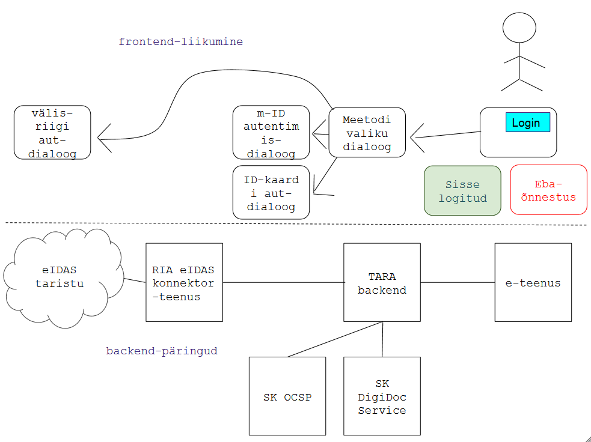

## Vead-tõrked. Ennetamine ja käsitlemine

_Tõrkena käsitame siin nii tehnilise komponendi mittetöötamist kui ka kasutaja viga, millest kasutaja ise aru ei saa (nt paneb ID-kaardi valetpidi lugejasse)._

Lahendada:
- Kuidas käsitletakse autentimise ebaõnnestumised, olukorrad, kus mõni osateenus on maas jm tõrked?
  - Kuidas saadakse teada?
  - Kuidas teavitatakse?
- Kelle poole kasutaja vajadusel pöördub?
  - Kuidas kasutaja pöördumine lahendatakse?
  - Kuidas selgitatakse välja vea põhjus? Kuidas osapooled suhtlevad?

Lähtekohti:
1) autentimine TARA-teenuses on tervikprotsess, mille õnnestumine sõltub mitmete komponentide ja osateenuste toimimisest; 
2) autentimise tulemusest (OK, NOK) antakse kasutajale teada e-teenuses; 
3) tõrkena käsitleme ka olukorda, kus kasutaja ei saa aru, mis ta valesti tegi; 
4) kasutaja esmane pöördumispunkt on e-teenuse kasutajatugi; 
5) kaalume e-teenuse kasutajatoe kontaktteabe kogumist klientrakenduse registreerimisel ja kuvamist TARA kasutajadialoogis.

| viga v tõrge   | ennetavad meetmed, lahendamine  |
|----|-----|
| valesti implementeeritud protokoll (klientrakenduses) | Paar kõige tähtsamat nõuet lisatud liitumisjuhendisse (jaotis 2) |
| eIDAS konnektorteenus on maas | |
| SK DigiDocService on maas | |
| SK OCSP teenus on maas | |
| välisriigi eIDAS vahendusserver on maas | |
| välismaalasel ei õnnestu autentida | |
| eestlasel ei õnnestu autentida | |
| TARA autentimisteenus on maas | |
| kasutaja esitas valed kredentsiaalid (nt vale PIN1) | TARA-teenus saadab klientrakendusele veakoodi (vt [Core], jaotis [3.1.2.6 Authentication Error Response](http://openid.net/specs/openid-connect-core-1_0.html#AuthError))  |
