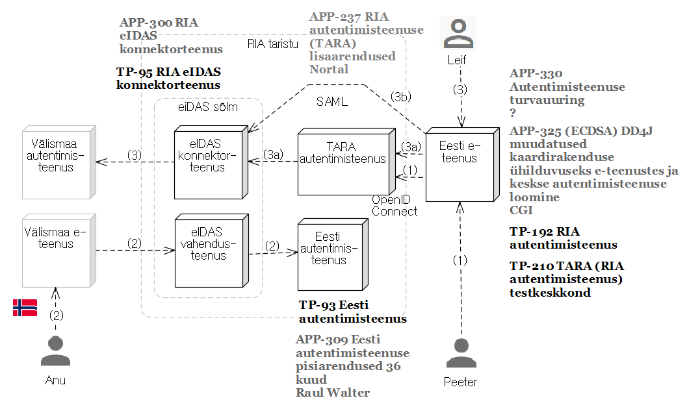

# eIDAS/TARA võimekuste ajaplaan

| nr | võimekus | selgitus | staatus | valmimisaeg |
|----|--------------------|----------|---------|
| 1  | __RIA konnektorteenus__ | TP-95 |         |    |
| 1.1  | teenus testkeskkonnas |       | OK |    |
| 1.2  | liidestamisjuhend |           | OK  |    |
| 1.3  | liides spetsifikatsioon |     | alustamisel (APP-237) |    |
| 1.4  | eIDAS klient            | näiterakendus, mis teostab liidese RIA eIDAS konnektorteenusega, vastavalt spetsifikatsioonile (vt p 1.2) | alustamisel (APP-237) |    |
| 1.5  | teenus toodangukeskkonnas |     |    |    |
| 2    | __Eesti autentimisteenus__ | TP-93 |     |    |
| 2.1  | teenus testkeskkonnas   |   | töös (APP-309) |    |
| 2.2  | teenus toodangukeskkonnas |   |     |    |
| 3    | __TARA teenus (RIA autentimisteenus)__ | TP-210 |  |    |
| 3.1  | m-ID ja ID-kaardiga autentimine (testkeskkonnas) | OK  | APP-325 |    |
| 3.2  | turvalisus kontrollitud | Turvatestimine teostatud | hankimisel (APP-333) |    |
| 3.2  | m-ID ja ID-kaardiga autentimine (toodangukeskkonnas) |   | APP-325 |    |
| 3.3  | eIDAS autentimine (testkeskkonnas) |   | alustamisel (APP-325) |    |
| 3.4  | eIDAS autentimine (toodagukeskkonnas) |   | alustamisel (APP-325) |    |
| 3.5  | SSO suhtes selgus | Autentimisteenuse turvauuring läbi viidud | ettevalmistamisel (APP-330) |    |
