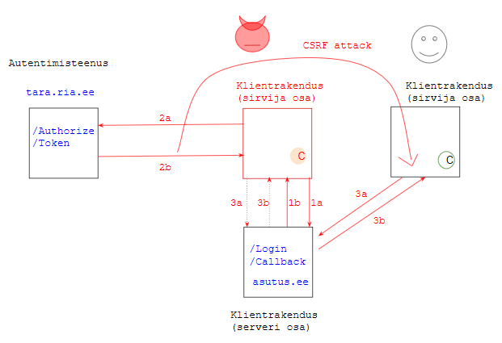

# Võltspäringurünne ja kaitse selle vastu



TL;DR Võltspäringutõke tuleb siduda sessiooniga, muidu pole sellest kasu.

## Normaalprotsess

1a Kasutaja vajutab nupule "Logi sisse" vms. Selle toimel saadab sirvija serverisse päringu `HTTP GET https://asutus.ee/Login`.

1b Server saadab päringule vastuseks ümbersuunamiskorralduse (_redirect_) autentimisteenusesse. HTTP vastuse staatusekood on 302. Vastuses on OpenID Connect protokolli kohased elemendid, nende seas võltspäringutõke `state`.

```
302 Found
Location: https://tara.ria.ee/authorize?
redirect_uri=https%3A%2F%2Fasutus.ee%2F
Callback&scope=openid&
state=hkMVY7vjuN7xyLl5&response_type=code&
client_id=asutus
```

2a Kasutaja veebisirvija teeb päringu ümbersuunamis-URL-le:

```
HTTP GET https://tara.ria.ee/authorize?
redirect_uri=https%3A%2F%2Fasutus.ee%2F
Callback&scope=openid&
state=hkMVY7vjuN7xyLl5&response_type=code&
client_id=asutus
```

2b Kasutaja autentimise järel saadab autentimisteenus sirvijast tulnud päringule vastuse. Vastuses sisaldub ümbersuunamiskorraldus, volituskood `code` ja võltspäringutõke `state`. 

```
302 Found
Location: https://asutus.ee/Callback?
code=71ed5797c3d957817d31&
state=hkMVY7vjuN7xyLl5
```

3a Sirvija täidab ümbersuunamiskorralduse, tehes päringu:

```
HTTP GET https://asutus.ee/Callback?
code=71ed5797c3d957817d31&
state=hkMVY7vjuN7xyLl5
```

3b Server teeb nüüd päringu autentimisteenuse otspunkti `/Token` ja saab volituskoodi vastu identsustõendi (_ID token_). Identsustõendis on autenditud kasutaja isikukood, nimi jm autentimisandmed. Sellega on autentimisprotsess lõppenud.

## Rünne

Ründaja laeb klientrakenduse oma sirvijasse. Vajutab "Logi sisse" ja teeb autentimisteenuses läbi autentimise. Püüab kinni autentimisteenuse vcode=71ed5797c3d957817d31&
state=hkMVY7vjuN7xyLl5astuse 2b ja tõkestab selles sisalduva ümbersuunamiskorralduse täitmist. See tähendab, et päring 3a sirvijast välja ei lähegi.

Selle asemel moodustab võltspärigu ja pettuse abil paneb ohvri võltspäringut serverile saatma. Näiteks saates ohvrile näiliselt süütu veebilehe aadressi; veebilehel on aga võltspäringut käivitav peidetud element

```

```

Kui selline päring jõuab serverisse ja server ei suuda aru saada, et 1a ja 3a tulevad erinevatest sirvijatest, siis ta pahaaimamatult täidab päringu. Tulemuseks on, et ründaja on ohvri sirvijas klientrakendusse sisse logitud.

## Kaitse

Võltspäringuründe vastu pakub kaitset tõkkeelement `state`. Kuid `state` peab olema sirvijaga seotud. Korrektne kaitseprotseduur on järgmine:

Vastuse 1b saatmisel paneb server kaasa ka küpsise seansidentifikaatoriga:

```
Set-Cookie: SessionID=2h5ft6; HttpOnly
``` 

Seansiidentifikaator `2h5ft6` on juhustring. Tõkkeelemendi `state` moodustab sirvija võttes seansiidentifikaatorist räsi: `state = hash(2h5ft6)`.

Nii seotakse `state` konkreetse sirvijaga, kuid seansiidentifikaator ei ole räsi põhjal arvutatav.

Sirvija talletab saadud küpsise. Autentimisteenusest tagasipöördumisel paneb sirvija küpsise päringusse 3a kaasa.

Server saab päringust 3a nii tõkkeelemendi `state` kui ka küpsises hoitud seansiidentifikaatori. Server PEAB kontrollima, et saadud `state = hash(2h5ft6)`.

Ründaja võib oma sirvijast küll küpsise kätte saada, kuid tal ei ole lihtsat võimalust küpsise paigaldamiseks ohvri arvutisse. Kuna ohvri arvutis vajalikku küpsist ei ole (või on seal teine seansiidentifikaator), siis võltspäringu saatmine ei õnnestu - eeldusel, et klientrakenduses on `state` kontroll õigesti teostatud.
 