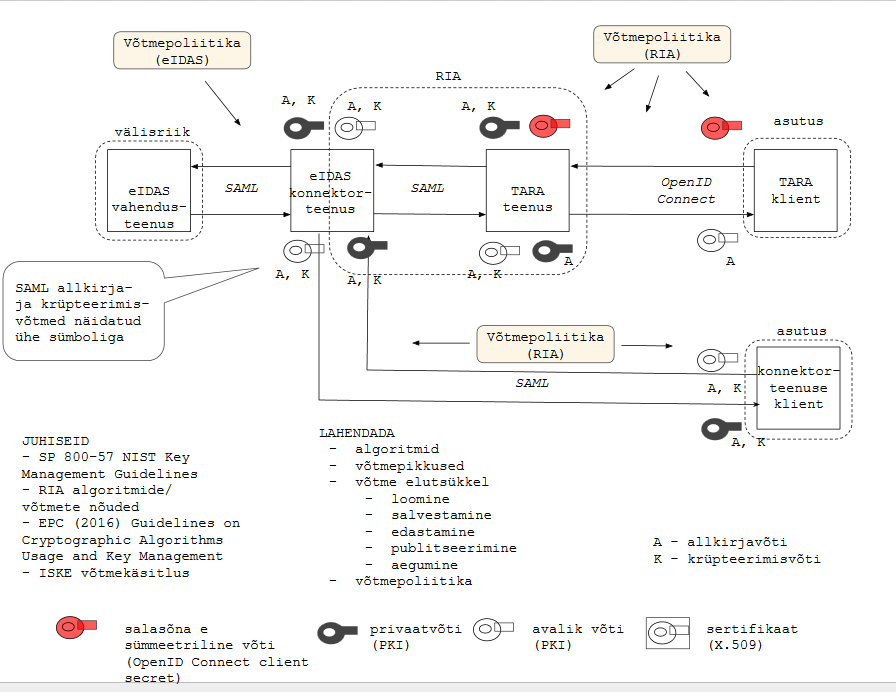
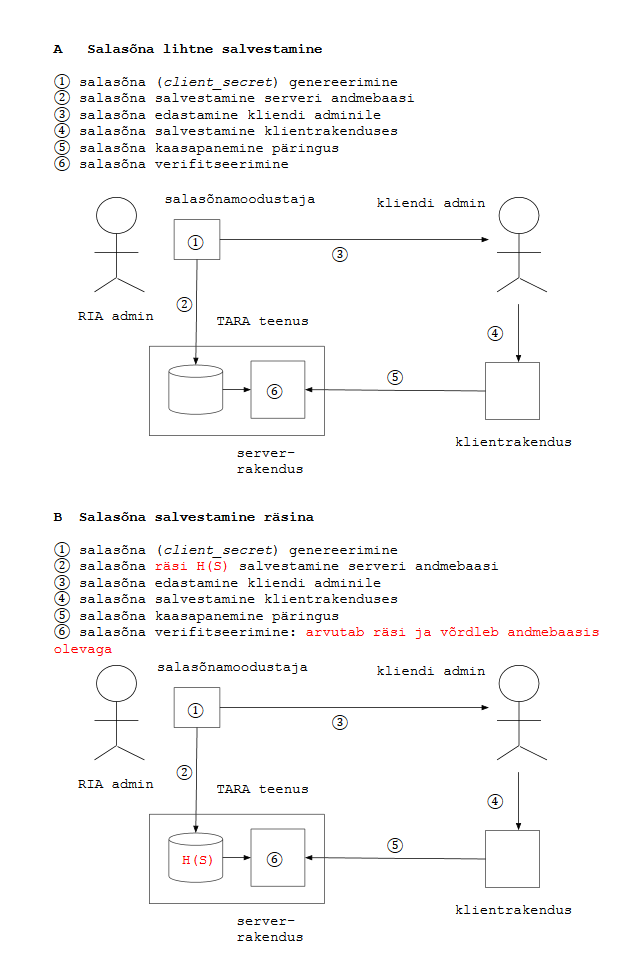

# Võtmehaldus

Joonis markeerib piiriülese autentimistaristu eIDAS ja TARA autentimisteenuse võtmehaldust.

TARA klientrakendus kasutab TARA teenusest identsustõendit pärides sümmeetrilist võtit &mdash; salasõna (OpenID Connect mõistes _client secret_). (joonisel punane)

TARA teenus allkirjastab väljastatava identsustõendi oma privaatvõtmega. Vastava avaliku võtme teeb TARA klientrakendustele teatavaks metaandmete otspunkti kaudu: [https://tara-test.ria.ee/oidc/jwks](https://tara-test.ria.ee/oidc/jwks).

(Võrdluseks: Google avalikud võtmed: [https://www.googleapis.com/oauth2/v3/certs](https://www.googleapis.com/oauth2/v3/certs)).

RIA eIDAS konnektorteenusega suhtlemisel kasutatakse SAML sõnumivormingut. SAML sõnumid allkirjastatakse ja krüpteeritakse. Kasutatakse PKI võtmeid, X.509 vormingus.

Võtmehaldus reguleeritakse võtmepoliitikaga.

## Salasõna salvestamine räsina

Variant B rakendab vastumeetme ohule, et RIA admin näeb salasõnu andmebaasis (ja võib neid levitada). Vastumeetme hindamisel peab arvestama, et RIA admin näeb salasõna niikuinii, salasõna genereerimisel ja kliendi adminile edastamisel.
 