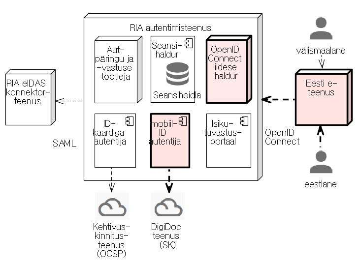

TARA on turvaline autentimisteenus, millega asutuse e-teenus saab autentida mobiil-ID kasutaja.
TARA teenust pakub RIA.

E-teenus kasutab TARA OpenID Connect protokolli kohaselt. Edaspidi TARA võimalused laienevad: ühekordne sisselogimine, täiendavad autentimismeetodid, sh piiriülene eIDAS-autentimine jm. 

## Kood ja dokumentatsioon

- [TARA-Server](https://github.com/e-gov/TARA-Server) (teenuse server)
- [TARA-Client](https://github.com/e-gov/TARA-Client) (makettrakendus teenuse testimiseks)
- [TARA-Doku](https://github.com/e-gov/TARA-Doku) (teenuse dokumentatsioon)

| nimetus, asukoht             |  seis     |
|------------------------------|-----------|
| 1 [Teabeleht](Teabeleht)       | kavand    |
| 2 [Ärikirjeldus](Arikirjeldus) | kavand    |
| 3 [Tehnilised tingimused ja liidestamise juhend](Juhend) | alustatud |
| 4 [Tehniline kirjeldus](TehnilineKirjeldus) |    |
| 5 [SLA]()                      |            |
| 6 [Paigaldusjuhend]()          |            |
| 7 [Haldusjuhend]()             |            |
| 8 [Testistrateegia](Testistrateegia)          |            |
| 9 [Testilood]()                  |            |
| 10 [Testiraport]()                |            |

***Tehniline kirjeldus*** - tarkvara spetsifikatsioon, sisaldab: arh-ijoonist, paigaldusjoonist, kasutusloo või -lugude kirjeldust, tarkvara oluliste mittefunktsionaalsete omaduste kirjeldust - teave kasutatud teekide kohta, logimise lahenduse kirjeldus, hinnang tööjõudlusele

***Testistrateegia*** - kirjeldab, kuidas ja mida testitakse, joonis testimise setup-i kohta

***SLA*** - nii test-kui ka toodanguteenusele

## Viited

[1] Riigi Infosüsteemi Amet. RIA SSO autentimisteenuse kavand. 18 lk. 
[2] [TP-93 RIA autentimisteenus](https://jira.ria.ee/browse/TP-93). RIA teenuseportfelli kirje. [mitteavalik] 
[3] Ettepanekud ja probleemid (GitHub Issues) [https://github.com/e-gov/TARA-Doku/issues](https://github.com/e-gov/TARA-Doku/issues) 

## Teenuse arenduskava

| teetähis | tööd | tulemus | orienteeruv, minimaalne ajakava |
|----------|------|---------|--------------|
| MVP/PoC  | Arendaja: 1) paneb üles OpenID Connect serveri; 2) koostab testimiseks vajaliku makettrakenduse ja 3) mobiil-ID-ga autentimise komponendi. | Töötav tarkvara, mis realiseerib eesmärgiks seatud kasutusloo; käideldavus v-o madal; dokumentatsioon v.o mittetäielik. | 2 nädalat |
| Tarkvara toodanguvalmis | RIA ja CGI koostöös: 1) testivad põhjalikult; 2) koostavad SLA ja teevad vajalikud tööd selle saavutamiseks (klaster); 3) viimistlevad dokumentatsiooni | Tarkvara testitud, tootmisse paigaldamiseks valmis, korralik dokumentatsioon | 2 nädalat |
| Asutustele suunatud kommunikatsiooni-pakett valmis | RIA: 1) avaldab teenuse – teabematerjal + liidestumisjuhend; 2) edaspidi toetab liidestujaid tööde kavandamisel | Liitumiseks vajalik teave sihtrühmale edastatud; kommunikatsioonipaketti on vähemalt ühe asutuse peal testitud | 1 nädal |
| Testteenus avatud | RIA: 1) paneb üles keskkonna, mille vastu liidestujad saavad oma arendusi testida; 2) edaspidi teenindab liidestujaid liideste testimisel (konf-ne jms) | Liitujad saavad oma liideseid testteenuse vastu testida | 1 nädal |
| Teenuse avamine toodangus | RIA: 1) avab teenuse toodangukeskkonna;
2) edaspidi laseb teenusekasutajad (pärast testide läbimist) toodangusse | | 1 nädal |

## Arhitektuur

Esimeses järgus teostatavad komponendid ja kasutusvoog on joonisel näidatud rõhutatult. Joonisel on kujutatud ka  teenuse EIDAS-autentimisega laiendamise võimalus.

## Esimesed arendustööd
1)	OpenID Connect serveri ülespanek (joonisel „OpenID Connect liidese haldur“) 
valida sobiv teek, võiks olla Java-põhine; otsus kooskõlastada Tellijaga. Seadistada ja täiendada teeki nii, et tarkvara teostab esmase autentimise kasutusloo [1].

2)	Makettrakenduse loomine 
koostada RIA rakendus, mis etendab autentimisteenust kasutavat Eesti e-teenust. Makettrakenduse eesmärk on testida loodavat RIA autentimisteenust. Selleks valida sobiv OpenID Connect kliendi teek. Ei pea olema Java.

3)	mobiil-ID autentija loomine 
teostada komponent, mis teostab Eesti mobiil-ID-ga autentimise. Siduda mobiil-ID autentija  ja OpenID Connect liidese haldur tervikuks. 

Arvestada edasise tööde järjekorraga, vt joonis ja [1]: 1) kasutusloo autentimise olemasolu kontroll teostamine; 2) kasutusloo väljalogimine teostamine; 3) komponentide Seansihaldur ja selle koosseisus Seansihoidla teostamine; 4) komponendi Isikutuvastusportaal teostamine (võimaldab kasutajal valida mitme autentimismeetodi vahel); 5) liidestamine eIDAS konnektorteenusega (vajalik välismaalaste autentimisel).

## Arenduskorraldus

TARA Confluence-is: 
[https://confluence.ria.ee/display/TARA](https://confluence.ria.ee/display/TARA) 

TARA JIRA-s: 
[https://jira.ria.ee/browse/DD4J-88](https://jira.ria.ee/browse/DD4J-88) 

TARA Skype-is: 
Autentimisteenuse arendus

